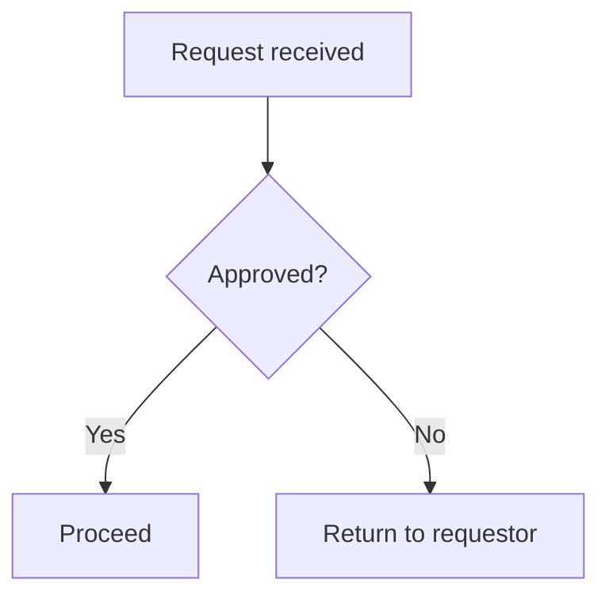

# Product Summary & Requirements Generator

Produces a polished Product Summary and Requirements `.md` file by
synthesising three sources:

1. **Meeting transcript** — stakeholder intent, goals, features, decisions
2. **SOP / policy documents** — constraints, compliance rules, standards
3. **Output template** — document structure and formatting to follow

All source files are `.md` format.

The output also includes **process-flow diagrams (Mermaid)** for any
workflow in the sources that has steps or branching — see Step 4
(Process Flow Diagrams) and Step 7.5 (rendering them in Confluence).

---

## Step 1 — Read the Template

Read the file in `templates/`. This is your **output blueprint**.

- Note every heading, section order, and formatting convention exactly
- Your output must mirror this structure — do not invent new sections or
  reorder unless the transcript or SOPs introduce content with no home
- Note the tone (formal, concise, bullet-driven, etc.) and replicate it

If no template file exists, use the Default Output Structure in Step 3.

---

## Step 2 — Read All Source Files

**Before reading any file, list the contents of both folders** so you
know exactly what you are working with:

```
ls transcripts/
ls sop/
```

Note every filename — you will use these as source tags throughout the
output document.

---

### Meeting Transcripts (`transcripts/`)

Read **every** `.md` file found in the folder — there may be one or many.
For each file, extract:

- Product or feature name and one-line description
- Business goals and the problem being solved
- Functional requirements — what the product must **do**
- Non-functional requirements — performance, scale, UX, accessibility
- Decisions made during the meeting (record as confirmed)
- Open questions or deferred decisions (record as unresolved)
- Stakeholder names, roles, and their stated positions or concerns
- Any deadlines, milestones, or phasing discussed

**When multiple transcript files exist:**
- Read them in filename order (alphabetical / chronological)
- Track which file each piece of information came from
- Where two transcripts cover the same topic and agree, merge them into
  one requirement and tag it with both filenames, e.g.
  `Transcript: kickoff.md, followup.md`
- Where two transcripts **conflict** on the same point, do not silently
  pick one — record both versions and flag it as a conflict in
  Section 7 with both filenames cited

---

### SOP / Policy Documents (`sop/`)

Read **every** `.md` file found in the folder — there may be one or many.
For each file, extract:

- Compliance requirements the product must satisfy
- Mandatory process steps, approvals, or sign-offs
- Technical or security standards that apply
- Data handling, privacy, or retention rules
- Any restrictions on scope, tooling, or implementation approach
- References to external standards or regulations

**When multiple SOP files exist:**
- Read each one independently
- Tag every constraint with its exact source filename so traceability
  is clear, e.g. `SOP: data-privacy.md`
- Where two SOPs cover the same topic, merge into one constraint and
  cite both filenames
- Where two SOPs conflict, flag it in Section 7 — do not guess which
  policy takes precedence

---

### Handling Missing or Empty Folders

If a folder is empty or a file cannot be read:
- Do **not** silently skip it
- Continue generating the document with what is available
- Record every gap in **Section 9: Assumptions & Gaps** with a clear
  note about what was missing and what was assumed in its place

---

## Step 3 — Synthesise Before Writing

Before drafting, mentally map your findings:

| Source | What it drives in the output |
|---|---|
| Transcript | Sections 1–5, 8 (goals, features, stakeholders, open questions) |
| SOPs | Section 7 (constraints & compliance), tags on Section 4–5 items |
| Template | All headings, order, tone, and formatting |

Where a requirement appears in **both** the transcript and an SOP, tag it
`(Transcript + SOP)` — this signals validated, high-priority requirements.

Where the transcript and an SOP **conflict** (e.g. a stakeholder wants X
but a policy prohibits it), do not resolve it — surface it in Section 8
as a flagged risk with both sides stated.

---

## Step 4 — Write the Output Document

Use the template structure as your skeleton. If no template exists, use
the structure below exactly.

Every requirement must carry a source tag. Every section must be present —
write `_To be confirmed._` rather than omitting a section.

### Default Output Structure

```
# Product Summary & Requirements
**Product / Feature:** [name]
**Date:** [today's date]
**Status:** Draft

---

## 1. Overview
[One paragraph: what it is, why it exists, who it is for]

## 2. Goals & Success Metrics
[Business goals from transcript. Measurable KPIs if mentioned.]

## 3. Stakeholders
| Name | Role | Key Position / Concern |
|---|---|---|

## 4. Functional Requirements
| ID | Requirement | Source |
|---|---|---|
| REQ-001 | [description] | Transcript / SOP: [filename] / Both |

## 5. Non-Functional Requirements
| ID | Requirement | Category | Source |
|---|---|---|---|
| NFR-001 | [description] | Performance / Security / UX / etc. | |

## 6. Process Flows
[One or more Mermaid diagrams of the key processes/workflows in the
sources, each as a Mermaid fenced block. Keep the Mermaid source inline and
tag each diagram with its source. See the Process Flow Diagrams guidance
below.]

## 7. Constraints & Compliance
[All SOP-driven constraints. Include SOP filename as reference for each.]

## 8. Open Questions & Risks
| # | Item | Type | Raised By |
|---|---|---|---|
| 1 | [question or risk] | Open Question / Risk / Conflict | [name or source] |

## 9. Assumptions & Gaps
[List anything assumed due to missing source files or ambiguous content.
Note which folders or files were empty.]

## 10. Revision History
| Version | Date | Author | Notes |
|---|---|---|---|
| 0.1 | [today] | Claude | Initial draft from transcript + SOPs |
```

---

### Process Flow Diagrams (Mermaid)

Any process or workflow in the sources that has **sequential steps or
branching/decision logic** must be captured as a **Mermaid diagram**, not
just prose. Typical candidates: an end-to-end lifecycle, an
approval/review workflow, routing logic, or a state transition.

Rules:

- Author each diagram in **Mermaid**, inside a fenced `mermaid` code
  block — this is the maintainable source and renders natively in GitHub
  and the VS Code markdown preview.
- Place them in the **Process Flows** section — mirror the template's
  numbering if a template exists, otherwise use Section 6 of the Default
  Output Structure.
- Use `flowchart TD` for processes, `stateDiagram-v2` for state machines,
  and `sequenceDiagram` for multi-party interactions over time.
- Show **decision points** as `{ ... }` nodes and put **timeframes/SLAs**
  inline in the node label (e.g. `6-week SLA starts`).
- **Tag every diagram with its source**, the same way requirements are
  tagged.
- Keep node labels free of unescaped `()`; use `<br/>` for line breaks.
- Do **not** invent steps — only diagram flows stated in the transcript or
  SOPs. If a flow is only partly described, diagram what is known and note
  the gap in Assumptions & Gaps.

Example:



---

## Step 5 — Quality Check

Before saving, verify:

- [ ] Template structure is matched heading-for-heading
- [ ] Every requirement in Section 4–5 has a source tag
- [ ] SOP constraints are in Section 7, not mixed into Section 4
- [ ] Every process/workflow with steps or branching is captured as a Mermaid diagram in Section 6, and each diagram is source-tagged
- [ ] All open questions and conflicts from the transcript are in Section 8
- [ ] No section is silently empty — gaps documented in Section 9
- [ ] Revision History is filled in with today's date

---

## Step 6 — Save to Output Folder and Present

Save the file to the `output/` folder inside the skill directory using
this naming convention:

```
output/product-requirements-[product-name]-[YYYY-MM-DD].md
```

Use lowercase, hyphen-separated words for the product name.
Example: `output/product-requirements-customer-portal-2026-06-10.md`

Create the `output/` folder if it does not already exist:
```bash
mkdir -p output
```

Then call `present_files` so the user can download it immediately.

---

## Step 7 — Publish to Confluence

After saving the file, read its full content and publish it to Confluence
using the Confluence MCP.

### 7.1 — Ask for Confluence details (if not already provided)

Before publishing, check whether the user has already told you:
- **Space key** — the Confluence space to publish into (e.g. `PROD`, `ENG`)
- **Parent page title** — the page this should sit under (optional)

If either is missing, ask for them before proceeding. Do not guess.

### 7.2 — Convert Markdown to Confluence format

Confluence uses its own storage format. Apply these conversions when
building the page body:

| Markdown | Confluence storage format |
|---|---|
| `# Heading` | `<h1>Heading</h1>` |
| `## Heading` | `<h2>Heading</h2>` |
| `**bold**` | `<strong>bold</strong>` |
| `_italic_` | `<em>italic</em>` |
| `- item` | `<ul><li>item</li></ul>` |
| `\| table \|` | `<table><tbody><tr><td>…</td></tr></tbody></table>` |
| `` `code` `` | `<code>code</code>` |
| `---` | `<hr/>` |
| `[ ] checkbox` | `<ac:task-list>` (omit if unsupported) |
| fenced `mermaid` block | **Not native** — pre-render to an image (see 7.5) |

### 7.3 — Create the Confluence page

Use the Confluence MCP `create_page` tool with:

- **title**: the product name + " — Product Requirements" 
  (e.g. `Customer Portal — Product Requirements`)
- **spaceKey**: as provided by the user
- **parentId**: look up the parent page ID by title if a parent was given
- **body**: the converted Confluence storage format content

### 7.4 — Confirm success

After the page is created, report back to the user with:
- The Confluence page title
- The direct URL to the page (from the MCP response)
- A note of any content that could not be converted cleanly

If the MCP call fails, report the error clearly and suggest the user
check their Confluence space key and permissions. The output `.md` file
is already saved, so no work is lost.

### 7.5 — Rendering Mermaid diagrams in Confluence

Confluence does **not** render Mermaid natively — a raw fenced `mermaid`
block sent in storage format shows up as plain code text, not a diagram.

**Default approach: pre-render to an image. Do not ask the user.** For each
Mermaid diagram in the document:

1. Render the Mermaid source to an image — SVG preferred, PNG as fallback
   (e.g. Mermaid CLI `mmdc`, or mermaid.ink).
2. Attach the image to the Confluence page.
3. Embed it in the page body with `<ac:image>`, with a caption that matches
   the diagram's heading.

Always keep the Mermaid source in the `.md` file as the source of truth,
even though Confluence shows the rendered image.

If image rendering is genuinely unavailable, fall back — in this order — to
**(a)** a Marketplace Mermaid macro if the instance has one installed, then
**(b)** the Mermaid source inside a `<ac:structured-macro ac:name="code">`
block so it is at least visible (and note that it is not rendered).
