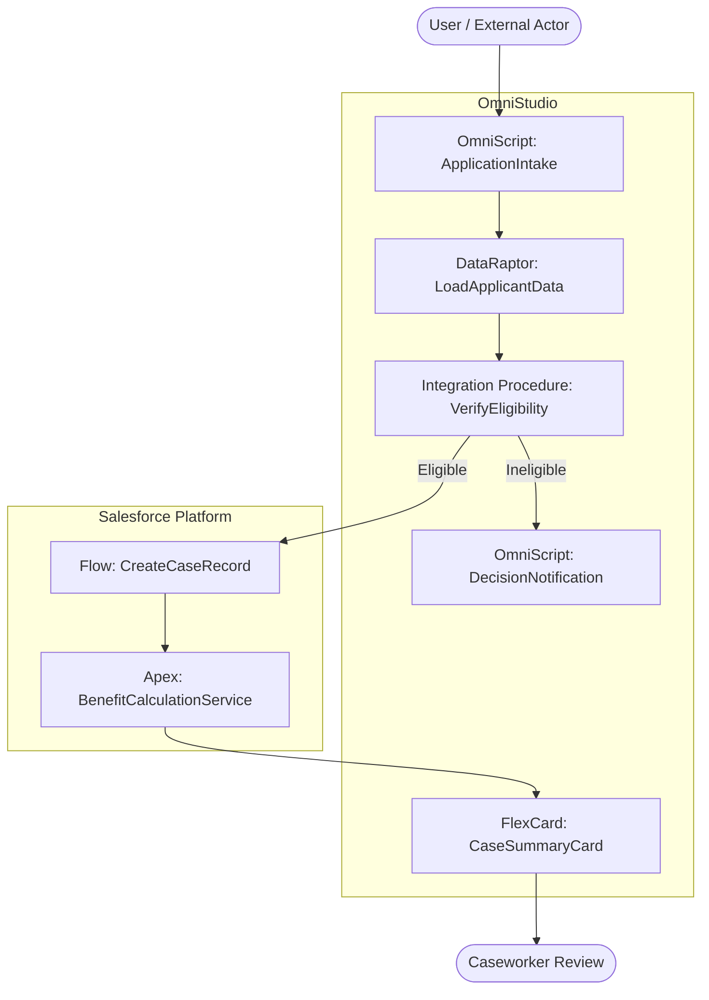

# Salesforce Solution Design Document Generator

Reads product summary `.md` files and data model reference `.md` files,
then produces a complete Solution Design Document (SDD) that:

1. Maps every requirement to the most appropriate Salesforce capability
   using a strict **declarative-first, low-code second, custom-code last**
   decision hierarchy
2. Documents the solution approach for each requirement
3. Produces a **Mermaid solution flow diagram** showing how components
   interact end-to-end

All source files are `.md` format.

---

## Step 1 — List and Read All Source Files

Before reading anything, list the contents of both folders:

```bash
ls productsummary/
ls datamodel/
```

Note every filename — these will be cited as sources throughout the
document. If either folder is empty, record it in the output under
**Assumptions & Gaps** and continue with what is available.

---

## Step 2 — Read the Product Summary Files

Read **every** `.md` file in `productsummary/`.

Extract and catalogue the following:

### 2.1 Functional Requirements
- Every stated feature, capability, or system behaviour
- User-facing processes (intake, submission, assessment, approval,
  notification, payment, reporting, case management, etc.)
- Integrations with external systems or data sources
- Automation rules, triggers, or workflows described
- User roles and personas interacting with the system

### 2.2 Non-Functional Requirements
- Performance expectations
- Security and access control rules
- Compliance, audit, or data retention needs
- Scalability or volume constraints

### 2.3 Implicit Solution Needs
Look beyond explicit mentions — infer solution needs from business
processes. For example:
- "guide user through application" → likely an OmniScript step-by-step UI
- "fetch data from external API" → likely an Integration Procedure
- "transform and map data" → likely a DataRaptor
- "automatically assign case on submission" → likely a Flow or
  Assignment Rule
- "complex eligibility calculation with branching logic" → may need
  Apex if rule complexity exceeds Flow capability
- "custom UI with real-time validation" → may need LWC

Assign a preliminary solution type to each requirement at this stage —
you will validate it against the hierarchy in Step 4.

---

## Step 3 — Read the Data Model Files

Read **every** `.md` file in `datamodel/`.

For each file, note:
- Standard objects relevant to the requirements
- Custom objects or fields already identified (from a prior data model
  impact analysis if available)
- Object relationships relevant to solution design
- Any OmniStudio-specific data model objects
  (e.g. `OmniProcess`, `DataRaptorBundle`, `IntegrationProcedure`)

Use this to inform which objects the solution components will read from
or write to in the design.

---

## Step 4 — Apply the Solution Decision Hierarchy

### 4.0 — Declarative-First Principle (MUST follow this order)

**Always attempt to satisfy a requirement using the simplest, most
maintainable Salesforce capability first.** Apply this hierarchy strictly
for every requirement — do not skip levels, do not default to code:

```
Level 1 → STANDARD OUT-OF-BOX (OOB)
          Can standard Salesforce features meet this with zero
          configuration or minimal setup?
          Examples: standard page layouts, record types, list views,
          reports & dashboards, approval processes, assignment rules,
          escalation rules, standard flows (screen flow / record-triggered),
          email alerts, path guidance, in-app guidance.
              YES → Use OOB. Document which feature. Stop here.
               ↓ NO

Level 2 → LOW-CODE / DECLARATIVE CUSTOMISATION
          Can this be met using declarative tools that require
          configuration but no Apex code?

          2a. OmniStudio — for guided user journeys and data operations:
              - OmniScript    : multi-step guided UI processes
              - DataRaptor    : read / transform / write data without code
              - Integration Procedure : orchestrate multi-step server-side
                                        logic and external callouts
              - FlexCard      : contextual data display components

          2b. Salesforce Flow — for automation and business logic:
              - Screen Flow           : user-facing guided processes (when
                                        OmniScript is not already in scope)
              - Record-Triggered Flow : automation on record create/update
              - Scheduled Flow        : time-based automation
              - Auto-launched Flow    : called from other processes

          2c. Other declarative tools:
              - Validation Rules, Formula Fields, Roll-Up Summary Fields
              - Einstein features (if licensed)
              - Platform Events (declarative pub/sub)

              YES → Use the appropriate low-code tool. Stop here.
               ↓ NO

Level 3 → CUSTOM CODE
          Only if Levels 1 and 2 are fully exhausted and documented.
          Use the minimum code approach that satisfies the requirement:

          3a. Apex — for complex business logic, bulk processing,
              callouts requiring response handling, platform event
              triggers, or logic that exceeds Flow governor limits
          3b. LWC (Lightning Web Component) — for custom UI that cannot
              be achieved with standard components, OmniScript, or
              FlexCards; or for high-interactivity client-side behaviour
          3c. Apex + LWC — only when both custom logic and custom UI
              are genuinely required together

              → Document why Levels 1 and 2 were ruled out before
                proposing any code-based solution.
```

**Code is a last resort.** Every Level 3 decision must include a written
justification explaining why Levels 1 and 2 were insufficient.

---

### 4.1 — Classify Each Requirement

Work through the hierarchy for every requirement and assign:

| Classification | Meaning |
|---|---|
| **OOB** | Met by standard Salesforce out-of-box feature |
| **OmniScript** | Guided multi-step user process |
| **DataRaptor** | Data read / transform / write operation |
| **Integration Procedure** | Server-side orchestration / external callout |
| **FlexCard** | Contextual data display |
| **Flow** | Declarative automation or screen-guided process |
| **Apex** | Custom server-side business logic |
| **LWC** | Custom UI component |
| **Apex + LWC** | Custom logic with custom UI |
| **Hybrid** | Combination of low-code + code (document both) |

For each requirement, record:
- The chosen solution type from the table above
- The specific Salesforce feature or component name
- A one-line rationale
- Why the level(s) above were skipped (if not OOB)

---

### 4.2 — OmniStudio Component Design

For every requirement assigned to an OmniStudio component:

**OmniScript:**
- Script name and description
- Steps and their sequence
- Input fields per step
- Conditional branching logic
- Integration Procedures or DataRaptors called
- Object(s) written to on completion

**DataRaptor:**
- DataRaptor name and type (Extract / Transform / Load / Turbo Extract)
- Source object(s) and fields read
- Target object(s) and fields written
- Transformation or mapping logic
- Called by (OmniScript step / Integration Procedure / FlexCard)

**Integration Procedure:**
- Procedure name
- Steps in sequence (HTTP Action, DataRaptor Action, Conditional, Loop, etc.)
- External endpoint(s) called (if any)
- Data in / data out
- Error handling approach

**FlexCard:**
- Card name and purpose
- Data source (DataRaptor or SOQL)
- Fields displayed
- Actions available (buttons, flyouts, OmniScript launchers)

---

### 4.3 — Flow Design

For every requirement assigned to a Flow:

- Flow name, type (Screen / Record-Triggered / Scheduled / Auto-launched)
- Trigger: object, when (before/after save, on create/update/delete)
- Entry criteria
- Key steps in the flow (decisions, loops, actions, subflows)
- Objects read from and written to
- External actions called (if any)

---

### 4.4 — Apex Design

For every requirement assigned to Apex:

- Class or trigger name
- Pattern: Trigger + Handler, Service class, Batch, Queueable, Schedulable,
  REST/SOAP callout, Platform Event handler
- Key methods and their purpose
- Bulkification approach
- Test class requirements
- Justification for why Flow could not satisfy this (mandatory)

---

### 4.5 — LWC Design

For every requirement assigned to LWC:

- Component name
- Placement: App Page / Record Page / Experience Cloud / OmniScript embed
- Parent-child component structure (if applicable)
- Wire adapters or Apex methods called
- Events emitted or handled
- Justification for why standard UI or OmniScript could not satisfy this

---

## Step 5 — Write the Output Document

Write the full document using exactly this structure:

---

```markdown
# Solution Design Document
**Product / Feature:** [name from product summary]
**Date:** [today's date]
**Version:** 0.1
**Status:** Draft
**Product Summary Sources:** [list productsummary filenames]
**Data Model Sources:** [list datamodel filenames]

---

## 1. Executive Summary

[3–5 sentences covering: what is being built, the dominant solution
approach (OOB / low-code / code ratio), key OmniStudio components used,
any custom code introduced and why, overall complexity assessment.]

---

## 2. Solution Approach Summary

High-level breakdown of how requirements are being met:

| Approach | Count | % of Requirements |
|---|---|---|
| Standard OOB | X | X% |
| OmniScript | X | X% |
| DataRaptor | X | X% |
| Integration Procedure | X | X% |
| FlexCard | X | X% |
| Flow | X | X% |
| Apex | X | X% |
| LWC | X | X% |
| Hybrid | X | X% |
| **Total** | **X** | **100%** |

---

## 3. Requirements to Solution Mapping

| Req ID | Requirement Summary | Solution Type | Component / Feature Name | Rationale | Levels Skipped |
|---|---|---|---|---|---|
| REQ-001 | [summary] | OmniScript | [ScriptName] | [why] | N/A |
| REQ-002 | [summary] | Apex | [ClassName] | [why] | L1: [reason], L2: [reason] |

---

## 4. Component Design

### 4.1 Standard OOB Features

| # | Feature | Configuration Required | Requirement(s) |
|---|---|---|---|
| 1 | [e.g. Approval Process] | [brief config note] | REQ-00X |

---

### 4.2 OmniStudio Components

#### OmniScripts

##### [OmniScript Name]
- **Purpose:** [what it does]
- **Trigger:** [how it is launched — button, FlexCard, URL, etc.]
- **Steps:**
  1. [Step name] — [description, fields, any DataRaptor/IP called]
  2. [Step name] — [description]
- **Branching Logic:** [conditions that change the path]
- **Writes To:** [object(s)]
- **Requirements:** REQ-00X

---

#### DataRaptors

##### [DataRaptor Name] — [Type: Extract / Load / Transform / Turbo Extract]
- **Purpose:** [what it does]
- **Source:** [object and fields]
- **Target:** [object and fields]
- **Mapping / Transform Logic:** [key rules]
- **Called By:** [component name]
- **Requirements:** REQ-00X

---

#### Integration Procedures

##### [Integration Procedure Name]
- **Purpose:** [what it orchestrates]
- **Steps:**
  1. [Step type] — [description]
  2. [Step type] — [description]
- **External Endpoint:** [URL / system name, or N/A]
- **Input:** [key fields]
- **Output:** [key fields]
- **Error Handling:** [approach]
- **Requirements:** REQ-00X

---

#### FlexCards

##### [FlexCard Name]
- **Purpose:** [what it displays]
- **Data Source:** [DataRaptor or SOQL]
- **Fields Displayed:** [list]
- **Actions:** [buttons, flyouts, OmniScript launchers]
- **Requirements:** REQ-00X

---

### 4.3 Flows

##### [Flow Name] — [Type]
- **Trigger:** [object / schedule / platform event]
- **Entry Criteria:** [conditions]
- **Key Steps:** [numbered list of major decision/action nodes]
- **Reads From:** [objects]
- **Writes To:** [objects]
- **Requirements:** REQ-00X

---

### 4.4 Apex

##### [Class / Trigger Name] — [Pattern]
- **Purpose:** [what it does]
- **Key Methods:** [method names and purpose]
- **Bulkification:** [approach]
- **Test Class:** [ClassName_Test]
- **Why Flow / Low-Code Was Insufficient:** [mandatory justification]
- **Requirements:** REQ-00X

---

### 4.5 LWC

##### [Component Name]
- **Purpose:** [what it renders]
- **Placement:** [where it is deployed]
- **Structure:** [parent/child breakdown if applicable]
- **Data:** [wire adapters or Apex methods called]
- **Events:** [emitted / handled]
- **Why Standard UI / OmniScript Was Insufficient:** [mandatory justification]
- **Requirements:** REQ-00X

---

## 5. Solution Flow Diagram

The following Mermaid diagram shows the end-to-end solution flow across
all components. OOB features are shown in plain boxes. OmniStudio
components are prefixed `[OS]`. Flows are prefixed `[FL]`. Apex is
prefixed `[APX]`. LWC is prefixed `[LWC]`. External systems are shown
as actors on the boundary.



**Diagram conventions:**
- Rounded rectangles `([...])` = external actors / users
- Plain rectangles `[...]` = Salesforce components
- Arrows show data/control flow direction
- `subgraph` blocks group components by layer
- Prefix legend: `[OS]` OmniStudio, `[FL]` Flow, `[APX]` Apex, `[LWC]` LWC

---

## 6. Integration Points

| # | Integration Name | Direction | Protocol | External System | Salesforce Component | Authentication |
|---|---|---|---|---|---|---|
| 1 | [name] | Inbound / Outbound / Bidirectional | REST / SOAP / Platform Event / File | [system] | Integration Procedure / Apex | OAuth / Named Credential / API Key |

If no integrations are required, write: _No external integrations required._

---

## 7. Security & Access Design

| # | Requirement | Approach | Salesforce Feature |
|---|---|---|---|
| 1 | [e.g. Caseworkers can only see assigned cases] | [Record-level security] | Sharing Rules / OWD |

---

## 8. Assumptions & Gaps

| # | Item | Impact | Recommendation |
|---|---|---|---|
| 1 | [What was assumed or is missing] | [How it affects the design] | [What to do] |

---

## 9. Recommendations & Risks

**Recommendations:**
- [Key guidance for the implementation team]

**Risks:**
| # | Risk | Likelihood | Impact | Mitigation |
|---|---|---|---|---|
| 1 | [risk description] | High / Medium / Low | High / Medium / Low | [mitigation] |

---

## 10. Revision History

| Version | Date | Author | Notes |
|---|---|---|---|
| 0.1 | [today] | Claude | Initial solution design |
```

---

## Step 6 — Quality Check

Before saving, verify:

- [ ] Every requirement is accounted for in Section 3
- [ ] Every requirement was evaluated at all levels of the decision hierarchy
- [ ] No Apex or LWC component exists without a written justification for
      why OOB and low-code approaches were insufficient
- [ ] Every OmniStudio component has full design detail in Section 4.2
- [ ] Every Flow has trigger, entry criteria, and steps documented
- [ ] Every Apex class has bulkification and test class noted
- [ ] The Mermaid diagram includes every component from Sections 4.1–4.5
- [ ] All component names in the diagram match exactly those in Section 4
- [ ] Integration points table is complete (or explicitly marked N/A)
- [ ] Assumptions & Gaps covers missing source files or ambiguous requirements
- [ ] Section 2 summary table counts add up to total requirements

---

## Step 7 — Save and Present

Save the completed file to the `/mnt/user-data/outputs/` folder —
**not** the `output/` subfolder inside the skill directory:

```
/mnt/user-data/outputs/solution-design-[product-name]-[YYYY-MM-DD].md
```

Use lowercase, hyphen-separated words for the product name.
Example: `/mnt/user-data/outputs/solution-design-social-insurance-claims-2026-06-11.md`

The file must be fully written to disk before calling `present_files`.
Then call `present_files` with the full absolute path so the user can
download it immediately.

After presenting, give the user a brief summary covering:
- Total requirements designed
- Breakdown by solution type (OOB / Low-code / Code counts and %)
- Names of all OmniStudio components introduced
- Names of any Apex classes or LWC components introduced, each with a
  one-line justification
- Any open assumptions or risks the team should resolve before build
