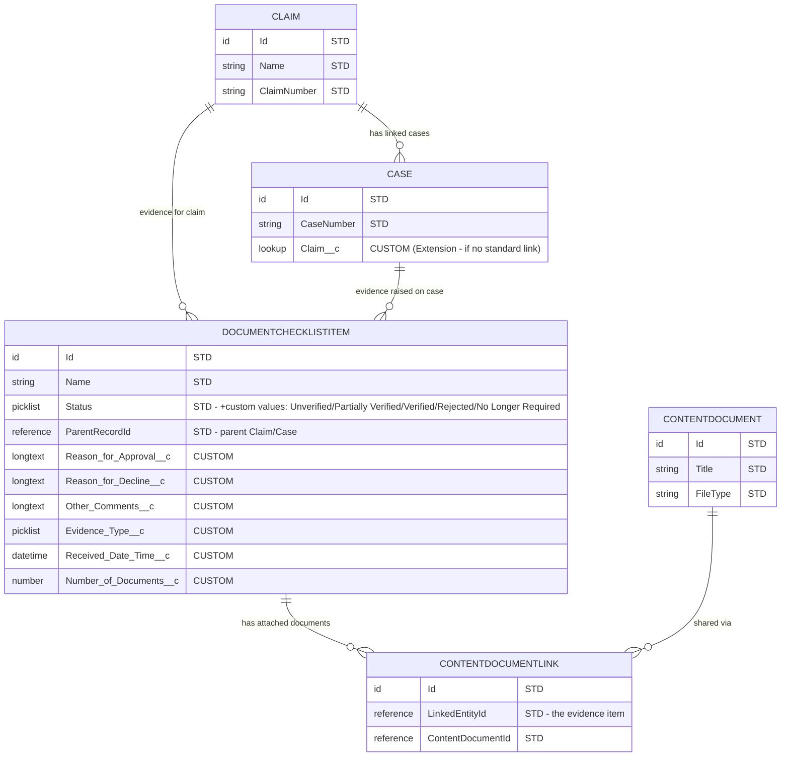

# Salesforce Data Model Impact Analysis
**Product / Feature:** RTWSA — Interim Benefits: Review & Verify Evidence (Process 2.4.1 Review evidence)
**Date:** 2026-06-11
**Reference Models:** `benefit-management-a878da6d.md`, `social-program-management-286c461c.md`, `application-authorization-6551f33c.md`, `grantmaking-2e4fb43e.md`, `grantmaking-app-form-bb72f298.md`, `provider-management-c0e289b9.md`, `pss-overview-91483e37.md`
**Product Summary Sources:** `productsummary/product-summary.md`

> **Sourcing note.** The `datamodel-reference/*.md` files contain object **labels only** — no API names, field definitions, data types, or relationships (the structural detail lives in the linked Salesforce diagram PNGs, which are not machine-readable here). API names, field types, picklist semantics and relationships in this analysis are therefore derived from Salesforce Public Sector Solutions / Social Insurance domain knowledge and **must be validated against the target org's metadata before build**. Every such inference is logged in Section 6 (Assumptions & Gaps).

---

## 1. Executive Summary

The Review & Verify Evidence feature is satisfied **entirely by standard Salesforce objects** — **no new custom objects are required**. Five standard objects are impacted: `DocumentChecklistItem` (the evidence item — **Partial Match**, 6 custom fields + custom Status picklist values), `Claim` and `Case` (parents — Full Match for context, with one **Extension** to relate Case to Claim if no standard link exists), and the standard Files stack `ContentDocument` / `ContentDocumentLink` (document storage and preview — Full Match). In total **6 custom fields** and **~5 custom picklist values** are proposed on `DocumentChecklistItem`, plus **one lookup relationship** (Case → Claim) pending confirmation. The principal risks are (a) confirming the Claim↔Case relationship already present in the org, and (b) the "Number of Documents" count, which cannot be a native roll-up summary on `DocumentChecklistItem` and will need a Flow/Apex-maintained field.

---

## 2. Data Model Impact Table

| # | Standard Object (API Name) | Object Label | Solution | Impact Type | Custom Fields Required | Requirement Source |
|---|---|---|---|---|---|---|
| 1 | `DocumentChecklistItem` | Document Checklist Item (Evidence Item) | PSS / Social Insurance (Benefit & Application Mgmt) | Partial Match | See Section 3 (6 fields + custom Status picklist values) | 2.4.1.1, 2.4.1.2, 2.4.1.3, 2.4.1.4 |
| 2 | `Claim` | Claim | PSS / Social Insurance (Benefit Management) | Full Match | NA | 2.4.1.1, 2.4.1.5 |
| 3 | `Case` | Case | PSS / Social Insurance (Benefit Management, Social Program Mgmt) | Extension | See Section 3 (Claim lookup) | 2.4.1.1 |
| 4 | `ContentDocument` | File (Salesforce Files) | Platform (standard) | Full Match | NA | 2.4.1.1, 2.4.1.3 |
| 5 | `ContentDocumentLink` | Content Document Link | Platform (standard) | Full Match | NA | 2.4.1.1, 2.4.1.3 |

**Impact Type definitions:**
- **Full Match** — standard object covers the requirement with no changes
- **Partial Match** — standard object needs custom fields added
- **No Match** — a new custom object must be created
- **Extension** — a new relationship or junction object is needed

> Security objects (`User`, `PermissionSet`, `PermissionSetGroup`) govern persona authority (EO-only status updates, MCM access) but are configuration, not data-model impacts — see Section 6 / Section 7.

---

## 3. Custom Fields Detail

### `DocumentChecklistItem` — Document Checklist Item (Evidence Item)

This is the standard object Salesforce provides for tracking items of documentation/evidence requested and verified against a parent record (Claim, Case, Application). It supplies `Name`, `Status`, document-type and parent-reference fields out of the box, and attaches the actual files via the standard Files stack. The feature's evidence-specific data is added as custom fields below.

| # | Field Label | API Name | Data Type | Required? | Description | Requirement Source |
|---|---|---|---|---|---|---|
| 1 | Reason for Approval | `Reason_for_Approval__c` | Long Text Area (32,768) | No | Structured rationale captured when evidence is approved/verified; surfaced in the Supporting Information summary. | 2.4.1.4 |
| 2 | Reason for Decline | `Reason_for_Decline__c` | Long Text Area (32,768) | No | Structured rationale captured when evidence is declined/rejected. | 2.4.1.4 |
| 3 | Other Comments | `Other_Comments__c` | Long Text Area (32,768) | No | Free-text supporting notes for auditability and the determination letter. | 2.4.1.4 |
| 4 | Evidence Type | `Evidence_Type__c` | Picklist | Yes | Categorises the evidence item (e.g. "AWE Calculation"); drives the document-required validation exemption. May instead reuse the standard `DocumentType` lookup — see gaps. | 2.4.1.2, 2.4.1.3 |
| 5 | Received Date & Time | `Received_Date_Time__c` | Date/Time | No | Business-meaningful timestamp of when evidence was received (distinct from `CreatedDate`); shown as a list column. May be satisfied by `CreatedDate` — see gaps. | 2.4.1.1 |
| 6 | Number of Documents | `Number_of_Documents__c` | Number (Flow/Apex maintained) | No | Count of files linked to the evidence item, shown in the list. **Cannot be a native roll-up summary** (`DocumentChecklistItem`→`ContentDocument` is not master-detail); maintain via record-triggered Flow or Apex on `ContentDocumentLink` change. | 2.4.1.1 |

**Status picklist values (configuration, not a new field).** The feature's verification lifecycle — **Unverified** (default), **Partially Verified**, **Verified**, **Rejected**, **No Longer Required** — should be applied as picklist values on the standard `Status` field of `DocumentChecklistItem`. If the standard `Status` field's semantics or restricted value set cannot accommodate these, fall back to a custom `Verification_Status__c` picklist (this would not change the Partial Match classification). _See gaps — confirm against org metadata._

**Validation rules (configuration, not fields)** — implemented as Validation Rules and/or Flow, no data-model impact:
- Block `Verified` / `Partially Verified` when no document is attached, **except** when `Evidence_Type__c = "AWE Calculation"`.
- Make `Verified` and `Rejected` final/irreversible (lock further status changes).
- Enforce the 32,768-character limit on the three rationale fields (inherent to the Long Text Area length above).

### `Case` — Case (Extension)

| # | Field Label | API Name | Data Type | Required? | Description | Requirement Source |
|---|---|---|---|---|---|---|
| 1 | Claim | `Claim__c` (or standard relationship if present) | Lookup → `Claim` | No | Links a Case to its parent Claim so the Claim-context evidence list can include evidence from linked cases. **Only add if no standard Claim↔Case relationship already exists** in the org — see Section 6 and the Extension note in Section 4-adjacent reasoning. | 2.4.1.1 |

### `Claim` — Claim
_No custom fields required — standard fields are sufficient._ Claim acts as the parent context for the evidence list and the aggregation point for the Supporting Information summary (Section 2.4.1.5), which reads the rationale fields off the related `DocumentChecklistItem` records — no new fields on `Claim` itself.

### `ContentDocument` / `ContentDocumentLink` — Files
_No custom fields required — standard fields are sufficient._ Document storage, the previewer pane, and multi-document navigation (2.4.1.3) all use the standard Files stack; multiple `ContentDocumentLink` rows against one evidence item provide the multi-document set.

---

## 4. New Custom Objects (if any)

_All requirements are satisfied by standard objects — no custom objects required._

**Standard-first reasoning for the evidence item (why `DocumentChecklistItem`, not a new `Evidence__c` object):**
- **Level 1 (standard object, no change):** Not sufficient alone — the feature needs to store approval/decline rationale and an evidence-type categorisation that the standard object does not carry.
- **Level 2 (standard object + custom fields):** **Satisfied here.** `DocumentChecklistItem` is purpose-built for "documentation/evidence requested and verified against a parent record," already provides `Name`, `Status`, parent reference and native file attachment, and supports the six custom fields in Section 3. This meets the requirement without a new object — so the hierarchy **stops at Level 2** and a custom object is **not** justified.
- **Levels 3–4 not reached** for the evidence item: a new relationship/junction or a new custom object would add complexity with no capability the standard object + fields cannot provide.

The only Level-3 (Extension) item in the feature is the **Case → Claim** lookup (Section 3), introduced solely to support the Claim-context evidence list, and only if a standard relationship is not already present.

---

## 5. ER Diagram

The following Mermaid ER diagram shows all impacted objects and their relationships. All impacted objects are standard `[STD]`; no new custom objects are introduced. Proposed custom fields are marked `"CUSTOM"`; representative standard fields are marked `"STD"`.

**Diagram conventions:**
- `||--o{` = one-to-many
- `||--||` = one-to-one
- `}o--o{` = many-to-many (via junction)
- Fields marked `"CUSTOM"` are proposed custom fields
- Fields marked `"STD"` are standard fields included for context

---

## 6. Assumptions & Gaps

| # | Item | Impact | Recommendation |
|---|---|---|---|
| 1 | Reference `.md` files contain object **labels only**; all API names, field types and relationships are inferred from PSS/Social Insurance knowledge, not the source docs. | Inferred metadata may not match the target org exactly. | Validate every API name, field type and relationship against the org's metadata (Setup → Object Manager) or the linked Salesforce diagram PNGs before build. |
| 2 | "Evidence item" is mapped to standard `DocumentChecklistItem`. | If the org models evidence on a different object (e.g. a Claim-related custom object already in use), the field placement changes. | Confirm the org's current evidence/document-tracking object before adding the six custom fields. |
| 3 | Verification statuses applied as **custom values on the standard `Status` field**; standard restricted value set may not permit them. | Could force a custom `Verification_Status__c` picklist instead. | Inspect `DocumentChecklistItem.Status` value set and restriction; decide standard-values vs custom field. |
| 4 | **Claim ↔ Case relationship** assumed not standard, hence the Case→Claim lookup Extension. | If a standard relationship already exists, the Extension is unnecessary; if cases relate to claims differently (e.g. junction), the model changes. | Confirm the existing Claim/Case relationship in the org before creating `Claim__c` on Case. |
| 5 | `Number_of_Documents__c` cannot be a native roll-up summary (no master-detail from `DocumentChecklistItem` to files). | Requires Flow/Apex to stay accurate; risk of drift if not maintained on file add/remove. | Implement a record-triggered Flow/Apex on `ContentDocumentLink`; or compute the count in the UI/LWC at render time instead of storing it. |
| 6 | `Received_Date_Time__c` may duplicate `CreatedDate`. | A redundant custom field if `CreatedDate` is acceptable as "received" time. | Confirm whether business needs a received time distinct from record creation; drop the field if not. |
| 7 | `Evidence_Type__c` may duplicate the standard `DocumentType` lookup on `DocumentChecklistItem`. | Risk of a custom field duplicating standard functionality. | Prefer the standard `DocumentType` if it can carry "AWE Calculation"; only add `Evidence_Type__c` if it cannot. |
| 8 | Persona permission sets / sharing rules are "Not specified" in the product summary; MCM status-update authority is unconfirmed. | Security model (EO-only updates, MCM read/write) is undefined. | Define Permission Set Groups / Permission Sets and sharing for EO and MCM before build; resolve the MCM authority gap. |
| 9 | Section 3.6 (Reporting): Excel export column layout for the Supporting Information report is unspecified. | Report/export build cannot be finalised. | Confirm export columns; the underlying data already exists on the `DocumentChecklistItem` custom fields — this is a reporting concern, not a data-model one. |
| 10 | Product summary Data Model section (3.3.1) is a manual placeholder. | No org-confirmed model to reconcile against. | Populate 3.3.1 from this analysis once API names/relationships are validated. |

---

## 7. Recommendations

- **Validate before build:** confirm `DocumentChecklistItem` is the org's evidence object, and verify all proposed API names, field types and the Status value set against org metadata or the Salesforce diagram PNGs.
- **Resolve the Claim↔Case relationship first** — it determines whether the Case→Claim lookup Extension is needed at all.
- **Design the "Number of Documents" mechanism deliberately** — Flow/Apex-maintained field vs UI-computed count; do not assume a roll-up summary.
- **Eliminate redundant custom fields** — prefer standard `DocumentType` over `Evidence_Type__c`, and `CreatedDate` over `Received_Date_Time__c`, if business rules allow.
- **Define the security model** — Permission Set Groups / Permission Sets and sharing rules for EO and MCM, and close the MCM status-update authority gap, before development.
- **Treat the Supporting Information summary and Excel export as a reporting layer** over the new `DocumentChecklistItem` fields — no additional data-model objects required; confirm the export column layout.
- **No custom objects** should be introduced for this feature; if any future requirement appears to need one, re-run the Level 1–3 standard-first checks first.

---

## 8. Revision History

| Version | Date | Author | Notes |
|---|---|---|---|
| 0.1 | 2026-06-11 | Claude | Initial data model impact analysis — RTWSA Review & Verify Evidence. |
