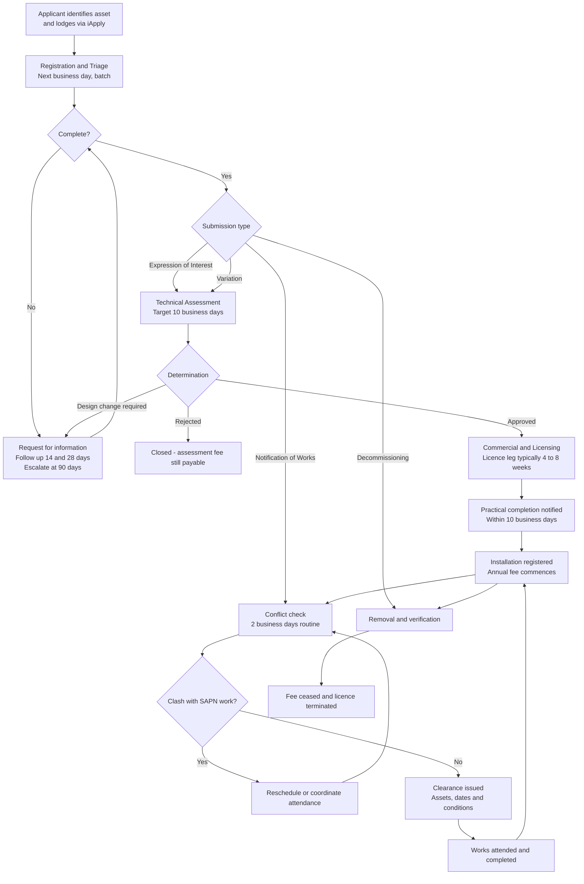
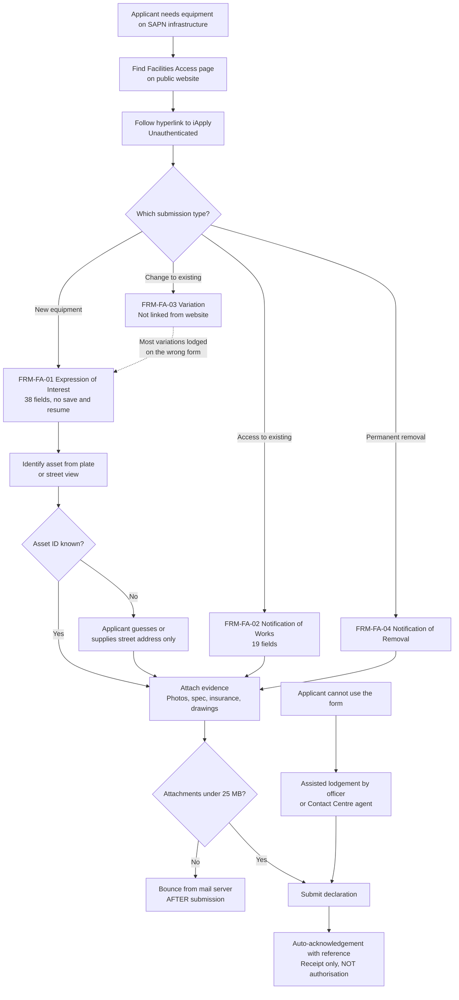
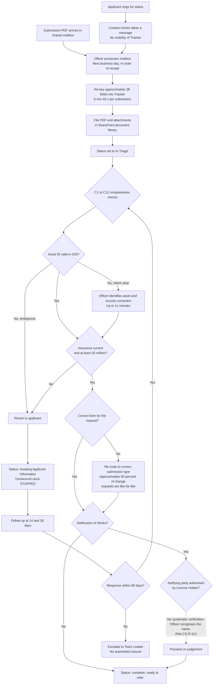
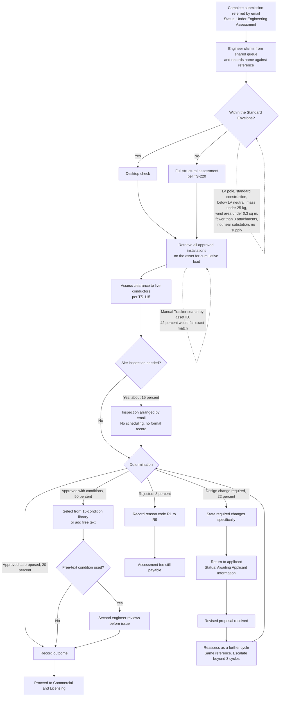
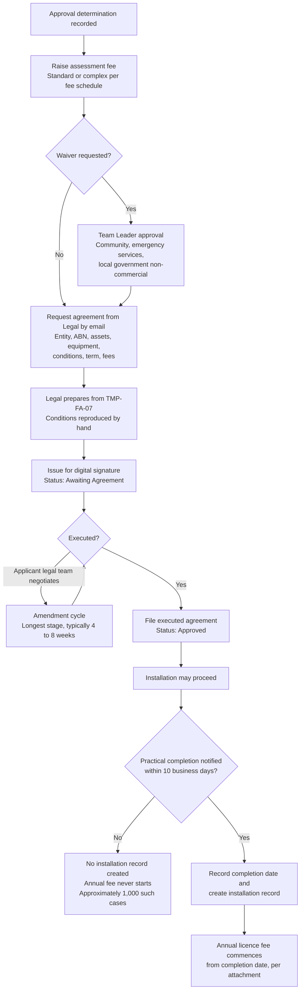
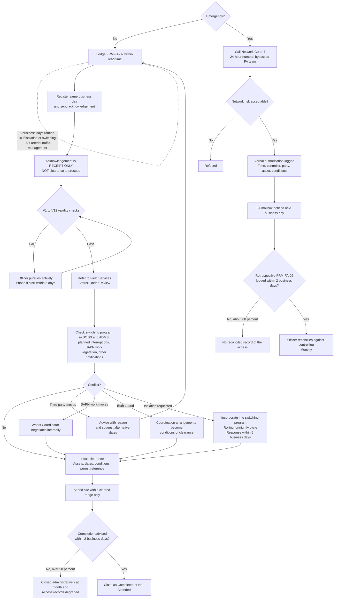
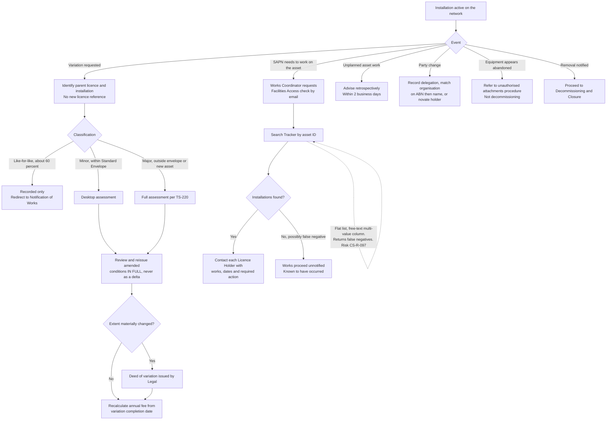
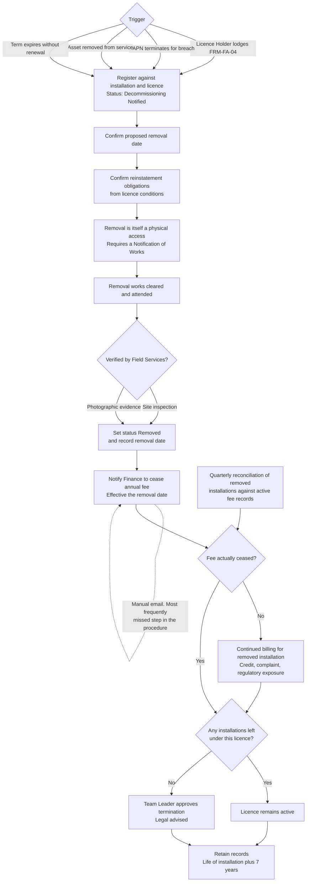

# Capability & Process Map
**Project / Feature:** SAPN_DEMO / project-wide — SA Power Networks, Facilities Access capability
**Date:** 25 August 2026
**Documents read:** 9 across Notes, SOP, Transcripts and product-summary — plus 2 pipeline test artefacts under project/root that carry no client content

---

## 1. Executive Summary

This map covers SA Power Networks' **Facilities Access** capability — the receipt, assessment, approval and lifelong administration of third-party equipment attached to SAPN distribution assets. Every discovery document staged for this project concerns that capability and the QT3934 CX Transformation programme that is replacing the systems behind it. The model comprises **8 L1 domains, 22 L2 capability groups and 68 L3 capabilities**, against a process model of **7 lifecycle phases, 25 L2 steps and 87 L3 activities**.

The dominant maturity finding is that this capability is **not implemented as a system**. ARC-CX-014 states it plainly: Facilities Access is a business process executed by two people using a shared mailbox, a spreadsheet and a document library, with a set of unauthenticated forms at the front whose only output is an emailed PDF. Of 68 L3 capabilities, **15 do not exist at all today** and **41 exist only in manual, single-person-dependent form**; just 12 reach Operational, and those are the documented engineering and procedural controls — Standard Envelope screening, structural assessment, conflict checking, clearance issue and procedure governance. Nothing reaches Optimised. The largest current-to-target gaps are the capabilities that must move from **None to Optimised**: business rule configuration, assessment threshold versioning, map-based asset selection, operational reporting, system integration and enterprise data platform integration.

Two of the gaps are safety controls rather than efficiency ones, and both are on the Customer Solutions risk register. **Delegation & Authority Management (6.1.3)** means SAPN cannot verify that a contractor lodging works has authority from the licence holder — the check is satisfied by an officer recognising the organisation name (CS-R-114). **Reverse Asset Lookup (5.3.1)** means SAPN cannot reliably answer "who has equipment on this asset": 42% of a sampled hundred asset references would fail an exact match, and SAPN works have proceeded without notifying affected licence holders (CS-R-097). A third, **Access Authorisation & Clearance (3.3.2)**, is Operational in procedure but carries the ambiguity between *Received* and *Cleared* that has put crews on poles on the strength of an acknowledgement.

The biggest evidence gap is **commercial ownership**. Fee raising, fee cessation and agreement generation sit on the critical path, are the source of the documented revenue leakage in both directions, and — as ARC-CX-014 constraint C10 and the BA's open question Q4 both record — have no owner in the programme and no agreed architecture. Neither Legal & Commercial nor Finance was represented in any staged document. **13 L3 capabilities have no supporting process activity**, which is a true finding rather than a modelling defect: they are the target-state capabilities that no current procedure performs at all.

---

## 2. Business Capability Map

| ID | Capability | Level | Parent | Lifecycle Stage | Current | Target | Source |
|---|---|---|---|---|---|---|---|
| 1.0 | **Customer & Partner Engagement** | 1 | — | Discovery & Lodgement | — | — | SOP-FA-001, Workshop 11 Aug 2026, ARC-CX-014, RFT Introduction QT3934 |
| 1.1 | Channel & Access Management | 2 | 1.0 | Discovery & Lodgement | — | — | SOP-FA-001, ARC-CX-014, Workshop 11 Aug 2026 |
| 1.1.1 | Digital Channel Provision | 3 | 1.1 | Discovery & Lodgement | Foundational | Optimised | SOP-FA-001, ARC-CX-014, Workshop 11 Aug 2026, BA Working Notes |
| 1.1.2 | Assisted Lodgement | 3 | 1.1 | Discovery & Lodgement | Foundational | Operational | SOP-FA-001, Workshop 11 Aug 2026, BA Working Notes |
| 1.1.3 | Enquiry & Contact Handling | 3 | 1.1 | Discovery & Lodgement | Foundational | Optimised | SOP-FA-001, Workshop 11 Aug 2026, ARC-CX-014, BA Working Notes |
| 1.2 | Applicant Communication | 2 | 1.0 | Discovery & Lodgement | — | — | SOP-FA-001, SOP-FA-002, Workshop 11 Aug 2026 |
| 1.2.1 | Transactional Notification Management | 3 | 1.2 | Discovery & Lodgement | Foundational | Optimised | SOP-FA-001, SOP-FA-002, Workshop 11 Aug 2026, ARC-CX-014 |
| 1.2.2 | Communication Preference Management | 3 | 1.2 | Discovery & Lodgement | None | Operational | ARC-CX-014, Workshop 11 Aug 2026 |
| 1.2.3 | Status Transparency & Self-Service Enquiry | 3 | 1.2 | Discovery & Lodgement | None | Optimised | SOP-FA-001, Workshop 11 Aug 2026, BA Working Notes |
| 1.2.4 | Customer Feedback & Satisfaction Measurement | 3 | 1.2 | Discovery & Lodgement | None | Operational | ARC-CX-014 |
| 2.0 | **Facilities Access Lifecycle Management** | 1 | — | Registration & Triage | — | — | SOP-FA-001, SOP-FA-002, SOP-FA-003, Workshop 11 Aug 2026 |
| 2.1 | Submission Intake & Registration | 2 | 2.0 | Registration & Triage | — | — | SOP-FA-001, SOP-FA-002, ARC-CX-014 |
| 2.1.1 | Submission Capture & Registration | 3 | 2.1 | Registration & Triage | Foundational | Optimised | SOP-FA-001, SOP-FA-002, ARC-CX-014, BA Working Notes |
| 2.1.2 | Completeness & Validity Verification | 3 | 2.1 | Registration & Triage | Operational | Optimised | SOP-FA-001, SOP-FA-002 |
| 2.1.3 | Submission Type Classification & Routing | 3 | 2.1 | Registration & Triage | Foundational | Operational | SOP-FA-003, SOP-FA-002, Workshop 11 Aug 2026 |
| 2.1.4 | Work Queue & Assignment Management | 3 | 2.1 | Registration & Triage | Foundational | Operational | SOP-FA-001, ARC-CX-014, Workshop 11 Aug 2026 |
| 2.2 | Case Progression & Service Levels | 2 | 2.0 | Registration & Triage | — | — | SOP-FA-001, Workshop 11 Aug 2026, ARC-CX-014 |
| 2.2.1 | Submission Status & State Management | 3 | 2.2 | Registration & Triage | Foundational | Operational | SOP-FA-001, SOP-FA-002, ARC-CX-014, BA Working Notes |
| 2.2.2 | Service Level & Turnaround Management | 3 | 2.2 | Registration & Triage | Foundational | Optimised | SOP-FA-001, Workshop 11 Aug 2026, ARC-CX-014 |
| 2.2.3 | Applicant Follow-up & Dormancy Management | 3 | 2.2 | Registration & Triage | Foundational | Operational | SOP-FA-001, Workshop 11 Aug 2026 |
| 2.3 | Change & Removal Request Management | 2 | 2.0 | Installation Lifecycle Management | — | — | SOP-FA-003, Workshop 11 Aug 2026 |
| 2.3.1 | Variation Request Management | 3 | 2.3 | Installation Lifecycle Management | Foundational | Operational | SOP-FA-003, Workshop 11 Aug 2026, BA Working Notes |
| 2.3.2 | Decommissioning Request Management | 3 | 2.3 | Decommissioning & Closure | Foundational | Operational | SOP-FA-003, Workshop 11 Aug 2026 |
| 3.0 | **Network Safety & Technical Assurance** | 1 | — | Technical Assessment | — | — | SOP-FA-001, SOP-FA-002, Workshop 11 Aug 2026 |
| 3.1 | Engineering Assessment | 2 | 3.0 | Technical Assessment | — | — | SOP-FA-001, SOP-FA-003, Workshop 11 Aug 2026 |
| 3.1.1 | Structural & Clearance Assessment | 3 | 3.1 | Technical Assessment | Operational | Optimised | SOP-FA-001, Workshop 11 Aug 2026, BA Working Notes |
| 3.1.2 | Standard Envelope Screening | 3 | 3.1 | Technical Assessment | Operational | Optimised | SOP-FA-001, Workshop 11 Aug 2026 |
| 3.1.3 | Cumulative Attachment Assessment | 3 | 3.1 | Technical Assessment | Foundational | Optimised | SOP-FA-003, BA Working Notes, Workshop 11 Aug 2026 |
| 3.1.4 | Assessment Threshold & Standards Configuration | 3 | 3.1 | Technical Assessment | None | Optimised | BA Working Notes, Workshop 11 Aug 2026, ARC-CX-014 |
| 3.1.5 | Site Inspection Management | 3 | 3.1 | Technical Assessment | Foundational | Operational | SOP-FA-001, BA Working Notes |
| 3.2 | Determination & Conditions | 2 | 3.0 | Technical Assessment | — | — | SOP-FA-001, Workshop 11 Aug 2026 |
| 3.2.1 | Determination & Outcome Recording | 3 | 3.2 | Technical Assessment | Operational | Optimised | SOP-FA-001, Workshop 11 Aug 2026 |
| 3.2.2 | Conditions Management | 3 | 3.2 | Technical Assessment | Foundational | Optimised | SOP-FA-001, Workshop 11 Aug 2026, ARC-CX-014 |
| 3.2.3 | Design Change & Reassessment Cycle Management | 3 | 3.2 | Technical Assessment | Foundational | Operational | SOP-FA-001, Workshop 11 Aug 2026 |
| 3.3 | Works Safety Coordination | 2 | 3.0 | Works Notification & Clearance | — | — | SOP-FA-002, Workshop 11 Aug 2026 |
| 3.3.1 | Conflict & Clash Detection | 3 | 3.3 | Works Notification & Clearance | Operational | Optimised | SOP-FA-002 |
| 3.3.2 | Access Authorisation & Clearance | 3 | 3.3 | Works Notification & Clearance | Operational | Optimised | SOP-FA-002, Workshop 11 Aug 2026, BA Working Notes |
| 3.3.3 | Isolation & Switching Coordination | 3 | 3.3 | Works Notification & Clearance | Operational | Operational | SOP-FA-002, Workshop 11 Aug 2026 |
| 3.3.4 | Competency & Permit Verification | 3 | 3.3 | Works Notification & Clearance | Foundational | Operational | SOP-FA-002, ARC-CX-014 |
| 3.3.5 | Emergency Access Authorisation | 3 | 3.3 | Works Notification & Clearance | Foundational | Operational | SOP-FA-002, Workshop 11 Aug 2026, ARC-CX-014, BA Working Notes |
| 4.0 | **Commercial & Licence Administration** | 1 | — | Commercial & Licensing | — | — | SOP-FA-001, SOP-FA-003 |
| 4.1 | Agreement Management | 2 | 4.0 | Commercial & Licensing | — | — | SOP-FA-001, SOP-FA-003, Workshop 11 Aug 2026 |
| 4.1.1 | Licence Agreement Preparation & Execution | 3 | 4.1 | Commercial & Licensing | Operational | Optimised | SOP-FA-001, Workshop 11 Aug 2026, ARC-CX-014 |
| 4.1.2 | Licence Variation & Novation Management | 3 | 4.1 | Commercial & Licensing | Foundational | Operational | SOP-FA-003 |
| 4.1.3 | Licence Term & Termination Management | 3 | 4.1 | Commercial & Licensing | Foundational | Operational | SOP-FA-003 |
| 4.2 | Revenue & Fee Management | 2 | 4.0 | Commercial & Licensing | — | — | SOP-FA-001, SOP-FA-003, ARC-CX-014 |
| 4.2.1 | Fee Determination & Raising | 3 | 4.2 | Commercial & Licensing | Foundational | Operational | SOP-FA-001, ARC-CX-014, BA Working Notes |
| 4.2.2 | Fee Cessation & Revenue Assurance | 3 | 4.2 | Commercial & Licensing | Foundational | Operational | SOP-FA-003, ARC-CX-014 |
| 4.2.3 | Fee Waiver & Concession Management | 3 | 4.2 | Commercial & Licensing | Operational | Operational | SOP-FA-001 |
| 5.0 | **Asset & Installation Information Management** | 1 | — | Installation Lifecycle Management | — | — | SOP-FA-003, ARC-CX-014, Workshop 11 Aug 2026 |
| 5.1 | Asset Identification & Reference | 2 | 5.0 | Discovery & Lodgement | — | — | SOP-FA-001, Workshop 11 Aug 2026, BA Working Notes |
| 5.1.1 | Network Asset Identification & Validation | 3 | 5.1 | Discovery & Lodgement | Foundational | Optimised | SOP-FA-001, BA Working Notes, Workshop 11 Aug 2026 |
| 5.1.2 | Spatial & Map-Based Asset Selection | 3 | 5.1 | Discovery & Lodgement | None | Optimised | Workshop 11 Aug 2026, ARC-CX-014 |
| 5.2 | Installation Register | 2 | 5.0 | Installation Lifecycle Management | — | — | SOP-FA-003, ARC-CX-014 |
| 5.2.1 | Installation Registration & Lifecycle Tracking | 3 | 5.2 | Installation Lifecycle Management | Foundational | Optimised | SOP-FA-003, ARC-CX-014, BA Working Notes, Workshop 11 Aug 2026 |
| 5.2.2 | Practical Completion Verification | 3 | 5.2 | Installation Lifecycle Management | Foundational | Operational | SOP-FA-001, SOP-FA-003 |
| 5.2.3 | Attachment & Equipment Inventory Management | 3 | 5.2 | Installation Lifecycle Management | Foundational | Operational | SOP-FA-003, SOP-FA-001 |
| 5.3 | Asset-Centric Retrieval & Proactive Contact | 2 | 5.0 | Installation Lifecycle Management | — | — | SOP-FA-003, ARC-CX-014, Workshop 11 Aug 2026 |
| 5.3.1 | Reverse Asset Lookup | 3 | 5.3 | Installation Lifecycle Management | Foundational | Optimised | SOP-FA-003, ARC-CX-014, Workshop 11 Aug 2026, BA Working Notes |
| 5.3.2 | Asset-Driven Licence Holder Notification | 3 | 5.3 | Installation Lifecycle Management | Foundational | Optimised | SOP-FA-003, BA Working Notes, Workshop 11 Aug 2026 |
| 5.3.3 | Access History & Record Reconciliation | 3 | 5.3 | Installation Lifecycle Management | Foundational | Operational | SOP-FA-002, SOP-FA-003 |
| 6.0 | **External Party & Identity Management** | 1 | — | Discovery & Lodgement | — | — | SOP-FA-003, ARC-CX-014, Workshop 11 Aug 2026 |
| 6.1 | Party & Organisation Management | 2 | 6.0 | Discovery & Lodgement | — | — | SOP-FA-003, ARC-CX-014, Workshop 11 Aug 2026 |
| 6.1.1 | Organisation Master Data Management | 3 | 6.1 | Discovery & Lodgement | Foundational | Optimised | SOP-FA-003, ARC-CX-014, BA Working Notes, Workshop 11 Aug 2026 |
| 6.1.2 | Multi-Party Role Management | 3 | 6.1 | Discovery & Lodgement | Foundational | Operational | SOP-FA-003, Workshop 11 Aug 2026, ARC-CX-014 |
| 6.1.3 | Delegation & Authority Management | 3 | 6.1 | Discovery & Lodgement | Foundational | Optimised | SOP-FA-003, SOP-FA-002, Workshop 11 Aug 2026, ARC-CX-014 |
| 6.2 | External Identity & Access | 2 | 6.0 | Discovery & Lodgement | — | — | ARC-CX-014, Workshop 11 Aug 2026 |
| 6.2.1 | External User Authentication | 3 | 6.2 | Discovery & Lodgement | None | Operational | ARC-CX-014, Workshop 11 Aug 2026 |
| 6.2.2 | External Authorisation & Portfolio Visibility | 3 | 6.2 | Discovery & Lodgement | None | Operational | ARC-CX-014, Workshop 11 Aug 2026 |
| 6.2.3 | Customer-Managed User Administration | 3 | 6.2 | Discovery & Lodgement | None | Operational | Workshop 11 Aug 2026, BA Working Notes |
| 6.3 | Party Compliance Evidence | 2 | 6.0 | Registration & Triage | — | — | SOP-FA-001, SOP-FA-002, BA Working Notes |
| 6.3.1 | Insurance Currency Verification | 3 | 6.3 | Registration & Triage | Operational | Optimised | SOP-FA-001, SOP-FA-002, BA Working Notes |
| 6.3.2 | Third-Party Consent & Council Approval Management | 3 | 6.3 | Registration & Triage | Foundational | Operational | SOP-FA-001, SOP-FA-002, SOP-FA-003 |
| 7.0 | **Governance, Risk & Compliance** | 1 | — | Registration & Triage | — | — | SOP-FA-001, SOP-FA-002, SOP-FA-003, ARC-CX-014 |
| 7.1 | Records & Audit | 2 | 7.0 | Registration & Triage | — | — | SOP-FA-001, SOP-FA-002, SOP-FA-003, ARC-CX-014 |
| 7.1.1 | Records Management & Retention | 3 | 7.1 | Registration & Triage | Foundational | Operational | SOP-FA-001, SOP-FA-002, SOP-FA-003 |
| 7.1.2 | Access Audit & Confidential Logging | 3 | 7.1 | Registration & Triage | None | Operational | ARC-CX-014 |
| 7.1.3 | Privacy & Personal Information Handling | 3 | 7.1 | Registration & Triage | Foundational | Operational | ARC-CX-014 |
| 7.2 | Risk & Control | 2 | 7.0 | Registration & Triage | — | — | ARC-CX-014, SOP-FA-002, SOP-FA-003 |
| 7.2.1 | Operational Risk Management | 3 | 7.2 | Registration & Triage | Operational | Operational | ARC-CX-014, SOP-FA-002, SOP-FA-003 |
| 7.2.2 | Unauthorised Attachment Management | 3 | 7.2 | Installation Lifecycle Management | Foundational | Operational | SOP-FA-003 |
| 7.2.3 | Procedure Governance & Quality Assurance | 3 | 7.2 | Registration & Triage | Operational | Operational | SOP-FA-001, SOP-FA-002, SOP-FA-003 |
| 7.3 | Performance & Insight | 2 | 7.0 | Registration & Triage | — | — | ARC-CX-014, Workshop 11 Aug 2026 |
| 7.3.1 | Operational Reporting & Analytics | 3 | 7.3 | Registration & Triage | None | Optimised | ARC-CX-014, Workshop 11 Aug 2026 |
| 7.3.2 | Structured Reason Code & Quality Analysis | 3 | 7.3 | Registration & Triage | Foundational | Operational | SOP-FA-001, Workshop 11 Aug 2026 |
| 8.0 | **Enabling Digital Capabilities** | 1 | — | Registration & Triage | — | — | ARC-CX-014, RFT Introduction QT3934, Workshop 11 Aug 2026 |
| 8.1 | Platform & Workflow | 2 | 8.0 | Registration & Triage | — | — | ARC-CX-014, Workshop 11 Aug 2026, SOP-FA-001 |
| 8.1.1 | Business Rule & Workflow Configuration | 3 | 8.1 | Registration & Triage | None | Optimised | Workshop 11 Aug 2026, RFT Introduction QT3934, ARC-CX-014 |
| 8.1.2 | Document Generation & E-Signature | 3 | 8.1 | Commercial & Licensing | Foundational | Operational | SOP-FA-001, ARC-CX-014, Workshop 11 Aug 2026 |
| 8.1.3 | Document & Evidence Management | 3 | 8.1 | Registration & Triage | Foundational | Operational | SOP-FA-001, ARC-CX-014 |
| 8.2 | Integration & Data | 2 | 8.0 | Registration & Triage | — | — | ARC-CX-014, Workshop 11 Aug 2026 |
| 8.2.1 | System Integration Management | 3 | 8.2 | Registration & Triage | None | Optimised | ARC-CX-014 |
| 8.2.2 | Enterprise Data Platform Integration | 3 | 8.2 | Registration & Triage | None | Optimised | ARC-CX-014, Conceptual Data Model, Workshop 11 Aug 2026 |
| 8.2.3 | Master Data Reconciliation & Stewardship | 3 | 8.2 | Registration & Triage | None | Operational | Workshop 11 Aug 2026, ARC-CX-014 |
| 8.3 | Service Continuity & Experience | 2 | 8.0 | Registration & Triage | — | — | ARC-CX-014, RFT Introduction QT3934 |
| 8.3.1 | Accessibility & Inclusive Design | 3 | 8.3 | Discovery & Lodgement | None | Operational | ARC-CX-014, RFT Introduction QT3934, Workshop 11 Aug 2026 |
| 8.3.2 | Business Continuity & Operational Resilience | 3 | 8.3 | Registration & Triage | Foundational | Operational | ARC-CX-014 |
| 8.3.3 | Knowledge & Operating Procedure Management | 3 | 8.3 | Registration & Triage | Foundational | Operational | ARC-CX-014, BA Working Notes |

Maturity is assessed on L3 leaves only. The scale is None / Foundational / Operational / Optimised / Transformational; **Foundational** here means the capability is exercised but manually, inconsistently or by one person's knowledge, and **Operational** means it is documented, repeatable and consistently performed but neither automated nor measured.

### 2.1 Capability Descriptions

#### 1.0 Customer & Partner Engagement

How SA Power Networks presents the Facilities Access service to external parties, receives their requests, and keeps them informed across the life of a submission. _(Source: SOP-FA-001, Workshop 11 Aug 2026, ARC-CX-014, RFT Introduction QT3934)_

**1.1 Channel & Access Management** — Provision and operation of the channels through which an external party can reach the Facilities Access service. _(Source: SOP-FA-001, ARC-CX-014, Workshop 11 Aug 2026)_

- **1.1.1 Digital Channel Provision** — Provision of an online lodgement channel for Facilities Access requests. Today this is a set of unauthenticated forms on the iApply platform reached by a hyperlink from the public website; the forms have no back end and their only output is an emailed PDF. _(Source: SOP-FA-001, ARC-CX-014, Workshop 11 Aug 2026, BA Working Notes)_
- **1.1.2 Assisted Lodgement** — Completion of a submission on an applicant's behalf by a Facilities Access Officer or Contact Centre Agent where the applicant cannot use the online form. Practised today but not tracked as a distinct channel, so digital adoption cannot be measured. _(Source: SOP-FA-001, Workshop 11 Aug 2026, BA Working Notes)_
- **1.1.3 Enquiry & Contact Handling** — Handling of inbound enquiries about Facilities Access submissions. The Contact Centre has no visibility of the Facilities Access Tracker and can only take a message, producing three to four long, unresolvable calls a week. _(Source: SOP-FA-001, Workshop 11 Aug 2026, ARC-CX-014, BA Working Notes)_

**1.2 Applicant Communication** — Outbound communication to applicants, licence holders and their agents across the submission and installation lifecycle. _(Source: SOP-FA-001, SOP-FA-002, Workshop 11 Aug 2026)_

- **1.2.1 Transactional Notification Management** — Issue of acknowledgements, requests for information, assessment outcomes, agreement and clearance notices from templates. All correspondence is manual email from a shared mailbox with no delivery tracking or record against the submission. _(Source: SOP-FA-001, SOP-FA-002, Workshop 11 Aug 2026, ARC-CX-014)_
- **1.2.2 Communication Preference Management** — Capture and enforcement of how each contact and organisation wishes to be contacted, including SMS for time-critical clearances and organisation-level distribution addresses. SAPN's preference platform is not used by this capability. _(Source: ARC-CX-014, Workshop 11 Aug 2026)_
- **1.2.3 Status Transparency & Self-Service Enquiry** — Ability for an applicant to see where their submission is, what happens next and what is awaited from them. Applicants are advised only at determination and at issue of the agreement; there is no status view. _(Source: SOP-FA-001, Workshop 11 Aug 2026, BA Working Notes)_
- **1.2.4 Customer Feedback & Satisfaction Measurement** — Collection and analysis of applicant feedback on the Facilities Access experience. No survey exists for this journey and satisfaction is unmeasured. _(Source: ARC-CX-014)_

#### 2.0 Facilities Access Lifecycle Management

End-to-end management of the four Facilities Access submission types — Expression of Interest, Notification of Works, Variation and Decommissioning — from receipt to closure. _(Source: SOP-FA-001, SOP-FA-002, SOP-FA-003, Workshop 11 Aug 2026)_

**2.1 Submission Intake & Registration** — Receipt, registration, verification and routing of an incoming submission. _(Source: SOP-FA-001, SOP-FA-002, ARC-CX-014)_

- **2.1.1 Submission Capture & Registration** — Creation of the record of a received submission. Performed by manually re-keying approximately 38 fields from an emailed PDF into a SharePoint spreadsheet, measured at 6 minutes 40 seconds per submission and about 73 minutes each morning. _(Source: SOP-FA-001, SOP-FA-002, ARC-CX-014, BA Working Notes)_
- **2.1.2 Completeness & Validity Verification** — Verification of a submission against a defined checklist before it proceeds — twelve completeness checks for an Expression of Interest and twelve validity checks for a Notification of Works. The checklists are documented and consistently applied, but performed entirely by hand. _(Source: SOP-FA-001, SOP-FA-002)_
- **2.1.3 Submission Type Classification & Routing** — Determining which of the four submission types a request actually is and routing it accordingly. The variation form is not linked from the public website, so most variations arrive as new Expressions of Interest and must be identified and re-routed during triage. _(Source: SOP-FA-003, SOP-FA-002, Workshop 11 Aug 2026)_
- **2.1.4 Work Queue & Assignment Management** — Holding work awaiting action and assigning it to the person who will perform it. The shared mailbox is the de facto queue; assessment is claimed informally from a second shared mailbox and two engineers occasionally assess the same submission. _(Source: SOP-FA-001, ARC-CX-014, Workshop 11 Aug 2026)_

**2.2 Case Progression & Service Levels** — Tracking a submission's state, the time it takes, and the pursuit of anything outstanding. _(Source: SOP-FA-001, Workshop 11 Aug 2026, ARC-CX-014)_

- **2.2.1 Submission Status & State Management** — Maintaining the current state of each submission. The status column is free text and holds 47 distinct values, conflating status, assignment and blocked-reason in one field; no state machine exists. _(Source: SOP-FA-001, SOP-FA-002, ARC-CX-014, BA Working Notes)_
- **2.2.2 Service Level & Turnaround Management** — Setting, measuring and meeting turnaround targets. An internal 10 business day assessment target is attained about 70% of the time, is not published to applicants, and the end-to-end figure quoted to customers is not evidence-based. _(Source: SOP-FA-001, Workshop 11 Aug 2026, ARC-CX-014)_
- **2.2.3 Applicant Follow-up & Dormancy Management** — Pursuit of outstanding applicant information and closure of dormant submissions. Follow-ups occur at 14 and 28 days with escalation at 90, but there is no automated closure and submissions have remained open for eleven months. _(Source: SOP-FA-001, Workshop 11 Aug 2026)_

**2.3 Change & Removal Request Management** — Management of requests to change or remove an installation that already exists on the network. _(Source: SOP-FA-003, Workshop 11 Aug 2026)_

- **2.3.1 Variation Request Management** — Handling a proposed change to an approved installation as a child of the existing licence rather than as a new request. Approximately 200 variations a year are received, most on the wrong form, and processing one as an Expression of Interest creates duplicate licence records and duplicate annual fees. _(Source: SOP-FA-003, Workshop 11 Aug 2026, BA Working Notes)_
- **2.3.2 Decommissioning Request Management** — Handling notification that an installation is to be permanently removed. Approximately 30 a year, currently received as an email rather than on the published form. _(Source: SOP-FA-003, Workshop 11 Aug 2026)_

#### 3.0 Network Safety & Technical Assurance

Assurance that third-party equipment and third-party access to SAPN infrastructure do not compromise the safety, structural integrity or operability of the distribution network. _(Source: SOP-FA-001, SOP-FA-002, Workshop 11 Aug 2026)_

**3.1 Engineering Assessment** — Technical evaluation of a proposed attachment against SAPN network standards. _(Source: SOP-FA-001, SOP-FA-003, Workshop 11 Aug 2026)_

- **3.1.1 Structural & Clearance Assessment** — Assessment of structural loading against TS-220 and clearance to live conductors against TS-115. A documented, competent engineering practice, but every calculation is performed by hand from attachments opened in separate windows. _(Source: SOP-FA-001, Workshop 11 Aug 2026, BA Working Notes)_
- **3.1.2 Standard Envelope Screening** — Screening a proposal against eight defined criteria to determine whether it may be determined on a desktop check or requires full structural assessment. The criteria are documented and applied consistently; the screening itself is manual. _(Source: SOP-FA-001, Workshop 11 Aug 2026)_
- **3.1.3 Cumulative Attachment Assessment** — Assessment of the aggregate load on an asset across all approved installations, not only the incremental change. Requires a manual search of the Tracker by asset ID, which is unreliable, so engineers knowingly assess with incomplete information. _(Source: SOP-FA-003, BA Working Notes, Workshop 11 Aug 2026)_
- **3.1.4 Assessment Threshold & Standards Configuration** — Maintenance of assessment thresholds by the engineering standards owners, with version history, effective dating and a record of which version each determination was made against. Thresholds are embedded in forms and documents today; a clearance table revision took four months to reach the iApply form. _(Source: BA Working Notes, Workshop 11 Aug 2026, ARC-CX-014)_
- **3.1.5 Site Inspection Management** — Scheduling, conducting and evidencing a physical site inspection where the desktop assessment is insufficient. Required for about 15% of Expressions of Interest, arranged by email with no scheduling and no record beyond the engineer's own notes and phone photographs. _(Source: SOP-FA-001, BA Working Notes)_

**3.2 Determination & Conditions** — Recording the assessment outcome, the conditions attached to it, and any reassessment cycles. _(Source: SOP-FA-001, Workshop 11 Aug 2026)_

- **3.2.1 Determination & Outcome Recording** — Recording one of four determination outcomes with a categorised reason from a nine-value list plus supporting narrative. The taxonomy is defined in procedure; in practice reasons are conveyed as free text in email and cannot be reported on. _(Source: SOP-FA-001, Workshop 11 Aug 2026)_
- **3.2.2 Conditions Management** — Selection, issue and enduring enforcement of the conditions imposed on an approval. Fifteen standard conditions exist in a library, but conditions are held only in approval letter and agreement PDFs, are not structured data, and are not surfaced when a later Notification of Works is lodged. _(Source: SOP-FA-001, Workshop 11 Aug 2026, ARC-CX-014)_
- **3.2.3 Design Change & Reassessment Cycle Management** — Management of the loop where a proposal is returned to the applicant for change and resubmitted. Each cycle is recorded against the same reference with escalation beyond three cycles, but cycles are not counted as a discrete record and the history is not preserved as a quality metric. _(Source: SOP-FA-001, Workshop 11 Aug 2026)_

**3.3 Works Safety Coordination** — Control of third-party physical access to assets carrying their equipment, so that work is authorised, competent and free of clashes with SAPN's own work. _(Source: SOP-FA-002, Workshop 11 Aug 2026)_

- **3.3.1 Conflict & Clash Detection** — Checking a notified asset and date range against the switching program, planned interruptions, SAPN construction and maintenance work, vegetation programs and other third-party notifications. A defined check performed by manual lookup in SODS and ADMS. _(Source: SOP-FA-002)_
- **3.3.2 Access Authorisation & Clearance** — Issue of the clearance that authorises notified works to proceed on stated assets, dates and conditions. The procedure is explicit that acknowledgement is not clearance, but the distinction is carried only by email wording and crews have attended on the strength of an acknowledgement. _(Source: SOP-FA-002, Workshop 11 Aug 2026, BA Working Notes)_
- **3.3.3 Isolation & Switching Coordination** — Incorporation of a third-party isolation request into the rolling fortnightly switching program, with a 10 business day lead time and clearance conditional on the switching plan being approved. _(Source: SOP-FA-002, Workshop 11 Aug 2026)_
- **3.3.4 Competency & Permit Verification** — Verification that the personnel attending hold current competency for the class of work and that any required Access Permit is in place. Evidence is supplied as an attachment and checked by eye; licence condition compliance at works time is not verifiable as written. _(Source: SOP-FA-002, ARC-CX-014)_
- **3.3.5 Emergency Access Authorisation** — Out-of-hours authorisation of urgent access by Network Control, bypassing the standard notification process. Verbal authorisation is logged in the control room, but retrospective lodgement compliance is about 40%, so a population of network access exists with no reconciled record. _(Source: SOP-FA-002, Workshop 11 Aug 2026, ARC-CX-014, BA Working Notes)_

#### 4.0 Commercial & Licence Administration

Establishment and administration of the commercial and legal relationship governing third-party equipment on SAPN infrastructure, and the revenue arising from it. _(Source: SOP-FA-001, SOP-FA-003)_

**4.1 Agreement Management** — Preparation, execution, variation and termination of the Facilities Access Licence Agreement. _(Source: SOP-FA-001, SOP-FA-003, Workshop 11 Aug 2026)_

- **4.1.1 Licence Agreement Preparation & Execution** — Preparation of the agreement from the legal template with the approved conditions reproduced in full, issue for digital signature, and filing of the executed copy. A reliable but wholly manual leg, and the longest in the process at typically four to eight weeks. _(Source: SOP-FA-001, Workshop 11 Aug 2026, ARC-CX-014)_
- **4.1.2 Licence Variation & Novation Management** — Issue of a deed of variation where a change materially alters the extent of an installation, and novation where an installation changes hands. Portfolio transfers may affect hundreds of installations at once and are handled as a project rather than through routine processing. _(Source: SOP-FA-003)_
- **4.1.3 Licence Term & Termination Management** — Management of the licence term and its termination once no installations remain under it. Termination requires Team Leader approval and referral to Legal, and is dependent on a manual step that is frequently missed. _(Source: SOP-FA-003)_

**4.2 Revenue & Fee Management** — Determination, raising, cessation and assurance of Facilities Access fees. _(Source: SOP-FA-001, SOP-FA-003, ARC-CX-014)_

- **4.2.1 Fee Determination & Raising** — Raising the assessment fee on determination and commencing the annual attachment licence fee from practical completion. The trigger to Finance is a free-text email with no reconciliation, and the fee amount is blank on 61% of rows flagged as fee-raised. _(Source: SOP-FA-001, ARC-CX-014, BA Working Notes)_
- **4.2.2 Fee Cessation & Revenue Assurance** — Ceasing the annual fee on verified removal and reconciling removed installations against active fee records. The most frequently missed step in the decommissioning procedure, producing over-billing on removed installations and revenue leakage where equipment remains. _(Source: SOP-FA-003, ARC-CX-014)_
- **4.2.3 Fee Waiver & Concession Management** — Approval of fee waivers, ordinarily limited to community groups, emergency services and local government non-commercial installations, subject to Team Leader approval. _(Source: SOP-FA-001)_

#### 5.0 Asset & Installation Information Management

Knowing what third-party equipment is attached to which SAPN network asset, who is responsible for it, and being able to retrieve that from the asset. _(Source: SOP-FA-003, ARC-CX-014, Workshop 11 Aug 2026)_

**5.1 Asset Identification & Reference** — Identifying and validating the SAPN network asset a request or installation relates to. _(Source: SOP-FA-001, Workshop 11 Aug 2026, BA Working Notes)_

- **5.1.1 Network Asset Identification & Validation** — Resolving the applicant's stated asset to a valid SAPN Asset ID in GIS. The most common completeness failure at about one in five submissions, taking up to 11 minutes to resolve by hand and sometimes abandoned in favour of reverting to the applicant. _(Source: SOP-FA-001, BA Working Notes, Workshop 11 Aug 2026)_
- **5.1.2 Spatial & Map-Based Asset Selection** — Allowing an external party to select the asset from a map rather than transcribing a plate number. Asset locations exist in Esri GIS and are published in aggregated form for the outage map, but no external selection capability exists and the exposure appetite is an open action. _(Source: Workshop 11 Aug 2026, ARC-CX-014)_

**5.2 Installation Register** — The enduring record of what third-party equipment physically exists on the network. _(Source: SOP-FA-003, ARC-CX-014)_

- **5.2.1 Installation Registration & Lifecycle Tracking** — Maintenance of one record per installation, from practical completion to removal, as a persistent fact about the network distinct from the submission that requested it. The register holds 1,847 rows against approximately 2,900 approved Expressions of Interest and is about 35% incomplete. _(Source: SOP-FA-003, ARC-CX-014, BA Working Notes, Workshop 11 Aug 2026)_
- **5.2.2 Practical Completion Verification** — Confirmation that an approved installation has actually been built, and of removal and reinstatement at end of life. The Licence Holder is obliged to notify within 10 business days; where they do not, no installation record is created and the fee never starts. _(Source: SOP-FA-001, SOP-FA-003)_
- **5.2.3 Attachment & Equipment Inventory Management** — Maintenance of the equipment schedule for each installation — the individual attachments, their specification, mass, dimensions and mounting — as approved and as subsequently varied. _(Source: SOP-FA-003, SOP-FA-001)_

**5.3 Asset-Centric Retrieval & Proactive Contact** — Answering the question 'who has equipment on this asset' and acting on the answer before SAPN works on it. _(Source: SOP-FA-003, ARC-CX-014, Workshop 11 Aug 2026)_

- **5.3.1 Reverse Asset Lookup** — Retrieval of all installations on a given network asset. Asset IDs are held as free text with no delimiter standard and 42% of a sampled hundred rows would fail an exact match, so the search returns false negatives. Recorded as risk CS-R-097. _(Source: SOP-FA-003, ARC-CX-014, Workshop 11 Aug 2026, BA Working Notes)_
- **5.3.2 Asset-Driven Licence Holder Notification** — Advance contact with affected Licence Holders where SAPN proposes to replace, relocate, rebuild or de-energise an asset carrying their equipment. SAPN works have proceeded without notification, and a contractor reported discovering a pole replacement by attending and finding no pole. _(Source: SOP-FA-003, BA Working Notes, Workshop 11 Aug 2026)_
- **5.3.3 Access History & Record Reconciliation** — Maintenance of a complete history of who accessed which installation and when. Completion advice compliance is under 50% and notifications are closed administratively at month end, so access records are known to be incomplete. _(Source: SOP-FA-002, SOP-FA-003)_

#### 6.0 External Party & Identity Management

Knowing who the external parties are, which role each plays in relation to an installation, and controlling what each may see and do. _(Source: SOP-FA-003, ARC-CX-014, Workshop 11 Aug 2026)_

**6.1 Party & Organisation Management** — Maintenance of the record of external organisations and the roles they hold. _(Source: SOP-FA-003, ARC-CX-014, Workshop 11 Aug 2026)_

- **6.1.1 Organisation Master Data Management** — Maintenance of a controlled record of applicant and licence holder organisations. There is no master: 891 distinct organisation strings represent approximately 150 real organisations, with no key, no ABN validation and no link to SAP business partner records. _(Source: SOP-FA-003, ARC-CX-014, BA Working Notes, Workshop 11 Aug 2026)_
- **6.1.2 Multi-Party Role Management** — Representation of the four distinct roles a party may hold against a single installation — Licence Holder, Equipment Owner, Notifying Party and Billing Party. For a typical carrier installation on a tower company's licence all four may be different organisations, and today agent and principal are conflated in one column. _(Source: SOP-FA-003, Workshop 11 Aug 2026, ARC-CX-014)_
- **6.1.3 Delegation & Authority Management** — Recording that a Licence Holder has authorised another organisation to act on their behalf, and the scope and period of that authority. The delegations register holds 23 rows and was last updated in November 2023; the authority check relies on an officer recognising the organisation name. Recorded as risk CS-R-114. _(Source: SOP-FA-003, SOP-FA-002, Workshop 11 Aug 2026, ARC-CX-014)_

**6.2 External Identity & Access** — Authentication and authorisation of external users of the Facilities Access service. _(Source: ARC-CX-014, Workshop 11 Aug 2026)_

- **6.2.1 External User Authentication** — Verified identity for external users. Lodgement is entirely anonymous — any person on the internet may submit a form claiming to be any organisation and asserting authority to act for any licence holder. PingOne is SAPN's designated external identity platform and is not used here. _(Source: ARC-CX-014, Workshop 11 Aug 2026)_
- **6.2.2 External Authorisation & Portfolio Visibility** — Control of which submissions and installations an authenticated external user may see, from their own lodgements through to a licence holder's whole portfolio. No account, no submission history and no status visibility exist. _(Source: ARC-CX-014, Workshop 11 Aug 2026)_
- **6.2.3 Customer-Managed User Administration** — Ability for an administrator within a customer organisation to manage their own users and to grant a contractor access to a specific installation or to all of them, without SAPN administering it on their behalf. _(Source: Workshop 11 Aug 2026, BA Working Notes)_

**6.3 Party Compliance Evidence** — Verification and currency of the evidence external parties must hold to transact. _(Source: SOP-FA-001, SOP-FA-002, BA Working Notes)_

- **6.3.1 Insurance Currency Verification** — Verification that public liability cover of at least $20,000,000 is current at the date of submission and for the works period. Checked by opening the certificate and reading the expiry and amount by hand; about one in six is expired or for the wrong amount, and one contractor uploads the same certificate roughly 300 times a year. _(Source: SOP-FA-001, SOP-FA-002, BA Working Notes)_
- **6.3.2 Third-Party Consent & Council Approval Management** — Verification of evidence of council consultation where an asset is on council land or the proposal has visual amenity impact, and of council permits where works require lane or footpath closure. _(Source: SOP-FA-001, SOP-FA-002, SOP-FA-003)_

#### 7.0 Governance, Risk & Compliance

The controls, records, risk management and reporting that make Facilities Access determinations defensible and its obligations auditable. _(Source: SOP-FA-001, SOP-FA-002, SOP-FA-003, ARC-CX-014)_

**7.1 Records & Audit** — Retention of the record and the ability to establish who did and saw what. _(Source: SOP-FA-001, SOP-FA-002, SOP-FA-003, ARC-CX-014)_

- **7.1.1 Records Management & Retention** — Retention of submissions, assessments, agreements and correspondence for the life of the installation plus seven years. Retention schedules are defined per record type, but enforcement is manual and correspondence retention relies on mailbox policy rather than a system control. _(Source: SOP-FA-001, SOP-FA-002, SOP-FA-003)_
- **7.1.2 Access Audit & Confidential Logging** — A confidential log of who accessed a record, including searches performed and data downloaded. No such capability exists; SharePoint version history records who edited the workbook, not who read it or what they retrieved. _(Source: ARC-CX-014)_
- **7.1.3 Privacy & Personal Information Handling** — Handling of personal information across the capability, including the right to erasure. Contact details sit in an Excel file on a shared site with sensitive content occasionally in free-text notes, and there is no erasure mechanism because data is spread across mailbox, workbook and file library with no index. _(Source: ARC-CX-014)_

**7.2 Risk & Control** — Identification and management of the operational and safety risks the capability carries. _(Source: ARC-CX-014, SOP-FA-002, SOP-FA-003)_

- **7.2.1 Operational Risk Management** — Identification, recording and escalation of the capability's risks. Both material control weaknesses — unverifiable contractor authority and unreliable reverse asset lookup — are recorded on the Customer Solutions risk register as CS-R-114 and CS-R-097. _(Source: ARC-CX-014, SOP-FA-002, SOP-FA-003)_
- **7.2.2 Unauthorised Attachment Management** — Handling of equipment found on the network with no responsive Licence Holder or no licence record, referred out of the standard procedure to SOP-NO-019. _(Source: SOP-FA-003)_
- **7.2.3 Procedure Governance & Quality Assurance** — Ownership, versioning, review cycles and quality assurance sampling of the Facilities Access procedures. The three procedures are approved, versioned, dated and carry named owners, approvers and next-review dates, with peer review of free-text conditions. _(Source: SOP-FA-001, SOP-FA-002, SOP-FA-003)_

**7.3 Performance & Insight** — Reporting and analysis of the capability's volume, quality and performance. _(Source: ARC-CX-014, Workshop 11 Aug 2026)_

- **7.3.1 Operational Reporting & Analytics** — Reporting on Facilities Access volume, turnaround, outcomes and quality. The capability publishes nothing to and consumes nothing from the enterprise data platform, so it is invisible to enterprise reporting and regulatory response. _(Source: ARC-CX-014, Workshop 11 Aug 2026)_
- **7.3.2 Structured Reason Code & Quality Analysis** — Analysis of why submissions are rejected, returned for design change or found incomplete. A nine-value reason taxonomy is defined in procedure, but reasons are conveyed as free text so SAPN cannot state today why it rejects what it rejects. _(Source: SOP-FA-001, Workshop 11 Aug 2026)_

#### 8.0 Enabling Digital Capabilities

The platform, integration, data and service capabilities that the Facilities Access process depends on to operate at all. _(Source: ARC-CX-014, RFT Introduction QT3934, Workshop 11 Aug 2026)_

**8.1 Platform & Workflow** — The configurable application capabilities that carry the process and its documents. _(Source: ARC-CX-014, Workshop 11 Aug 2026, SOP-FA-001)_

- **8.1.1 Business Rule & Workflow Configuration** — Configuration of business rules, routing and workflow by business users without a software release, with change approval and version history. No such capability exists; a clearance table revision took four months to reach the form. _(Source: Workshop 11 Aug 2026, RFT Introduction QT3934, ARC-CX-014)_
- **8.1.2 Document Generation & E-Signature** — Generation of the Licence Agreement from a template with merged data and its execution by digital signature. Adobe Sign is in use and integrated elsewhere in SAPN, but here the document is prepared in Word by hand, uploaded manually and the executed copy filed manually. _(Source: SOP-FA-001, ARC-CX-014, Workshop 11 Aug 2026)_
- **8.1.3 Document & Evidence Management** — Storage and retrieval of submission forms, photographs, specifications, drawings, certificates and agreements. Approximately 40 GB in a SharePoint library organised by a manual naming convention, protected only by site permissions. _(Source: SOP-FA-001, ARC-CX-014)_

**8.2 Integration & Data** — Movement and reconciliation of data between Facilities Access and the wider SAPN landscape. _(Source: ARC-CX-014, Workshop 11 Aug 2026)_

- **8.2.1 System Integration Management** — Automated, monitored interfaces between the capability and the systems it depends on. Of fourteen identified information flows exactly one is automated, and none carries a correlation identifier, delivery guarantee, retry, dead-letter path or reconciliation. _(Source: ARC-CX-014)_
- **8.2.2 Enterprise Data Platform Integration** — Publication to and consumption from ADA, SAPN's designated enterprise system of record. Facilities Access has no interface to it, and the Network Asset, Functional Location, Address and Work Notification entities it already holds are unreferenced. _(Source: ARC-CX-014, Conceptual Data Model, Workshop 11 Aug 2026)_
- **8.2.3 Master Data Reconciliation & Stewardship** — Matching a new organisation against enterprise records on creation, with a stewardship queue for anything ambiguous, so that a Facilities Access record of an organisation and a billing record of the same organisation are linked. _(Source: Workshop 11 Aug 2026, ARC-CX-014)_

**8.3 Service Continuity & Experience** — The resilience, accessibility and transferability of the capability as an operating service. _(Source: ARC-CX-014, RFT Introduction QT3934)_

- **8.3.1 Accessibility & Inclusive Design** — Design of the lodgement experience for a broad range of users. Accessibility has never been assessed: the form runs to 38 fields with no save and resume and no tested keyboard path, against a WCAG 2.2 AA target and an explicit ESG commitment to accessible design. _(Source: ARC-CX-014, RFT Introduction QT3934, Workshop 11 Aug 2026)_
- **8.3.2 Business Continuity & Operational Resilience** — The capability's ability to keep running. There is no application support arrangement because there is no application; continuity is the availability of two staff and their access to a spreadsheet, with no SLA, monitoring, alerting or tested restore. _(Source: ARC-CX-014)_
- **8.3.3 Knowledge & Operating Procedure Management** — Capture and transfer of the operating knowledge the capability runs on. Fourteen undocumented personal mailbox rules route the shared mailbox and organisations are identified by an individual's recall, so significant capability is lost if one person leaves. _(Source: ARC-CX-014, BA Working Notes)_

---

## 3. Process Model (L1 / L2 / L3)

Activities are listed in the sequence they occur within each phase. The four submission types — Expression of Interest, Notification of Works, Variation and Decommissioning — share the Discovery, Registration and Triage phases and diverge thereafter; the **Tier** column records where an activity applies to only one of them.

### Discovery & Lodgement

| L2 Step | L3 Activity | Actor | Tier | Components | Capabilities | Source |
|---|---|---|---|---|---|---|
| Find and understand the requirement | Locate Facilities Access information and the applicable form | Client | All | sapowernetworks.com.au, iApply | 1.1.1 | SOP-FA-001, ARC-CX-014 |
| Find and understand the requirement | Determine which submission type applies | Client | All | iApply | 2.1.3 | SOP-FA-003, Workshop 11 Aug 2026 |
| Identify the network asset | Identify the SAPN asset the request relates to | Client | All | Esri ArcGIS | 5.1.1, 5.1.2 | Workshop 11 Aug 2026, BA Working Notes, SOP-FA-001 |
| Prepare and lodge the submission | Complete the submission form | Client | All | iApply | 1.1.1, 8.3.1 | SOP-FA-001, BA Working Notes |
| Prepare and lodge the submission | Attach supporting evidence | Client | All | iApply | 6.3.1, 6.3.2, 8.1.3 | SOP-FA-001, Workshop 11 Aug 2026 |
| Prepare and lodge the submission | Submit the declaration and lodge the request | Client | All | iApply, Exchange Online | 1.1.1 | SOP-FA-001, ARC-CX-014 |
| Prepare and lodge the submission | Lodge on the applicant's behalf where assistance is needed | Front office | Assisted lodgement | iApply | 1.1.2 | SOP-FA-001, Workshop 11 Aug 2026 |
| Prepare and lodge the submission | Issue the automated acknowledgement | System | All | iApply, Exchange Online | 1.2.1 | SOP-FA-001, SOP-FA-002 |

### Registration & Triage

| L2 Step | L3 Activity | Actor | Tier | Components | Capabilities | Source |
|---|---|---|---|---|---|---|
| Register the submission | Process the shared mailbox queue | Back office | All | Exchange Online | 2.1.4 | SOP-FA-001, BA Working Notes |
| Register the submission | Record the submission in the Facilities Access Tracker | Back office | All | Facilities Access Tracker, SharePoint Online | 2.1.1 | SOP-FA-001, ARC-CX-014, BA Working Notes |
| Register the submission | File the submission and attachments in the document library | Back office | All | SharePoint Online | 8.1.3, 7.1.1 | SOP-FA-001 |
| Verify completeness and validity | Verify applicant identity and ABN | Back office | All | ABR lookup | 2.1.2, 6.1.1 | SOP-FA-001 |
| Verify completeness and validity | Validate each asset ID against GIS | Back office | All | Esri ArcGIS | 5.1.1 | SOP-FA-001, BA Working Notes |
| Verify completeness and validity | Verify insurance currency and level of cover | Back office | All | — | 6.3.1 | SOP-FA-001, SOP-FA-002, BA Working Notes |
| Verify completeness and validity | Verify equipment and attachment detail is complete | Back office | All | — | 2.1.2 | SOP-FA-001, BA Working Notes |
| Verify completeness and validity | Verify third-party consent and council consultation | Back office | All | — | 6.3.2 | SOP-FA-001 |
| Verify completeness and validity | Verify the notifying party's authority to act | Back office | Notification of Works | Facilities Access Tracker | 6.1.3, 3.3.4 | SOP-FA-002, ARC-CX-014 |
| Verify completeness and validity | Classify the request and re-route where the wrong form was used | Back office | All | — | 2.1.3 | SOP-FA-003, SOP-FA-002, BA Working Notes |
| Manage incomplete submissions | Issue a consolidated request for information | Back office | All | Exchange Online | 1.2.1, 2.2.3 | SOP-FA-001 |
| Manage incomplete submissions | Follow up at 14 and 28 days and escalate at 90 | Back office | All | Exchange Online | 2.2.3 | SOP-FA-001, Workshop 11 Aug 2026 |
| Manage incomplete submissions | Stop the turnaround clock while awaiting applicant information | Back office | All | Facilities Access Tracker | 2.2.2 | SOP-FA-001, Workshop 11 Aug 2026 |
| Manage incomplete submissions | Set and maintain the submission status | Back office | All | Facilities Access Tracker | 2.2.1 | SOP-FA-001, ARC-CX-014, BA Working Notes |
| Handle enquiries | Handle applicant status enquiries | Front office | All | Exchange Online, NICE CXONE | 1.1.3, 1.2.3 | SOP-FA-001, Workshop 11 Aug 2026, ARC-CX-014 |

### Technical Assessment

| L2 Step | L3 Activity | Actor | Tier | Components | Capabilities | Source |
|---|---|---|---|---|---|---|
| Refer and assign the assessment | Refer the complete submission to Network Standards | Back office | Expression of Interest / Variation | Exchange Online | 2.1.4 | SOP-FA-001 |
| Refer and assign the assessment | Claim the assessment from the shared queue | Back office | Expression of Interest / Variation | Facilities Access Tracker | 2.1.4 | SOP-FA-001, Workshop 11 Aug 2026 |
| Screen and assess the proposal | Screen the proposal against the Standard Envelope | Back office | Expression of Interest / Variation | — | 3.1.2, 3.1.4 | SOP-FA-001, Workshop 11 Aug 2026 |
| Screen and assess the proposal | Retrieve all approved installations on the asset | Back office | Expression of Interest / Variation | Facilities Access Tracker | 5.3.1, 3.1.3 | SOP-FA-003, BA Working Notes |
| Screen and assess the proposal | Assess structural loading and clearance to live conductors | Back office | Expression of Interest / Variation | — | 3.1.1 | SOP-FA-001, Workshop 11 Aug 2026, BA Working Notes |
| Screen and assess the proposal | Conduct a site inspection where the desktop assessment is insufficient | Back office | Complex — full assessment | — | 3.1.5 | SOP-FA-001, BA Working Notes |
| Determine the outcome | Record the determination and categorised reason | Back office | Expression of Interest / Variation | Facilities Access Tracker | 3.2.1, 7.3.2 | SOP-FA-001, Workshop 11 Aug 2026 |
| Determine the outcome | Select conditions from the Standard Conditions Library | Back office | Expression of Interest / Variation | REG-FA-02 Standard Conditions Library | 3.2.2 | SOP-FA-001, Workshop 11 Aug 2026 |
| Determine the outcome | Peer-review any free-text condition before issue | Back office | Expression of Interest / Variation | — | 3.2.2, 7.2.3 | SOP-FA-001 |
| Determine the outcome | Issue the determination to the applicant | Back office | Expression of Interest / Variation | Exchange Online | 1.2.1 | SOP-FA-001 |
| Determine the outcome | Reassess a revised proposal as a further cycle | Back office | Expression of Interest / Variation | — | 3.2.3 | SOP-FA-001, Workshop 11 Aug 2026 |

### Commercial & Licensing

| L2 Step | L3 Activity | Actor | Tier | Components | Capabilities | Source |
|---|---|---|---|---|---|---|
| Raise the applicable fees | Determine and raise the assessment fee | Back office | All | SAP S/4HANA, SAP IS-U | 4.2.1 | SOP-FA-001 |
| Raise the applicable fees | Approve a fee waiver where the applicant is eligible | Back office | Concessional | — | 4.2.3 | SOP-FA-001 |
| Prepare and execute the licence | Request preparation of the Licence Agreement | Back office | Expression of Interest | Exchange Online | 4.1.1 | SOP-FA-001, ARC-CX-014 |
| Prepare and execute the licence | Prepare the agreement from the legal template | Back office | Expression of Interest | Legal contract register | 4.1.1, 8.1.2 | SOP-FA-001, ARC-CX-014 |
| Prepare and execute the licence | Issue the agreement for digital signature | Back office | Expression of Interest | Adobe Sign | 4.1.1, 8.1.2 | SOP-FA-001, ARC-CX-014 |
| Prepare and execute the licence | Execute the Licence Agreement | Client | Expression of Interest | Adobe Sign | 4.1.1 | SOP-FA-001, Workshop 11 Aug 2026 |
| Prepare and execute the licence | File the executed agreement and record the approval | Back office | Expression of Interest | Facilities Access Tracker, Legal contract register | 2.2.1, 4.1.3, 8.1.3 | SOP-FA-001 |
| Register the resulting installation | Notify practical completion of the installation | Client | Expression of Interest / Variation | — | 5.2.2 | SOP-FA-001, SOP-FA-003 |
| Register the resulting installation | Record the completion date and create the installation record | Back office | Expression of Interest / Variation | Facilities Access Tracker | 5.2.1, 5.2.3 | SOP-FA-001, SOP-FA-003, ARC-CX-014 |
| Register the resulting installation | Commence the annual licence fee from the completion date | Back office | All | SAP S/4HANA | 4.2.1 | SOP-FA-001 |

### Works Notification & Clearance

| L2 Step | L3 Activity | Actor | Tier | Components | Capabilities | Source |
|---|---|---|---|---|---|---|
| Lodge and register the notification | Lodge the Notification of Works within the minimum lead time | Third party | Notification of Works | iApply | 1.1.1, 2.1.1 | SOP-FA-002 |
| Lodge and register the notification | Register the notification and issue the acknowledgement | Back office | Notification of Works | Facilities Access Tracker, Exchange Online | 2.1.1, 1.2.1 | SOP-FA-002 |
| Lodge and register the notification | Check the notification against the licence and its conditions | Back office | Notification of Works | Facilities Access Tracker | 3.3.4, 3.2.2 | SOP-FA-002, ARC-CX-014 |
| Lodge and register the notification | Actively pursue a deficient notification | Back office | Notification of Works | Exchange Online | 2.2.3 | SOP-FA-002 |
| Check for conflicts | Refer the valid notification to Field Services | Back office | Notification of Works | Exchange Online | 2.1.4 | SOP-FA-002 |
| Check for conflicts | Check the notified asset and dates against the switching program | Back office | Notification of Works | SODS, ADMS / OMS | 3.3.1 | SOP-FA-002 |
| Check for conflicts | Resolve a clash by rescheduling or coordinated attendance | Back office | Notification of Works | — | 3.3.1 | SOP-FA-002 |
| Check for conflicts | Incorporate an isolation request into the switching program | Back office | Isolation required | SODS, ADMS / OMS | 3.3.3 | SOP-FA-002 |
| Clear and complete the works | Issue clearance stating assets, dates and conditions | Back office | Notification of Works | Exchange Online | 3.3.2, 1.2.1 | SOP-FA-002 |
| Clear and complete the works | Attend site within the cleared range | Third party | Notification of Works | — | 3.3.2 | SOP-FA-002 |
| Clear and complete the works | Advise completion or non-attendance | Third party | Notification of Works | — | 5.3.3 | SOP-FA-002 |
| Clear and complete the works | Close the notification and record the access | Back office | Notification of Works | Facilities Access Tracker | 5.3.3 | SOP-FA-002 |
| Authorise emergency access | Contact Network Control on the published 24-hour number | Third party | Emergency | — | 3.3.5 | SOP-FA-002 |
| Authorise emergency access | Assess network risk and grant or refuse verbal authorisation | Back office | Emergency | Network Control log | 3.3.5 | SOP-FA-002 |
| Authorise emergency access | Lodge the retrospective notification within 2 business days | Third party | Emergency | iApply | 3.3.5 | SOP-FA-002 |
| Authorise emergency access | Reconcile the control log against retrospective lodgements | Back office | Emergency | Network Control log, Facilities Access Tracker | 5.3.3, 7.2.1 | SOP-FA-002 |

### Installation Lifecycle Management

| L2 Step | L3 Activity | Actor | Tier | Components | Capabilities | Source |
|---|---|---|---|---|---|---|
| Manage a variation to an installation | Identify the parent licence and installation | Back office | Variation | Facilities Access Tracker | 2.3.1, 5.2.1 | SOP-FA-003 |
| Manage a variation to an installation | Classify the variation as like-for-like, minor or major | Back office | Variation | — | 2.3.1, 3.1.2 | SOP-FA-003, Workshop 11 Aug 2026 |
| Manage a variation to an installation | Review and reissue amended conditions in full | Back office | Variation | — | 3.2.2 | SOP-FA-003 |
| Manage a variation to an installation | Issue a deed of variation where the extent changes materially | Back office | Major variation | Legal contract register, Adobe Sign | 4.1.2, 8.1.2 | SOP-FA-003 |
| Manage a variation to an installation | Recalculate the annual fee from the variation completion date | Back office | Variation | SAP S/4HANA | 4.2.1 | SOP-FA-003 |
| Maintain the installation register | Maintain the installation register and its status | Back office | All | Facilities Access Tracker | 5.2.1 | SOP-FA-003 |
| Maintain the installation register | Maintain the equipment schedule for each installation | Back office | All | Facilities Access Tracker | 5.2.3 | SOP-FA-003 |
| Maintain the installation register | Reconcile approved submissions against installation records | Back office | All | Facilities Access Tracker | 5.2.1, 5.2.2 | SOP-FA-003, ARC-CX-014 |
| Administer external parties | Record delegation of authority to act | Back office | All | Facilities Access Tracker | 6.1.3 | SOP-FA-003 |
| Administer external parties | Match a new applicant organisation before creating a record | Back office | All | Facilities Access Tracker, SAP S/4HANA | 6.1.1, 8.2.3 | SOP-FA-003, Workshop 11 Aug 2026 |
| Administer external parties | Record the party roles against the installation | Back office | All | Facilities Access Tracker | 6.1.2 | SOP-FA-003, Workshop 11 Aug 2026 |
| Administer external parties | Process a change of Licence Holder | Back office | All | Legal contract register, SAP S/4HANA | 4.1.2, 6.1.2, 6.3.1 | SOP-FA-003 |
| Contact affected parties before asset works | Request a Facilities Access check for planned asset works | Back office | All | Exchange Online | 5.3.1 | SOP-FA-003 |
| Contact affected parties before asset works | Search the register by asset ID to identify installations | Back office | All | Facilities Access Tracker | 5.3.1 | SOP-FA-003, ARC-CX-014 |
| Contact affected parties before asset works | Contact each affected Licence Holder with the proposed works | Back office | All | Exchange Online | 5.3.2, 1.2.1 | SOP-FA-003 |
| Contact affected parties before asset works | Advise retrospectively where asset work was unplanned | Back office | Emergency | Exchange Online | 5.3.2 | SOP-FA-003 |
| Manage unauthorised attachments | Refer apparently abandoned equipment out of the standard procedure | Back office | All | — | 7.2.2 | SOP-FA-003 |

### Decommissioning & Closure

| L2 Step | L3 Activity | Actor | Tier | Components | Capabilities | Source |
|---|---|---|---|---|---|---|
| Notify removal | Lodge the Notification of Removal | Client | Decommissioning | iApply | 2.3.2 | SOP-FA-003 |
| Notify removal | Register the decommissioning against the installation and licence | Back office | Decommissioning | Facilities Access Tracker | 2.3.2, 5.2.1 | SOP-FA-003 |
| Notify removal | Confirm reinstatement obligations from the licence conditions | Back office | Decommissioning | — | 3.2.2 | SOP-FA-003 |
| Remove and verify | Lodge a Notification of Works for the removal | Third party | Decommissioning | iApply | 2.3.2, 3.3.2 | SOP-FA-003 |
| Remove and verify | Verify removal and reinstatement | Back office | Decommissioning | — | 5.2.2 | SOP-FA-003 |
| Remove and verify | Set the installation to Removed and record the removal date | Back office | Decommissioning | Facilities Access Tracker | 5.2.1 | SOP-FA-003 |
| Close the commercial record | Notify Finance to cease the annual licence fee | Back office | Decommissioning | SAP S/4HANA, SAP IS-U | 4.2.2 | SOP-FA-003 |
| Close the commercial record | Reconcile removed installations against active fee records | Back office | All | SAP S/4HANA, Facilities Access Tracker | 4.2.2 | SOP-FA-003 |
| Close the commercial record | Terminate the licence where no installations remain | Back office | Decommissioning | Legal contract register | 4.1.3 | SOP-FA-003 |
| Close the commercial record | Retain the records for the required period | Back office | All | SharePoint Online, Legal contract register | 7.1.1 | SOP-FA-001, SOP-FA-002, SOP-FA-003 |

---

## 4. Capability ↔ Process Coverage

| Capability | Activities | Coverage |
|---|---|---|
| 1.1.1 Digital Channel Provision | 4 | Covered |
| 1.1.2 Assisted Lodgement | 1 | Covered |
| 1.1.3 Enquiry & Contact Handling | 1 | Covered |
| 1.2.1 Transactional Notification Management | 6 | Covered |
| 1.2.2 Communication Preference Management | 0 | **No process evidence** |
| 1.2.3 Status Transparency & Self-Service Enquiry | 1 | Covered |
| 1.2.4 Customer Feedback & Satisfaction Measurement | 0 | **No process evidence** |
| 2.1.1 Submission Capture & Registration | 3 | Covered |
| 2.1.2 Completeness & Validity Verification | 2 | Covered |
| 2.1.3 Submission Type Classification & Routing | 2 | Covered |
| 2.1.4 Work Queue & Assignment Management | 4 | Covered |
| 2.2.1 Submission Status & State Management | 2 | Covered |
| 2.2.2 Service Level & Turnaround Management | 1 | Covered |
| 2.2.3 Applicant Follow-up & Dormancy Management | 3 | Covered |
| 2.3.1 Variation Request Management | 2 | Covered |
| 2.3.2 Decommissioning Request Management | 3 | Covered |
| 3.1.1 Structural & Clearance Assessment | 1 | Covered |
| 3.1.2 Standard Envelope Screening | 2 | Covered |
| 3.1.3 Cumulative Attachment Assessment | 1 | Covered |
| 3.1.4 Assessment Threshold & Standards Configuration | 1 | Covered |
| 3.1.5 Site Inspection Management | 1 | Covered |
| 3.2.1 Determination & Outcome Recording | 1 | Covered |
| 3.2.2 Conditions Management | 5 | Covered |
| 3.2.3 Design Change & Reassessment Cycle Management | 1 | Covered |
| 3.3.1 Conflict & Clash Detection | 2 | Covered |
| 3.3.2 Access Authorisation & Clearance | 3 | Covered |
| 3.3.3 Isolation & Switching Coordination | 1 | Covered |
| 3.3.4 Competency & Permit Verification | 2 | Covered |
| 3.3.5 Emergency Access Authorisation | 3 | Covered |
| 4.1.1 Licence Agreement Preparation & Execution | 4 | Covered |
| 4.1.2 Licence Variation & Novation Management | 2 | Covered |
| 4.1.3 Licence Term & Termination Management | 2 | Covered |
| 4.2.1 Fee Determination & Raising | 3 | Covered |
| 4.2.2 Fee Cessation & Revenue Assurance | 2 | Covered |
| 4.2.3 Fee Waiver & Concession Management | 1 | Covered |
| 5.1.1 Network Asset Identification & Validation | 2 | Covered |
| 5.1.2 Spatial & Map-Based Asset Selection | 1 | Covered |
| 5.2.1 Installation Registration & Lifecycle Tracking | 6 | Covered |
| 5.2.2 Practical Completion Verification | 3 | Covered |
| 5.2.3 Attachment & Equipment Inventory Management | 2 | Covered |
| 5.3.1 Reverse Asset Lookup | 3 | Covered |
| 5.3.2 Asset-Driven Licence Holder Notification | 2 | Covered |
| 5.3.3 Access History & Record Reconciliation | 3 | Covered |
| 6.1.1 Organisation Master Data Management | 2 | Covered |
| 6.1.2 Multi-Party Role Management | 2 | Covered |
| 6.1.3 Delegation & Authority Management | 2 | Covered |
| 6.2.1 External User Authentication | 0 | **No process evidence** |
| 6.2.2 External Authorisation & Portfolio Visibility | 0 | **No process evidence** |
| 6.2.3 Customer-Managed User Administration | 0 | **No process evidence** |
| 6.3.1 Insurance Currency Verification | 3 | Covered |
| 6.3.2 Third-Party Consent & Council Approval Management | 2 | Covered |
| 7.1.1 Records Management & Retention | 2 | Covered |
| 7.1.2 Access Audit & Confidential Logging | 0 | **No process evidence** |
| 7.1.3 Privacy & Personal Information Handling | 0 | **No process evidence** |
| 7.2.1 Operational Risk Management | 1 | Covered |
| 7.2.2 Unauthorised Attachment Management | 1 | Covered |
| 7.2.3 Procedure Governance & Quality Assurance | 1 | Covered |
| 7.3.1 Operational Reporting & Analytics | 0 | **No process evidence** |
| 7.3.2 Structured Reason Code & Quality Analysis | 1 | Covered |
| 8.1.1 Business Rule & Workflow Configuration | 0 | **No process evidence** |
| 8.1.2 Document Generation & E-Signature | 3 | Covered |
| 8.1.3 Document & Evidence Management | 3 | Covered |
| 8.2.1 System Integration Management | 0 | **No process evidence** |
| 8.2.2 Enterprise Data Platform Integration | 0 | **No process evidence** |
| 8.2.3 Master Data Reconciliation & Stewardship | 1 | Covered |
| 8.3.1 Accessibility & Inclusive Design | 1 | Covered |
| 8.3.2 Business Continuity & Operational Resilience | 0 | **No process evidence** |
| 8.3.3 Knowledge & Operating Procedure Management | 0 | **No process evidence** |

**13 of 68 L3 capabilities carry no process activity.** Every one of them has a current maturity of *None* or *Foundational*, and that is the point: these are capabilities the target state requires and that **no documented current procedure performs**. They are not gaps in this model but findings about the operating model, and are carried into Section 6.

---

## 5. Process Flow

One flow per lifecycle phase, plus an end-to-end view. Decision points carry the criterion; timeframes and service levels are shown on the node they govern. Every timeframe below is stated in a source document — none is inferred.

### 5.0 End-to-end lifecycle

### 5.1 Discovery and Lodgement

### 5.2 Registration and Triage

### 5.3 Technical Assessment

### 5.4 Commercial and Licensing

### 5.5 Works Notification and Clearance

### 5.6 Installation Lifecycle Management

### 5.7 Decommissioning and Closure

> **Note on step 5 of the emergency path.** Removal verification before fee cessation and fee cessation before verification fail in opposite directions: ceasing early causes revenue leakage where equipment remains in place, ceasing late causes billing for a removed installation. SOP-FA-003 §7.3 records both as live exposures, which is why the quarterly reconciliation feeds back into the decision rather than sitting at the end of the flow.

---

## 6. Assumptions & Gaps

| # | Item | Impact | Recommendation |
|---|---|---|---|
| 1 | **No feature-level scope boundary was staged.** Every discovery document concerns Facilities Access, and the one feature folder present is named `interiam-benifits`, which does not describe its contents. | The map is scoped to Facilities Access alone. It is not a whole-of-SAPN capability map, and the domains here would sit inside a much larger enterprise model covering connections, outages, maintenance and the DSO transition described in the project definition. | Confirm whether SAPN_DEMO is intended to cover only Facilities Access. If the broader CX Transformation scope is in play, stage the remaining Part B requirement workbooks and the roadmap. |
| 2 | **Legal & Commercial and Finance were absent from every source.** Legal sent apologies to the 11 August workshop and Finance was never engaged; ARC-CX-014 records constraint C10 and open action NEW-01 as unassigned, and the BA's open question Q4 records that nobody owns fee raising or cessation. | Domain 4.0 Commercial & Licence Administration is modelled from the SOPs alone. Agreement generation and the fee lifecycle are the two activities on the critical path with the least evidence and the clearest financial exposure. | Hold the deferred Legal & Commercial session on agreement generation and execution, and assign an owner to the fee raising and cessation architecture before design proceeds. |
| 3 | **Maturity is assessed from observation, not measurement.** ARC-CX-014 states that nothing in this capability is instrumented and rates its own non-functional confidence as Low. | Current maturity ratings are defensible but not evidentially precise. Turnaround, volume and compliance percentages throughout are the source documents' own estimates. | Instrument the target platform from day one so the next assessment can be measured. ARC-CX-014's own recommendation to phase a published SLA behind a measurement period applies equally here. |
| 4 | **Contact Centre volume and handling time are unquantified.** The BA's notes carry an open TODO to obtain average handle time from CXONE; the workshop offers only "three or four a week" and "double or triple" a normal call. | Capability 1.1.3 Enquiry & Contact Handling is rated from qualitative evidence. The benefits case for status transparency cannot be sized. | Obtain the CXONE extract for Facilities Access contacts — volume, handle time and disposition. |
| 5 | **Asset exposure appetite is undetermined.** Whether GIS asset locations can be presented in an authenticated external portal is open action RN-01, due 25 August 2026 and unresolved in every staged document. | Capability 5.1.2 Spatial & Map-Based Asset Selection is modelled as a target capability with a current maturity of None, but its target shape is a fork rather than a decision. The activity 'Identify the SAPN asset the request relates to' must support either pattern. | Close RN-01. The design must carry both the map-selection pattern and typed entry with synchronous validation as a fallback. |
| 6 | **The four submission types are not all evidenced in the tender requirement.** The BA's post-session note records that Variation and Decommissioning are absent from RFTCRMBR26, and that the reverse asset lookup, the emergency path, delegated administration and rules-based screening need a scope conversation. | Capabilities 2.3.1, 2.3.2, 5.3.1, 5.3.2, 6.1.3, 6.2.3 and 3.1.4 are evidenced by the SOPs and the workshop but not by the tender scope they will be delivered under. | Run the scope conversation the BA flagged. The gap between 'absorb information submitted through iApply forms' and a licensing and asset-attachment management capability is a commercial question, not a design one. |
| 7 | **Two `project/root` documents carry no client content.** `hookproof.md` and `scyne-workspace-proof.md` are pipeline test artefacts. The second contains the sentence "Claims are triaged within 24 hours of lodgement", which is fixture text and describes no SAPN process. | No capability or activity was derived from either file. Had that sentence been read as evidence it would have introduced a fictitious 24-hour triage service level into a capability whose real registration latency is next-business-day and batched. | Remove both files from the project's `documents/` tree so they are not staged into future runs. |
| 8 | **Every discovery document is staged twice**, identically, at project scope and under the `interiam-benifits` feature. | No effect on the model — capabilities are deduplicated by what the organisation does, so each is cited once. Noted because a reader comparing the source list against the folder tree will see sixteen files where there are eight. | No action required. This is the read-up staging behaviour working as designed. |
| 9 | **A previously generated capability map and persona set were staged as inputs** under `interiam-benifits/project/`, alongside a product summary. | These are derived pipeline artefacts, not client evidence. This map was built independently from the eight discovery documents; the prior artefact was consulted only to confirm that phase naming aligns, and is cited nowhere as a source for a capability or activity. | No action required. Recorded so the provenance of this map is unambiguous. |

### 6.1 Capabilities with no current process evidence

The 13 capabilities below appear in the map because the documents establish that SAPN needs them, and carry no activity because **no documented current procedure performs them**. This is the single clearest statement of the gap between the current and target operating models.

| ID | Capability | Current | Target | Why there is no activity |
|---|---|---|---|---|
| 1.2.2 | Communication Preference Management | None | Operational | SAPN's preference and communications platform is not used by this capability; all correspondence is manual email from a shared mailbox. |
| 1.2.4 | Customer Feedback & Satisfaction Measurement | None | Operational | No survey exists for this journey and satisfaction is unmeasured. Qualtrics is in the landscape and unconnected. |
| 6.2.1 | External User Authentication | None | Operational | Lodgement is entirely anonymous. There is no external account to authenticate, so no activity authenticates one. |
| 6.2.2 | External Authorisation & Portfolio Visibility | None | Operational | With no external identity there is nothing to authorise. Applicants have no submission history and no status visibility. |
| 6.2.3 | Customer-Managed User Administration | None | Operational | Delegation is administered by the Facilities Access team on a Tracker tab last updated in November 2023, not by the customer. |
| 7.1.2 | Access Audit & Confidential Logging | None | Operational | No access audit capability exists. SharePoint records who edited the workbook, not who read it or what they retrieved. |
| 7.1.3 | Privacy & Personal Information Handling | Foundational | Operational | No procedure defines privacy handling or erasure for this capability; data is spread across mailbox, workbook and library with no index. |
| 7.3.1 | Operational Reporting & Analytics | None | Optimised | The capability publishes nothing to the enterprise data platform, so there is no reporting activity to describe. |
| 8.1.1 | Business Rule & Workflow Configuration | None | Optimised | Rules and thresholds are embedded in forms and documents; changing one is a software change, not a configuration activity. |
| 8.2.1 | System Integration Management | None | Optimised | Of fourteen identified information flows exactly one is automated. There is no integration management activity because there are no managed integrations. |
| 8.2.2 | Enterprise Data Platform Integration | None | Optimised | Facilities Access has no interface to ADA in either direction. |
| 8.3.2 | Business Continuity & Operational Resilience | Foundational | Operational | There is no application support arrangement because there is no application. Continuity is the availability of two staff. |
| 8.3.3 | Knowledge & Operating Procedure Management | Foundational | Operational | Operating knowledge is fourteen undocumented personal mailbox rules and one person's recall of organisation names. Nothing captures it. |

---

## 7. Sources

All nine documents below were read in full. Each of the first eight is staged **twice** — once at project scope and once under `documents/interiam-benifits/` — with identical content; each is cited once.

| Category | File | Used for |
|---|---|---|
| Notes | Introduction.md — RFT QT3934 | Organisational context, Customer and Strategy business unit functions, DSO transition, digital strategy objectives, ESG and accessibility commitment, and the definition of the Shared Quality Layer. Grounds domains 1.0 and 8.0. |
| Notes | ARC-CX-014_Current_State_Architecture_Facilities_Access.md | The primary current-state evidence. Application and integration inventories, data profile findings, identity and access position, security and compliance gaps, technical debt register and the twelve target-state constraints. The main basis for every current maturity rating. |
| Notes | BA_Working_Notes_Facilities_Access.md | Observed reality — the timed shadowing session, the iApply field inventory, the engineer and contractor interviews, the data model sketch separating submission from installation from licence, and the running open-questions list. Basis for the volume, effort and rework figures. |
| Notes | Attachment 1 - SAPN Customer Conceptual Data Model - Draft V1.md | Confirms that Network Asset, Property, Address, Work Notification and Market Participant entities already exist in the enterprise model. Basis for capability 8.2.2 and the constraint against building a shadow asset list. |
| SOP | SOP-FA-001_Expression_of_Interest.md | Receipt and triage, the twelve completeness checks, the Standard Envelope, the four determination outcomes and nine reason codes, conditions, the design change loop, fees, the licence agreement and practical completion. Basis for phases 1 to 4. |
| SOP | SOP-FA-002_Notification_of_Works.md | Lead times, the twelve validity checks, the conflict check against the switching program, clearance and its scope, completion advice, and the emergency access path. Basis for phase 5 and domain 3.3. |
| SOP | SOP-FA-003_Variation_Decommissioning_Licence_Management.md | Variation classification, decommissioning and fee cessation, asset-driven contact, the four-party model, delegation, the organisation record and the installation register. Basis for phases 6 and 7 and domains 5.0 and 6.1. |
| Transcripts | Workshop_Transcript_Facilities_Access_RFTCRMBR26.md | Confirmation of four submission types rather than two, the installation as a persistent object, structured conditions carried through the lifecycle, delegated organisation access, the reverse asset lookup, and the status-model and identity discussions. Basis for most target maturity ratings. |
| product-summary | product-summary.md | Cross-check on lifecycle phase naming and scope only. No capability or activity is derived from it — it is a downstream pipeline artefact rather than client evidence. |
| project/root | hookproof.md, scyne-workspace-proof.md | **Not used.** Pipeline test artefacts containing no client content. Recorded here so their exclusion is deliberate and visible — see gap 7. |

### 7.1 Project definition

`projects/SAPN_DEMO/description.md` was read first and is present. It establishes that SA Power Networks is a regulated electricity **distribution network operator**, not a retailer, whose revenue is set by the Australian Energy Regulator. Two of its instructions shaped this map directly:

- **"The customer of a SAPN process is often not the electricity consumer."** For Facilities Access it never is. The customers here are carriers, tower companies, councils, contractors, community groups and emergency services — parties seeking to place equipment on distribution infrastructure. No capability in this map serves an electricity consumer, and the `Client` actor in the process model means the applicant or Licence Holder throughout.
- **"Revenue is regulated, so cost-to-serve and regulatory defensibility carry more weight than commercial upside."** This is why capabilities such as 3.1.4 Assessment Threshold & Standards Configuration, 7.1.1 Records Management & Retention and 7.1.2 Access Audit & Confidential Logging carry target maturities as high as the customer-facing ones: a determination that cannot be defended against the standards in force when it was made is a regulatory exposure, not an inconvenience.

The project definition also frames the DSO transition and two-way power flow as live strategic drivers. Nothing in the staged discovery documents connects Facilities Access to that programme, so no capability was created for it.

---

## 8. Revision History

| Version | Date | Author | Notes |
|---|---|---|---|
| 0.1 | 25 August 2026 | Capabilities Process Architect | Initial capability + process map. 98 capabilities across 8 L1 domains; 87 L3 activities across 7 lifecycle phases. Derived from 8 discovery documents covering the Facilities Access capability. |
