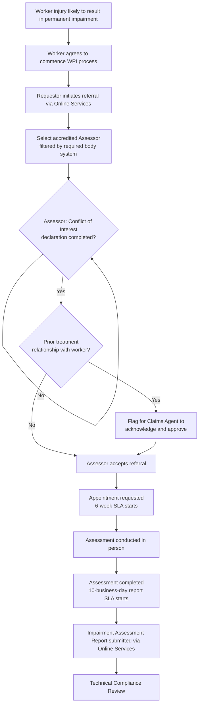
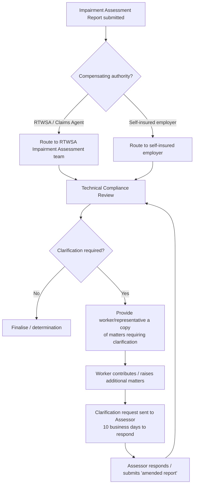

# Product Summary — Whole Person Impairment (WPI) Assessment

> ℹ️ **Draft Document** V0.1 as at 10.06.2026 — Generated from BRG transcript + IAAS SOPs. For stakeholder review (AI-01, due 17 June 2026).

**Product / Feature:** Whole Person Impairment (WPI) Assessment — Online Services Referral & Assessor Accreditation Management
**Program:** RTWSA Claim Transformation Program (CTP)
**Date:** 10 June 2026
**Status:** Draft

**Source tags used in this document:**
`Transcript` = `transcripts/RTWSA_CTP_WPI_BRG_Session_Transcript.md` ·
`SOP:IAAS` = `sop/Impairment-Assessor-Accreditation-Scheme_web.md` ·
`SOP:IA` = `sop/Impairment assessment.md` ·
`Both` = corroborated by transcript **and** an SOP (validated, high-priority).

## Contents

1. Product Summary Overview
2. User Personas
3. Requirements
   - 3.1 Business Requirements
   - 3.2 Data Requirements
     - 3.2.1 Data Model
     - 3.2.2 Data Migration
   - 3.3 Validation
   - 3.4 Integration
   - 3.5 Reporting
4. Key Design Decisions
5. Functionality
   - 5.1 Process Flows
6. Test Cases
7. Solution Design
8. Change Impact and Training Needs
9. Links
10. Document Governance
11. Document History
12. Open Questions & Risks *(appended — content with no home in the template)*
13. Assumptions & Gaps *(appended — content with no home in the template)*

---

## 1. Product Summary Overview

This product summary describes how the Claim Transformation Program (CTP) will **enhance and integrate with** RTWSA Online Services to manage the end-to-end Whole Person Impairment (WPI) assessment lifecycle — from referral initiation, assessor selection and conflict-of-interest/accreditation checks, through SLA tracking, technical compliance review, quality management and complaints handling. The capability is governed by Section 22 of the *Return to Work Act 2014* and the *Impairment Assessor Accreditation Scheme* (IAAS, July 2025). A WPI assessment determines the degree of permanent impairment arising from a work injury, feeding entitlement decisions for statutory lump sum payments and serious injury support. `(Transcript + SOP:IAAS + SOP:IA)`

The CTP scope is **integration and enhancement of the existing Online Services portal — not replacement.** `(Transcript)`

---

## 2. User Personas

> Salesforce permission set groups / sharing rules are not defined in the available sources — marked _To be confirmed_ and logged in Section 13.

| Persona | Permission Set Groups | Permission Set | Sharing Rules |
| --- | --- | --- | --- |
| Claims Agent Representative (Requestor — e.g. EML) | _To be confirmed_ | _To be confirmed_ | Scoped to claims they manage `(Transcript)` |
| WPI Assessment Manager (RTWSA) | _To be confirmed_ | _To be confirmed_ | Full WPI oversight `(Transcript)` |
| Accredited WPI Assessor (external medical practitioner) | _To be confirmed_ | Online Services provider access (medico-legal) | Scoped to referrals assigned to them `(Both)` |
| Self-Insured Employer Representative (Requestor) | _To be confirmed_ | _To be confirmed_ | Scoped to their own workers' claims `(Both)` |
| Legal & Compliance Advisor (RTWSA) | _To be confirmed_ | _To be confirmed_ | Compliance / complaints visibility `(Transcript)` |
| Injured Worker / Representative | _To be confirmed_ | Guest / limited access | Own claim; entitled to clarification matters `(Both)` |

---

## 3. Requirements

### 3.1 Business Requirements

> Every row is tagged with its source. Transcript requirement IDs (REQ-WPI-0xx) map to the BRG "Summary of Key Requirements Captured". Where the IAAS independently mandates the rule, the row is tagged `(Both)`.

| Process (L3) | Subprocess (L4) | User Story | Acceptance Criteria | Source |
| --- | --- | --- | --- | --- |
| Manage WPI Referral | Track assessment SLAs | **US-1** As a Claims Agent, I want the system to track WPI assessment timeframes and alert on breach, so that the statutory IAAS service timeframes are met without manual spreadsheets. | See **AC US-1** | `Both` — Transcript REQ-WPI-001/002/003; SOP:IAAS 3.5.8, 3.5.9 |
| Manage WPI Referral | Conflict of interest | **US-2** As an Assessor, I want to complete a structured conflict-of-interest declaration when accepting a referral, so that real/perceived/pecuniary conflicts are captured and the Requestor can decide whether to proceed. | See **AC US-2** | `Both` — Transcript REQ-WPI-004; SOP:IAAS 1.6, 3.4.9 |
| Manage WPI Referral | Prior-treatment check | **US-3** As a Claims Agent, I want the system to flag any prior treatment relationship between assessor and worker, so that I explicitly acknowledge and approve before the referral proceeds. | See **AC US-3** | `Both` — Transcript REQ-WPI-005; SOP:IAAS 3.4.13 |
| Manage Assessor Accreditation | Accreditation record | **US-4** As a WPI Assessment Manager, I want to manage each assessor's accreditation record, so that accreditation period, body-system scope, insurance and status are authoritative and visible at referral time. | See **AC US-4** | `Both` — Transcript REQ-WPI-006; SOP:IAAS 1.1–1.10, 3.2 |
| Manage Assessor Accreditation | Annual declaration | **US-5** As a WPI Assessment Manager, I want a system-enforced annual declaration workflow with overdue flagging, so that ongoing eligibility is confirmed each year. | See **AC US-5** | `Both` — Transcript REQ-WPI-007; SOP:IAAS 3.6 |
| Manage Assessor Accreditation | Mandatory notifications | **US-6** As a Legal & Compliance Advisor, I want mandatory notifications (AHPRA conditions, criminal charges, investigations) tracked within 7 business days, so that the system raises compliance alerts and can flag an assessor unavailable for new referrals pending review. | See **AC US-6** | `Both` — Transcript REQ-WPI-008; SOP:IAAS 3.4.2, 3.4.10, 3.4.11 |
| Conduct Technical Compliance Review | Multi-party review | **US-7** As a Requestor, I want a multi-party technical compliance review workflow with a worker-notification step, so that clarifications follow the IAAS transparency rule and defined timeframes. | See **AC US-7** | `Both` — Transcript REQ-WPI-009; SOP:IAAS 4.3 |
| Conduct Technical Compliance Review | Routing logic | **US-8** As a Requestor, I want the compliance review routed by compensating authority, so that self-insured reviews go to the employer and RTWSA/agent reviews go to RTWSA's Impairment Assessment team. | See **AC US-8** | `Both` — Transcript REQ-WPI-010; SOP:IAAS 3.4.6, 4.3.1 |
| Manage Quality & Peer Support | Compliance rating | **US-9** As a WPI Assessment Manager, I want an assessor compliance-rating dashboard, so that report volume and % compliant at first review are visible and feed accreditation decisions. | See **AC US-9** | `Both` — Transcript REQ-WPI-011; SOP:IAAS 4.2, 4.4 |
| Manage Quality & Peer Support | Peer support trigger | **US-10** As a WPI Assessment Manager, I want peer support triggered automatically when an assessor's compliance average drops below 80% at first review, so that support is mandated per the IAAS. | See **AC US-10** | `Both` — Transcript REQ-WPI-012; SOP:IAAS 4.2 |
| Manage Complaints & Legal | Complaint logging | **US-11** As a Legal & Compliance Advisor, I want complaints logged against an assessor record with lifecycle status tracking, so that outcomes can trigger performance management or accreditation review. | See **AC US-11** | `Both` — Transcript REQ-WPI-013; SOP:IAAS 6 |
| Manage Complaints & Legal | SAET appearance | **US-12** As an Assessor, I want SAET appearance requests captured against an assessment with a notification to me, so that there is a documented record of the summons and required attendance. | See **AC US-12** | `Both` — Transcript REQ-WPI-015; SOP:IAAS 3.4.12 |
| Manage Complaints & Legal | IAAS monitoring report | **US-13** As a WPI Assessment Manager, I want the system to generate structured IAAS monitoring data, so that RTWSA can publish its annual monitoring report. | See **AC US-13** | `Both` — Transcript REQ-WPI-014; SOP:IAAS 4.4 |
| Manage WPI Referral | Notification preferences | **US-14** *(Low / Platform Config)* As a Practice Administrator, I want notification preferences managed at practice level (not just per individual provider), so that large practices can route referral alerts efficiently. | See **AC US-14** | `Transcript` REQ-WPI-016 |

#### AC US-1 — Track assessment SLAs
1. The system must start a **six-week** countdown from the date the appointment is requested (assessor must see the worker within six weeks). `(SOP:IAAS 3.5.8)`
2. The system must start a **ten-business-day** countdown from the date the assessment is completed (report submission timeframe). `(SOP:IAAS 3.5.9)`
3. The system must raise automated alerts on approaching/breached SLA to the **claims agent, the assessor, and the RTWSA team**. `(Transcript REQ-WPI-003)`
4. The system must replace the current manual spreadsheet tracking and feed claims-agent SLA monitoring. `(Transcript)`

#### AC US-2 — Conflict of interest declaration
1. On receiving a referral, the system must prompt the assessor to complete a **structured conflict-of-interest declaration before accepting** the referral. `(Both)`
2. The declaration must capture personal, professional and pecuniary interests, existing relationships, and business interests of the assessor / immediate family / staff. `(SOP:IAAS 1.6, 3.4.9)`
3. The Requestor must be able to review the declaration and decide whether the assessment proceeds with that assessor. `(SOP:IAAS 3.4.9)`

#### AC US-3 — Prior-treatment check
1. The system must prompt for a check of whether the assessor has previously provided treatment, advice or assessment to the worker. `(SOP:IAAS 3.4.13)`
2. Where a prior relationship exists, the system must flag it for the claims agent to **explicitly acknowledge and approve** before proceeding (the Requestor may still agree where no alternative assessor is available). `(Both)`

#### AC US-4 — Accreditation record management
1. The system must hold an accreditation record per assessor including: accreditation period (**5 years**), accredited body system(s), accreditation status, and insurance thresholds (**medical indemnity ≥ AU$5m; public liability ≥ AU$10m**). `(SOP:IAAS 1.10, 3.2)`
2. The system must provide claims agents a **real-time accreditation status view** at referral (current accreditation, body systems, and ongoing training/declaration compliance). `(Transcript — Karen pain point)`
3. The system must support the IAAS Criteria Table constraints on which specialties may assess which body systems (e.g. CRPS restricted to specified specialties after CRPS training). `(SOP:IAAS 1.11, Guide for Systems and Specialties)`

#### AC US-5 — Annual declaration workflow
1. The system must require each assessor to submit the annual declaration on/by their accreditation anniversary, attesting to: AHPRA currency; ongoing eligibility; no notations/undertakings/reprimands in the prior 12 months; indemnity ≥ AU$5m; public liability ≥ AU$10m; training currency; and peer-support compliance. `(SOP:IAAS 3.6)`
2. The system must flag overdue declarations and surface them to the WPI Assessment Manager. `(Transcript REQ-WPI-007)`

#### AC US-6 — Mandatory notification tracking
1. The system must capture assessor self-reported notifications within **7 business days** for: AHPRA conditions/notations/reprimands; criminal charges/convictions involving dishonesty; and formal AHPRA investigations. `(SOP:IAAS 3.4.2, 3.4.10, 3.4.11)`
2. Such notifications must trigger automated compliance alerts and allow the assessor to be **flagged unavailable for new referrals pending review**. `(Transcript REQ-WPI-008)`

#### AC US-7 — Multi-party technical compliance review
1. The system must support the workflow: **report submission (assessor) → compliance review (Requestor) → worker notification of clarification matters → clarification request (assessor) → assessor response → final determination.** `(Both)`
2. Before a clarification request is sent to the assessor, the **worker or representative must be provided a copy of the matters requiring clarification** and able to contribute/raise additional matters. `(SOP:IAAS 4.3.1)`
3. The assessor must be allowed **10 business days** to respond to a clarification request; a subsequent report must be marked as an **'amended report'**. `(SOP:IAAS 4.3.2, 4.3.3)`

#### AC US-8 — Compliance review routing
1. The system must route the compliance review by the claim's **compensating authority** field: RTWSA / claims agent → RTWSA Impairment Assessment team; self-insured employer → that employer. `(Both)`

#### AC US-9 — Compliance rating dashboard
1. The system must calculate and display a **compliance rating per assessor**, including number of reports reviewed and **% compliant at first review**. `(SOP:IAAS 4.2)`
2. The dashboard data must be accessible to support accreditation decision-making (e.g. Ministerial suspension/cancellation considerations). `(Transcript)`

#### AC US-10 — Peer support trigger
1. The system must flag when an assessor's compliance average at first review drops **below 80%** and trigger the peer support process. `(SOP:IAAS 4.2)`
2. The system must record peer support interactions and outcomes. `(Transcript REQ-WPI-012)`
3. Peer support eligibility/triggers must also support: voluntary assessor request; volume-based (% of completed assessments per year); and repeated non-compliance. `(SOP:IAAS 4.2.7)`

#### AC US-11 — Complaint logging
1. The system must allow complaints to be logged against an assessor record by workers, employers or representatives where Service Standards are believed unmet. `(SOP:IAAS 6.2)`
2. The system must track complaint lifecycle status and flag outcomes that may trigger performance management or accreditation review (including referral to AHPRA where warranted). `(Both)`

#### AC US-12 — SAET appearance capture
1. The system must record SAET appearance requests against the relevant assessment and notify the assessor (who must attend at the requested date/time). `(Both)`

#### AC US-13 — IAAS monitoring report
1. The system must generate structured monitoring data (feedback/concerns, compliance statistics, report interactions, complaints) to support RTWSA's at-least-annual published IAAS monitoring report. `(SOP:IAAS 4.4)`

#### AC US-14 — Practice-level notification preferences *(Low)*
1. The system/portal should support notification preference management at the **practice level** as well as individual provider level. `(Transcript REQ-WPI-016)` — *flagged by Tom as Online Services platform configuration; see Section 12.*

### 3.2 Data Requirements

#### 3.2.1 Data Model
- An **Assessor Accreditation** data model is required (accreditation period, body-system scope, status, insurance, declaration history, notifications). `(Transcript REQ-WPI-006)`
- The **Compensating Authority** field on a claim is a key data element driving compliance-review routing. `(Transcript REQ-WPI-010)`
- Architecture spike pending: accreditation record data model and AHPRA integration options (AI-03, Tom Hartley, due 24 June 2026). _Final data model link to be confirmed._

#### 3.2.2 Data Migration
- WPI assessor records and accreditation history will require migration. Data migration, assessor onboarding and report-template requirements are scheduled for the **next BRG session (17 June 2026)**. _To be confirmed._ `(Transcript — Next Session)`

### 3.3 Validation

| Step / Page | Field / Label | Display Logic | Field Type | Mandatory | Picklist / Values | Validation | Source |
| --- | --- | --- | --- | --- | --- | --- | --- |
| Referral – Select Assessor | Assessor | Only display assessors **currently accredited** in the required body system | Lookup | Yes | Accredited assessors filtered by body system | Assessor must hold current accreditation in the relevant body system | `Both` |
| Referral – Accept | Conflict of Interest declaration | Shown at referral acceptance | Form | Yes | — | Must be completed **before** the assessor can accept the referral | `Both` |
| Referral – Accept | Prior-treatment check | Shown at referral acceptance | Checkbox / flag | Yes | — | If prior relationship exists, Requestor must explicitly acknowledge/approve | `Both` |
| Referral | Appointment requested date | — | Date | Yes | — | Drives 6-week appointment SLA countdown | `Both` |
| Assessment | Assessment completed date | — | Date | Yes | — | Drives 10-business-day report submission SLA countdown | `Both` |
| Accreditation | Medical indemnity insurance | — | Currency | Yes | — | Must be ≥ AU$5,000,000 | `SOP:IAAS` |
| Accreditation | Public liability insurance | — | Currency | Yes | — | Must be ≥ AU$10,000,000 | `SOP:IAAS` |
| Annual Declaration | Declaration submission | Due on accreditation anniversary | Form | Yes | — | Flag overdue if not submitted by anniversary; attest all 3.6 items | `SOP:IAAS` |
| Notification | Mandatory notification | — | Form | Yes | AHPRA condition / criminal charge / AHPRA investigation | Must be recorded within 7 business days; triggers compliance alert | `Both` |
| Compliance Review | Clarification request | Worker notified of matters first | Workflow | Yes | — | Worker/representative copy precedes assessor request; assessor has 10 business days; resubmission marked 'amended report' | `SOP:IAAS` |

### 3.4 Integration

| Capability | Integration Details | Source |
| --- | --- | --- |
| RTWSA Online Services portal | CTP integrates with / enhances the existing Online Services portal (WPI/IME referrals tile for providers) — **not a replacement**. Architecture team to determine configure-vs-extend. | `Transcript` |
| AHPRA | **Aspirational / Phase 2.** Phase 1 is self-reporting with system-enforced declaration workflows; an AHPRA API integration is a candidate for a later phase. | `Transcript` |
| Compliance-review routing | Routing driven by the claim's compensating-authority field (RTWSA/agent vs self-insured employer). | `Both` |
| SAET | SAET appearance requests captured against assessments with assessor notification. | `Both` |

### 3.5 Reporting

- **Assessor compliance-rating dashboard** — reports reviewed, % compliant at first review; feeds accreditation decisions. `(Both)` (US-9)
- **Annual IAAS monitoring report** — structured data generation for RTWSA's at-least-annual published report. `(Both)` (US-13)
- SLA breach / overdue declaration / notification reporting for operational monitoring. `(Transcript)`

---

## 4. Key Design Decisions

| Date | Decision | Decision Outcome | Decision Forum |
| --- | --- | --- | --- |
| 10/06/2026 | CTP scope for WPI Online Services | Integration and enhancement of the existing Online Services portal — **not a replacement**. Architecture team to determine how to configure/extend. | BRG – Sprint 2, Session 4 |
| 10/06/2026 | AHPRA integration approach | Phase 1 = self-reporting with system-enforced declaration workflows and overdue flagging. AHPRA API integration is aspirational / **Phase 2**. | BRG – Sprint 2, Session 4 |
| 10/06/2026 | Compliance-review routing | Routing determined by the claim's **compensating authority** field (RTWSA/agent → RTWSA team; self-insured → employer). | BRG – Sprint 2, Session 4 |
| 10/06/2026 | Conflict-of-interest capture | Structured COI declaration completed by the assessor **at referral acceptance**; Requestor reviews and decides whether to proceed. | BRG – Sprint 2, Session 4 |
| 10/06/2026 | Self-insured employers & portal | Currently out of scope for the portal (IAAS notes the portal requirement does not apply to self-insured-managed claims). Target-state onboarding is a **parking-lot** decision. | BRG – Sprint 2, Session 4 |

---

## 5. Functionality

High-level functional capabilities the solution must support:

- WPI/IME referral management within Online Services (provider referrals tile, secure document exchange, claim visibility). `(Both)`
- Structured conflict-of-interest and prior-treatment checks at referral acceptance. `(Both)`
- Real-time assessor accreditation register (period, body systems, status, insurance). `(Both)`
- SLA engine (6-week appointment, 10-business-day report) with multi-recipient alerts. `(Both)`
- Multi-party technical compliance review workflow with worker-notification and amended-report handling. `(SOP:IAAS)`
- Annual declaration workflow + mandatory-notification tracking with compliance alerts. `(Both)`
- Peer-support triggering and recording; assessor compliance-rating dashboard. `(Both)`
- Complaint logging/lifecycle and SAET appearance capture. `(Both)`
- IAAS monitoring report data generation. `(SOP:IAAS)`

### 5.1 Process Flows

> Diagrams are authored in Mermaid (the maintainable source). They render natively in GitHub and the VS Code markdown preview. For Confluence, these will be rendered via a Mermaid macro or as an embedded image when Step 7 (publish) is resumed.

#### 5.1.1 WPI Referral Lifecycle

*Source: `Transcript` REQ-WPI-001/002/004/005; `SOP:IAAS` 3.4.13, 3.5.8, 3.5.9; `SOP:IA`.*

#### 5.1.2 Technical Compliance Review (with routing)

*Source: `Transcript` REQ-WPI-009/010; `SOP:IAAS` 4.3, 3.4.6.*

---

## 6. Test Cases

_To be confirmed._ No test cases were present in the available sources. To be authored once requirements are signed off.

---

## 7. Solution Design

_To be confirmed._ Pending architecture spike on the accreditation record data model and AHPRA integration options (AI-03, Tom Hartley, due 24 June 2026). `(Transcript)`

---

## 8. Change Impact and Training Needs

_To be confirmed._ Indicative impacts from the transcript: assessor onboarding to enhanced Online Services capability; claims-agent process change away from manual spreadsheet SLA tracking; new COI/declaration/notification workflows for assessors. Assessor onboarding and report-template requirements are scheduled for the next BRG session (17 June 2026). `(Transcript)`

---

## 9. Links

| Title | Description / URL |
| --- | --- |
| RTWSA – Online Services for WPI Assessment Referrals | https://www.rtwsa.com/service-providers/assessment-services/impairment-assessment/whole-person-impairment-assessment |
| RTWSA – Impairment Assessor Accreditation Scheme (IAAS) July 2025 | https://www.rtwsa.com/media/documents/Impairment-Assessor-Accreditation-Scheme_web.pdf |
| RTWSA – Whole Person Impairment Assessors List | https://www.rtwsa.com/service-providers/assessment-services/impairment-assessment/wpi-assessors-list |
| Return to Work Act 2014 – Section 22 | SA Legislation |
| Source — BRG transcript | `transcripts/RTWSA_CTP_WPI_BRG_Session_Transcript.md` |
| Source — IAAS SOP (markdown) | `sop/Impairment-Assessor-Accreditation-Scheme_web.md` |
| Source — Impairment assessment SOP (markdown) | `sop/Impairment assessment.md` |

---

## 10. Document Governance

| Approver / Role | Date approved | Confirmation |
| --- | --- | --- |
| Sarah Mitchell — Program Manager, CTP (RTWSA) | _Pending_ | |
| Karen O'Brien — WPI Assessment Manager (RTWSA) | _Pending_ | |
| Rachel Donovan — Legal & Compliance Advisor (RTWSA) | _Pending_ | |

Draft to be published to Confluence for stakeholder review by **17 June 2026** (AI-01, Priya Sharma). `(Transcript)`

---

## 11. Document History

| Version | Date | Author | Changes made | Reason |
| --- | --- | --- | --- | --- |
| 0.1 | 10/06/2026 | Claude (product-summary-requirements skill) | Initial draft synthesised from BRG transcript + IAAS/Impairment-assessment SOPs, structured to the RTWSA Product Summary template | Initial draft |
| 0.2 | 10/06/2026 | Claude | Added Section 5.1 Process Flows — Mermaid diagrams for the WPI referral lifecycle and the technical compliance review (with routing) | Diagram request |

---

## 12. Open Questions & Risks

| # | Item | Type | Raised By / Source |
| --- | --- | --- | --- |
| 1 | Self-insured employer portal onboarding — remain out of scope or target-state onboarding? | Open Question (Parking lot, REQ-WPI-017) | Marcus Webb / Sarah Mitchell `(Transcript)` |
| 2 | AHPRA API integration deferred to Phase 2 — risk that self-reporting leaves a compliance-visibility gap in the interim | Risk | Rachel Donovan / Tom Hartley `(Transcript)` |
| 3 | Build-on-top vs configure vs extend the Online Services portal — architecture approach undecided | Open Question | Tom Hartley / Sarah Mitchell `(Transcript)` |
| 4 | SLA parameters may differ for self-insured employers vs RTWSA-managed claims (AI-07) | Open Question | Marcus Webb / Karen O'Brien `(Transcript)` |
| 5 | Practice-level notification management is an Online Services platform-config item, not core CTP — ownership/routing to platform team | Risk / Dependency | Linda Frost / Tom Hartley `(Transcript)` |

**Action Items (from the BRG):**

| # | Action | Owner | Due |
| --- | --- | --- | --- |
| AI-01 | Publish draft requirements to Confluence for stakeholder review | Priya Sharma | 17 June 2026 |
| AI-02 | Confirm scope position on self-insured employer portal onboarding | Sarah Mitchell | Post-Steering, 24 June 2026 |
| AI-03 | Architecture spike: accreditation record data model + AHPRA integration options | Tom Hartley | 24 June 2026 |
| AI-04 | Process map for Technical Compliance Review workflow for sign-off | Karen O'Brien | 17 June 2026 |
| AI-05 | Example conflict-of-interest declaration scenarios for form design | Dr. James Patel | 17 June 2026 |
| AI-06 | Share current complaint management SOP for requirements mapping | Rachel Donovan | 17 June 2026 |
| AI-07 | Confirm SLA parameters for self-insured vs RTWSA-managed claims | Marcus Webb / Karen O'Brien | 24 June 2026 |

*No direct contradictions were found between the transcript and the SOPs — the IAAS corroborates the transcript throughout (hence the high number of `Both`-tagged requirements).*

---

## 13. Assumptions & Gaps

- **User personas / permission model:** Salesforce permission set groups and sharing rules are **not defined** in the available sources (the template carried them from a different epic). Marked _To be confirmed_; needs definition with the platform team.
- **Process numbering (L3/L4):** The transcript does not assign formal process numbers to the WPI processes. Descriptive process/subprocess labels were assumed; align to the RTWSA process taxonomy before sign-off.
- **Test Cases (Section 6), Solution Design (Section 7):** no source content — left _To be confirmed_.
- **Change Impact (Section 8):** only indicative impacts available; detailed change-impact assessment not yet provided.
- **Data Model / Migration (Section 3.2):** final data model and migration scope pending architecture spike (AI-03) and the next BRG session.
- **Folders read:** `transcripts/` (1 file), `sop/` (2 markdown files + their source PDFs), `templates/` (1 markdown file + PDF). No folder was empty; PDFs in `sop/`/`templates/` were skipped as the skill operates on `.md` sources (the `.md` versions are the authoritative inputs).
