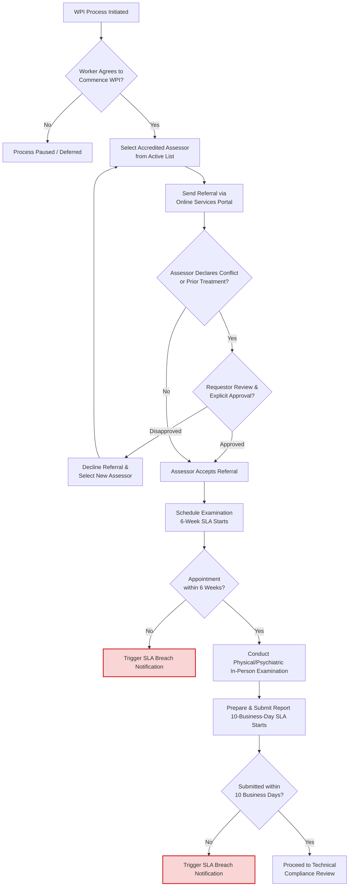

# Product Summary — Whole Person Impairment (WPI) Assessment

> ℹ️ **Final Draft Document** V1.0 as at 11.06.2026 - View access only except relevant BA, PM and WPI Assessment Team

---

## Contents

1. Product Summary Overview
2. User Personas
3. Requirements
   - 3.1 Business Requirements
   - 3.2 Data Requirements
     - 3.2.1 Data Model
     - 3.2.2 Data Migration
   - 3.3 Validation
   - 3.4 Integration
   - 3.5 Reporting
   - 3.6 Process Flows
4. Key Design Decisions
5. Functionality
6. Test Cases
7. Solution Design
8. Change Impact and Training Needs
9. Links
10. Document Governance
11. Document History

---

## 1. Product Summary Overview

The product summary describes the end-to-end digitisation of the **Whole Person Impairment (WPI) Assessment** process under the ReturnToWorkSA (RTWSA) Claim Transformation Program (CTP).

Governed by Section 22 of the *Return to Work Act 2014*, the WPI assessment determines the degree of permanent impairment arising from a work injury once it has stabilised. The assessment results are critical in establishing statutory lump sum entitlements and determining eligibility for high-level serious injury support.

This product enables secure, streamlined collaboration between Claims Agents, Accredited Assessors, self-insured employers, and RTWSA's Impairment Assessment Team. It manages the full assessor lifecycle (including 5-year accreditation, annual declarations, and mandatory compliance notifications), automates SLA monitoring, digitises multi-party Technical Compliance Reviews (with mandatory worker review steps), and triggers quality-support workflows.

---

## 2. User Personas

| Persona | Permission Set Groups | Permission Set | Sharing Rules |
| --- | --- | --- | --- |
| **Accredited WPI Assessor** | • Online_Services_Assessor_Group | • WPI_Assessor_Partner_User_Permission_Set | • Ownership of their assigned WPI referrals<br>• Access to their own Accreditation Profile and Annual Declaration records |
| **Claims Agent Representative (EML / GB)** | • Agent_Permission_Set_Group | • WPI_Referral_Requestor_Permission_Set | • Read/write access to WPI referrals initiated for claims under their management |
| **RTWSA Impairment Assessment Advisor / Team** | • RTWSA_Assessment_Advisor_Permission_Set_Group | • WPI_Admin_Permission_Set | • Global read/write access to all Assessor Accreditation records, compliance notifications, and reports<br>• Ownership of RTWSA-managed Technical Compliance Reviews |
| **Self-Insured Employer Representative** | • Self_Insured_Employer_Partner_User_Permission_Set | • Self_Insured_Requestor_Permission_Set | • Read/write access to referrals and Technical Compliance Reviews for claims under their self-insurance |
| **Peer Support Assessor** | • Online_Services_Assessor_Group | • Peer_Support_Assessor_Permission_Set | • Temporary read-only access to specific, de-identified report records shared for peer support |
| **Injured Worker / Representative** | | • Guest_User_Permission_Set | • Read-only access to specific WPI correspondence and draft clarification lists |

---

## 3. Requirements

### 3.1 Business Requirements

| Process (L3) | Subprocess (L4) | User Story | Acceptance Criteria | Source |
| --- | --- | --- | --- | --- |
| **3.x WPI Assessment** | **3.x.1 Referral Initiation** | **3.x.1.1** As a Claims Agent, I want to initiate a WPI referral through the Online Services portal so that I can securely refer an injured worker for assessment. | 1. The system must allow the user to select an accredited assessor from the live list.<br>2. The list must only display assessors with an 'Active' accreditation status who are accredited in the relevant body system(s) for the injury.<br>3. The system must prevent duplicate active referrals for the same injury item. | Transcript: `RTWSA_CTP_WPI_BRG_Session_Transcript.md`<br>SOP: `Impairment assessment.md` |
| | **3.x.2 Conflict & Prior Treatment Declaration** | **3.x.2.1** As an Assessor, I want to complete a structured conflict of interest declaration during referral acceptance so that any conflict is transparently managed. | 1. Prior to accepting a referral, the system must force the assessor to complete a structured conflict checklist covering personal, professional, and pecuniary conflicts.<br>2. The system must prompt the assessor to declare if they have previously treated, advised, or assessed the worker.<br>3. If a conflict or prior treatment is declared, the system must trigger a high-priority alert to the Requestor and halt automated acceptance. | Transcript: `RTWSA_CTP_WPI_BRG_Session_Transcript.md`<br>SOP: `Impairment-Assessor-Accreditation-Scheme_web.md` (Sec 1.6, 3.4.9, 3.4.13) |
| | **3.x.3 SLA Tracking & Alerts** | **3.x.3.1** As a WPI Assessment Manager, I want the system to track key milestones and SLAs so that service standards are met and monitored. | 1. The system must track the **6-week appointment SLA** starting from the date the referral is requested. If the appointment is not scheduled within 6 weeks, the system must flag a breach.<br>2. The system must track the **10-business-day report submission SLA** starting from the date the physical/psychiatric assessment is completed. <br>3. If either SLA is breached, the system must generate automated alerts to the Assessor, Claims Agent, and RTWSA team. | Transcript: `RTWSA_CTP_WPI_BRG_Session_Transcript.md`<br>SOP: `Impairment-Assessor-Accreditation-Scheme_web.md` (Sec 3.5.8, 3.5.9) |
| | **3.x.4 Accreditation Period & Profile** | **3.x.4.1** As a WPI Assessment Manager, I want to manage assessor profiles so that accreditation details, body system scopes, and credentials are kept up-to-date. | 1. The system must maintain an Assessor profile tracking their 5-year accreditation period, registered body systems (mandatory/non-mandatory), and specialty.<br>2. The profile must enforce active clinical practice criteria (minimum 6 hours/week or 288 hours/year) for mandatory body systems.<br>3. The profile must verify current medical indemnity insurance (>= $5M) and public liability insurance (>= $10M). | SOP: `Impairment-Assessor-Accreditation-Scheme_web.md` (Sec 1, 3.2) |
| | **3.x.5 Annual Declaration Workflow** | **3.x.5.1** As an Assessor, I want to submit my annual declaration through the portal so that my accreditation remains current. | 1. The system must automatically trigger an Annual Declaration workflow on the anniversary of the assessor's accreditation.<br>2. The system must require the assessor to attest to AHPRA currency, insurance thresholds, ongoing training (at least two RTWSA training activities annually), and peer support compliance.<br>3. If the declaration is not submitted on or by the anniversary date, the system must flag the profile as 'Overdue' and automatically suspend the assessor from receiving new referrals. | SOP: `Impairment-Assessor-Accreditation-Scheme_web.md` (Sec 3.3.4, 3.6) |
| | **3.x.6 Mandatory Notifications** | **3.x.6.1** As a Legal & Compliance Advisor, I want to ensure assessors submit mandatory notifications of registration changes or legal charges within statutory limits. | 1. The system must provide a secure workflow for assessors to submit mandatory notifications.<br>2. Notifications must be submitted within **7 business days** of the assessor becoming aware of any AHPRA investigation, registration conditions/notations, or dishonesty-related criminal charges.<br>3. Submitting a mandatory notification must automatically generate high-priority compliance alerts to the RTWSA team and temporarily flag the assessor as 'Unavailable' for new referrals. | Transcript: `RTWSA_CTP_WPI_BRG_Session_Transcript.md`<br>SOP: `Impairment-Assessor-Accreditation-Scheme_web.md` (Sec 3.4.2, 3.4.10, 3.4.11) |
| | **3.x.7 Technical Compliance Review & Clarification** | **3.x.7.1** As a Technical Compliance Reviewer, I want to manage report reviews and assessor clarifications within the system. | 1. Upon report submission, the system must route the review based on the claim's Compensating Authority (RTWSA vs Self-Insured Employer).<br>2. If clarification is required, the system must generate a PDF of clarification matters and notify the worker/representative to allow them an opportunity to contribute before sending.<br>3. The system must track a **10-business-day SLA** for assessors to respond to clarification requests.<br>4. Any updated report submitted by the assessor must be marked and versioned as an 'amended report'. | Transcript: `RTWSA_CTP_WPI_BRG_Session_Transcript.md`<br>SOP: `Impairment-Assessor-Accreditation-Scheme_web.md` (Sec 4.3) |
| | **3.x.8 Quality Management & Peer Support** | **3.x.8.1** As a WPI Assessment Manager, I want the system to monitor assessor performance and trigger peer support where compliance is below standard. | 1. The system must calculate an assessor compliance rating average based on reports reviewed and percentage compliant at first review.<br>2. If an assessor's compliance rating falls below **80% at first review annually**, the system must automatically flag the profile and trigger a Peer Support workflow.<br>3. The system must record peer support interactions and outcomes, and require remedial training to be completed within 6 weeks of notification. | Transcript: `RTWSA_CTP_WPI_BRG_Session_Transcript.md`<br>SOP: `Impairment-Assessor-Accreditation-Scheme_web.md` (Sec 3.3.2, 4.2) |
| | **3.x.9 Complaint Logging & Tracking** | **3.x.9.1** As a WPI Assessment Manager, I want to log and track complaints against assessors so that service standard compliance is monitored. | 1. The system must allow logging of complaints with fields for: Complainant (Worker, Employer, Representative), Service Standard breached, status (Under Investigation, Resolved, Escalated), and outcome.<br>2. Complaint outcomes must be linked to the assessor's profile and be reviewable by the accreditation board. | Transcript: `RTWSA_CTP_WPI_BRG_Session_Transcript.md`<br>SOP: `Impairment-Assessor-Accreditation-Scheme_web.md` (Sec 6) |
| | **3.x.10 SAET Appearance Tracking** | **3.x.10.1** As an Assessor, I want to track SAET appearance requests in the portal so that my attendance at the tribunal is documented. | 1. The system must allow recording of SAET appearance requests against an assessment, including scheduled date, time, and tribunal details.<br>2. The system must notify the assessor of the summons and track their digital acknowledgement. | Transcript: `RTWSA_CTP_WPI_BRG_Session_Transcript.md`<br>SOP: `Impairment-Assessor-Accreditation-Scheme_web.md` (Sec 3.4.12) |

---

### 3.2 Data Requirements

#### 3.2.1 Data Model

The database schema must support the following entities and relationships:

```
+------------------------+          1:N          +------------------------+
|      WPI_Assessor      |---------------------->|      WPI_Referral      |
+------------------------+                       +------------------------+
| - Assessor_ID (PK)     |                       | - Referral_ID (PK)     |
| - Specialty            |                       | - Claim_ID (FK)        |
| - AHPRA_Number         |                       | - Assessor_ID (FK)     |
| - Accreditation_Status |                       | - Compensating_Auth    |
| - Accred_Start_Date    |                       | - Referral_Status      |
| - Accred_End_Date      |                       | - Appt_Request_Date    |
| - Accredited_Body_Sys  |                       | - Appointment_Date     |
| - Prof_Indemnity_Ins   |                       | - Assessment_Comp_Date |
| - Public_Liability_Ins |                       | - Report_Submit_Date   |
| - Compliance_Rating    |                       | - SLA_Appt_Status      |
+------------------------+                       | - SLA_Submit_Status    |
       |                                         +------------------------+
       | 1:N                                                 |
       |                                                     | 1:1
       v 1:N                                                 v
+------------------------+                       +------------------------+
| WPI_Annual_Declaration |                       | WPI_Conflict_Decl      |
+------------------------+                       +------------------------+
| - Decl_ID (PK)         |                       | - COI_Decl_ID (PK)     |
| - Assessor_ID (FK)     |                       | - Referral_ID (FK)     |
| - Submitted_Date       |                       | - Conflict_Declared    |
| - Status (Overdue/Sub) |                       | - Prior_Treat_Declared |
| - AHPRA_Currency_Attest|                       | - Requestor_Approval   |
+------------------------+                       +------------------------+
       |                                                     |
       | 1:N                                                 | 1:N
       v                                                     v
+------------------------+                       +------------------------+
|    WPI_Complaint       |                       |  WPI_Compliance_Review |
+------------------------+                       +------------------------+
| - Complaint_ID (PK)    |                       | - Review_ID (PK)       |
| - Assessor_ID (FK)     |                       | - Referral_ID (FK)     |
| - Complainant_Type     |                       | - Reviewer_ID          |
| - Service_Standard     |                       | - Compliance_Status    |
| - Lifecycle_Status     |                       | - Compliance_Score     |
| - Outcome              |                       | - Worker_Notified      |
+------------------------+                       | - Clarification_Req    |
                                                 +------------------------+
```

#### 3.2.2 Data Migration

1. **Active WPI Assessors List Migration:** Extract and migrate the current list of accredited WPI assessors (active from 1 July 2025 to 30 June 2030), including their accredited body systems, specialties, and historical contact details from the legacy database.
2. **Referral History:** Migrate active or open referrals currently tracked in spreadsheets or claims management legacy systems, ensuring appointment requested dates and completed dates are loaded with integrity to maintain SLA tracking.
3. **Historical Performance:** Populate baseline compliance ratings based on the last year of manual report reviews to ensure the "compliance rating average" is populated accurately for active assessors.

---

### 3.3 Validation

| Page / Entity | Field / Action | Display Logic / Condition | Field Type | Mandatory | Picklist / Allowed Values | Validation / Verification Rule |
| --- | --- | --- | --- | --- | --- | --- |
| **Referral Creation** | Select Assessor | When adding an assessor to a referral | Checklist / Lookup | Yes | List of active accredited assessors | Must filter and display only assessors whose accreditation is 'Active' and who are accredited in the relevant body system of the injury. |
| **Conflict Declaration** | Personal/Pecuniary COI Checkbox | During referral acceptance | Checkbox | Yes | True / False | Must be completed before accepting referral. If marked True, must enforce comments entry. |
| **Conflict Declaration** | Prior Treatment Checkbox | During referral acceptance | Checkbox | Yes | True / False | Must be completed before accepting. If marked True, must route to Requestor for explicit review and override. |
| **Annual Declaration** | Professional Indemnity Level | During annual declaration submission | Currency | Yes | | Must be >= AU$5,000,000. Under-threshold values prevent submission. |
| **Annual Declaration** | Public Liability Level | During annual declaration submission | Currency | Yes | | Must be >= AU$10,000,000. Under-threshold values prevent submission. |
| **Annual Declaration** | Training Activities Attended | During annual declaration submission | Integer | Yes | | Must be >= 2. Under-threshold values trigger non-compliance workflow. |
| **Decision Record** | Decision Date | When creating a decision record (Withdrawn / Reopened) | Date | Yes | | Must not precede the Date of Injury; Must not be a date in the future. |
| **Compliance Review** | Compliance Score | During technical compliance review | Percentage | Yes | 0% to 100% | Must be populated to calculate assessor compliance average. Score < 80% triggers Peer Support alert. |
| **Compliance Notification** | Notification Date | Within 7 days of assessor awareness | Date | Yes | | Validation rule: Must be within 7 business days of today's date. |

---

### 3.4 Integration

| User Story | Acceptance Criteria | Integration Details |
| --- | --- | --- |
| **3.x.1.1 & 3.x.7.1** | Referrals and Reports Sync | **Salesforce Core to Online Services Portal Sync:**<br>• Bi-directional integration between Salesforce Core (used by claims agents and RTWSA) and Experience Cloud (Online Services Portal).<br>• Referrals generated in Salesforce Core are instantly published as "WPI Referral" tiles in the portal. Reports uploaded by assessors are written directly back to Salesforce Core as encrypted PDF attachments. |
| **3.x.5.1 & 3.x.6.1** | AHPRA Verification (Phase 2) | **AHPRA REST API Integration (Aspirational Phase 2):**<br>• System will make weekly calls to the AHPRA registration verification endpoint using the assessor's AHPRA number.<br>• Automated triggers will scan for any new conditions, notations, undertakings, reprimands, or suspensions, and auto-flag the assessor profile in Salesforce. |
| **3.x.7.1** | Content Manager Archival | **Micro Focus Content Manager Integration:**<br>• Once the compliance review is finalised, the final report and associated decision record must be archived in Content Manager.<br>• System must generate and store a "CM Document" record with a valid Document Reference Number. |

---

### 3.5 Reporting

1. **Assessor Compliance Dashboard (Internal RTWSA & Self-Insured):**
   - **Compliance Rating Average:** Tracks the percentage of reports that achieved a compliant rating at first review annually.
   - **SLA Metrics:** Displays % of appointments completed within the 6-week SLA, and % of reports submitted within the 10-business-day SLA.
   - **Feedback Score:** Visualises aggregated worker feedback surveys.
2. **Accreditation Operations Dashboard (WPI Team):**
   - Displays real-time alerts for overdue annual declarations (anniversary dates within next 30 days or overdue).
   - Monitors active mandatory notifications (AHPRA investigations or legal charges) requiring immediate action.
   - Tracks active Peer Support cases (assessors below 80% compliance) and their progress.
3. **Statutory Annual Reporting (Website Publishing):**
   - Automatically generates structured compliance and SLA data annually to support statutory monitoring publications on the RTWSA website.

---

### 3.6 Process Flows

#### Process 1: End-to-End WPI Referral & Assessment Lifecycle
*Source: transcripts/RTWSA_CTP_WPI_BRG_Session_Transcript.md & sop/Impairment-Assessor-Accreditation-Scheme_web.md (Section 3.4, 3.5)*



#### Process 2: Technical Compliance Review & Clarification Workflow
*Source: transcripts/RTWSA_CTP_WPI_BRG_Session_Transcript.md & sop/Impairment-Assessor-Accreditation-Scheme_web.md (Section 4.3)*

```mermaid
flowchart TD
    ReportSub[Impairment Assessment Report Submitted] --> CompAuth{Compensating Authority?}
    CompAuth -- Self-Insured Employer --> RouteSelfInsured[Route Review to <br/>Self-Insured Employer]
    CompAuth -- RTWSA / Claims Agent --> RouteRTWSA[Route Review to RTWSA <br/>Impairment Assessment Team]
    
    RouteSelfInsured --> ConductReview[Conduct Technical Compliance Review]
    RouteRTWSA --> ConductReview
    
    ConductReview --> QualityCheck{Report Meets <br/>Standards? <br/>(Calculations, Guidelines)}
    QualityCheck -- Yes --> FinalDetermination[Proceed to Final Determination <br/>& Entitlement Decisions]
    
    QualityCheck -- No --> DraftClarification[Draft Clarification Matters]
    DraftClarification --> WorkerNotice[Send Copy of Clarification <br/>Matters to Worker/Rep <br/>(Transparency Step)]
    WorkerNotice --> SendClarification[Send Clarification Request <br/>to Assessor via Portal <br/>10-Business-Day SLA Starts]
    
    SendClarification --> AssessorReply{Assessor Responds <br/>within 10 Days?}
    AssessorReply -- No --> Escalate[Trigger Escalation / SLA Breach]
    AssessorReply -- Yes --> SubmitAmended[Upload as 'Amended Report']
    SubmitAmended --> ConductReview

    classDef notice fill:#e1f5fe,stroke:#0288d1,stroke-width:2px;
    class WorkerNotice notice;
```

#### Process 3: Assessor Accreditation & Quality Support Lifecycle
*Source: sop/Impairment-Assessor-Accreditation-Scheme_web.md (Section 3.2, 3.3, 3.6, 4.2)*

```mermaid
flowchart TD
    AccredApproved[Accreditation Approved by Minister] --> FiveYearStart[5-Year Accreditation Period Begins]
    FiveYearStart --> AnnualAnniversary{Accreditation <br/>Anniversary reached?}
    
    AnnualAnniversary -- Yes --> AnnualDecWorkflow[Initiate Annual Declaration Workflow <br/>(AHPRA status, Insurance, Training)]
    AnnualDecWorkflow --> DecCheck{Declaration Submitted <br/>on or by Anniversary?}
    DecCheck -- No --> SuspendReferrals[Flag Assessor as 'Overdue' <br/>& Suspend New Referrals]
    DecCheck -- Yes --> RevDec[RTWSA WPI Team Review]
    RevDec --> ConfAccred[Confirm Continuing Accreditation]
    ConfAccred --> AnnualAnniversary
    
    FiveYearStart --> OngoingMonitoring[Monitor Reports for Compliance]
    OngoingMonitoring --> RatingCheck{Annual Compliance <br/>Rating Average <br/>drops below 80%?}
    RatingCheck -- Yes --> TriggerPeerSupport[Automatically Flag Profile & <br/>Trigger Peer Support Workflow]
    TriggerPeerSupport --> AssignPeer[Assign Peer Support Assessor <br/>(Specialist in same body system)]
    AssignPeer --> PeerSession[Conduct Peer Feedback Session <br/>(Medical Reasoning/Consistency)]
    PeerSession --> SummaryToRTWSA[Submit Summary & Recommendations <br/>to Assessor & RTWSA]
    SummaryToRTWSA --> RemedialAction[Implement Remedial Training <br/>within 6 Weeks]
    
    RatingCheck -- No --> OngoingMonitoring
    
    classDef suspend fill:#f9d5d5,stroke:#c00,stroke-width:2px;
    class SuspendReferrals suspend;
```

---

## 4. Key Design Decisions

### 4.1 Confirmed Design Decisions

| Date | Decision | Decision Outcome | Decision Forum |
| --- | --- | --- | --- |
| 10/06/2026 | **Routing of Technical Reviews** | Compliance reviews will be routed based on the claims' Compensating Authority. Reviews for self-insured claims will route to the Self-Insured Employer. Reviews for agent-managed claims route to RTWSA's Impairment Assessment Team. | CTP Business Requirements Gathering |
| 10/06/2026 | **Conflict of Interest Capture** | Implement a structured conflict declaration form embedded directly within the referral acceptance step in the Online Services Portal, replacing ad hoc email declarations. | CTP Business Requirements Gathering |
| 10/06/2026 | **Quality Threshold Peer Support** | Peer support will be automatically triggered when an assessor's compliance rating average drops below 80% at first review annually. | CTP Business Requirements Gathering |
| 10/06/2026 | **Transparency in Clarifications** | The system must enforce that a copy of clarification matters is sent to the worker/representative before the formal clarification request is dispatched to the assessor, allowing them to contribute. | CTP Business Requirements Gathering |
| 10/06/2026 | **Overdue Declaration Action** | If an annual declaration is not submitted on or by the anniversary date, the system will automatically change the assessor's status to 'Overdue' and suspend them from receiving new referrals. | CTP Business Requirements Gathering |

### 4.2 Open Questions & Risks

| # | Item | Type | Raised By | Description / Mitigation |
|---|---|---|---|---|
| **1** | **Self-Insured Portal Onboarding Scope** | Scope | Marcus Webb (SA Water) | *Open Question:* Currently, the IAAS notes that the portal requirement is not applicable for self-insurers. CTP must decide whether self-insurers will remain out of scope or be fully onboarded into the Target State portal. *Mitigation:* Deferred to the Program Steering Committee on 24 June 2026. |
| **2** | **AHPRA Direct API Integration** | Technical Risk | Tom Hartley (RTWSA) | *Risk:* Integrating directly with AHPRA's verification API involves high cost and complexity. *Mitigation:* Approved as an aspirational Phase 2 item. Phase 1 will rely on assessor self-reporting, portal declaration workflows, and manual checks by RTWSA. |
| **3** | **Prior Treating Relationship Overrides** | Conflict | Dr. James Patel (Accredited Assessor) | *Conflict:* IAAS prohibits assessors from assessing a worker they have treated unless agreed by the Requestor. In rural areas or ultra-specialised body systems, alternative assessors may not exist. *Mitigation:* System must support a documented override workflow allowing the claims agent to explicitly approve the assessor to proceed. |

---

## 5. Functionality

The target system will deliver five core functional areas in the Online Services Portal and Salesforce Core:

1. **Accreditation Profile & Registry (WPI Team / Assessors):**
   - Digital registry of all accredited assessors, indicating specialties, active body systems, and 5-year period.
   - Portal-based Annual Declaration submission form verifying training and insurance thresholds.
   - 7-day Mandatory Notification logger with immediate compliance alert generation.
2. **Referral Creation & Assessor Dispatch (Claims Agents):**
   - Wizard-based referral creator that searches and filters the live assessor list based on body system and status.
   - Automatic checking for duplicate active referrals on the same injury item.
3. **Assessor Workspace & Acceptance (Assessors):**
   - Secure portal workspace displaying incoming referrals, booking details, and claim documentation.
   - Mandatory inline Conflict of Interest (COI) checklist and treatment history declaration.
   - Digital acceptance/rejection buttons with immediate notification back to the claims agent.
4. **Technical Compliance Review Engine (RTWSA / Self-Insured):**
   - Work queue routing submitted reports based on Compensating Authority.
   - Tool to compile "Clarification Matters" and auto-dispatch worker/representative notifications.
   - Interactive clarification loop tracking the 10-business-day response SLA, supporting 'amended report' versioning.
5. **Quality & Performance Dashboard (WPI Team):**
   - Calculates and tracks compliance rating averages per assessor.
   - Automated Peer Support Case Generator that assigns a same-specialty peer assessor when compliance drops below 80%.

---

## 6. Test Cases

### TC-WPI-001 — Referral Creation and Assessor Validation
- **Objective:** Verify that a claims agent can only refer a case to an active, accredited assessor certified in the correct body system.
- **Preconditions:** Assessor A is active and accredited in Upper Extremity. Assessor B is suspended. Assessor C is active but only accredited in Psychiatric.
- **Test Steps:**
  1. Navigate to referral page for a physical "Spine / Upper Extremity" injury.
  2. Search the assessor list. Verify Assessor A is displayed.
  3. Verify Assessor B (suspended) and Assessor C (wrong body system) are filtered out and not selectable.
  4. Select Assessor A and click 'Submit Referral'.
- **Expected Outcome:** Referral is successfully created for Assessor A; ineligible assessors are hidden from selection.

### TC-WPI-002 — Mandatory COI Checklist & treatment history
- **Objective:** Verify that an assessor must complete the COI checklist and declare treatment history before accepting.
- **Preconditions:** Referral is in 'Sent' status on Assessor A's portal.
- **Test Steps:**
  1. Log in as Assessor A and open the referral.
  2. Attempt to click 'Accept Referral' without completing the COI checkboxes. Verify system blocks submission.
  3. Mark all COI checkboxes as 'No' and select 'Yes' for prior treatment of worker. Click 'Accept'.
- **Expected Outcome:** System blocks acceptance until checkboxes are completed. Declaring prior treatment flags the referral as 'Conflict Review' and alerts the claims agent.

### TC-WPI-003 — SLA Countdown, Breach Tracking & Notifications
- **Objective:** Verify that 6-week appointment and 10-business-day report SLAs are tracked accurately and trigger breach alerts.
- **Preconditions:** Referral created and accepted today.
- **Test Steps:**
  1. Simulate 6 weeks passing without an appointment date being scheduled in the system.
  2. Verify system updates `SLA_Appt_Status` to 'Breached' and auto-sends notifications.
  3. Populate appointment date as completed. Verify the 10-business-day report submission countdown starts.
  4. Simulate 10 business days passing without a report upload.
  5. Verify system updates `SLA_Submit_Status` to 'Breached' and alerts the assessor and claims agent.
- **Expected Outcome:** System accurately flags SLA breaches and issues the required notifications on the exact SLA date.

### TC-WPI-004 — Annual Declaration Anniversary & 'Overdue' Suspension
- **Objective:** Verify that failing to submit the annual declaration on or by the anniversary date auto-suspends the assessor.
- **Preconditions:** Assessor A's accreditation anniversary date is 11/06/2026. Today is 12/06/2026 and no declaration has been submitted.
- **Test Steps:**
  1. System daily batch job runs overnight on the anniversary date.
  2. Verify Assessor A's status is changed from 'Active' to 'Overdue'.
  3. Log in as a Claims Agent and attempt to search for Assessor A for a new referral.
- **Expected Outcome:** Status is automatically updated to 'Overdue', and the assessor is hidden from active search lists.

### TC-WPI-005 — Technical Compliance Review Routing & Worker Notification
- **Objective:** Verify that report compliance reviews are routed correctly based on Compensating Authority and worker notifications are sent.
- **Preconditions:** Claim 1 compensating authority is 'RTWSA'. Claim 2 compensating authority is 'SA Water' (Self-Insured).
- **Test Steps:**
  1. Assessor uploads report for Claim 1. Verify review routes to RTWSA WPI team work queue.
  2. Assessor uploads report for Claim 2. Verify review routes to SA Water work queue.
  3. On Claim 1 review, click 'Flag Clarification'.
  4. Verify system blocks sending clarification to the assessor until 'Send Copy of Clarification to Worker' is ticked and verified.
- **Expected Outcome:** Accurate routing based on Compensating Authority, and enforcement of the mandatory worker notification step.

---

## 7. Solution Design

The target architecture leverages **Salesforce Experience Cloud** (Online Services Portal) integrated bi-directionally with **Salesforce Financial Services Cloud (FSC)** as the core claims management database.

- **Assessor Portal:** Experience Cloud site styled with RTWSA branding. Houses the WPI referral workspace, annual declaration forms, and notifications dashboard.
- **SLA tracking Engine:** Standard Salesforce Flow or Apex triggers tracking `Appointment_Request_Date` and `Assessment_Completion_Date`. Triggers email and SMS templates (integrated via Twilio / SendGrid) upon SLA breach.
- **Review Workflow:** Salesforce Case Management routing engine. Uses standard assignment rules to inspect the `Compensating_Authority__c` field on the linked claim. If equal to 'Self-Insured', routes Case to the Partner Portal queue. If equal to 'RTWSA', routes Case to internal FSC queue.
- **Document Integration:** Secure REST integration to archive final compliance reviews, reports, and declaration PDF binaries into **Micro Focus Content Manager**.

---

## 8. Change Impact and Training Needs

### 8.1 WPI Assessors (External Providers)
- **Change Impact:** Moving from ad hoc email-based communications to structured workflows in the Online Services Portal. Mandatory COI checklists during acceptance, and portal-based annual declaration submissions.
- **Training Needs:** Provision of quick-reference guides, video tutorials on logging into and navigating the portal, and dedicated support webinars.

### 8.2 Claims Agents (EML / GB)
- **Change Impact:** Automated SLA tracking replacing manual spreadsheets. System-enforced live lists prevent referring to inactive or unaccredited assessors.
- **Training Needs:** Training on the new Salesforce referral wizard, reviewing assessor conflict declarations, and managing SLA breach alerts.

### 8.3 RTWSA Impairment Assessment Team
- **Change Impact:** Automated monitoring dashboards for declarations, compliance scores, and peer support triggers replace tedious manual tracking.
- **Training Needs:** Training on managing the central assessor registry, processing mandatory compliance notifications, and coordinating peer support cases.

### 8.4 Self-Insured Employers (e.g., SA Water)
- **Change Impact:** Conducting compliance reviews and clarification loops within the unified Salesforce partner workspace.
- **Training Needs:** Training on partner queues, logging review compliance scores, and managing assessor clarification loops.

---

## 9. Links

1. [RTWSA Whole Person Impairment Assessment Services Page](https://www.rtwsa.com/service-providers/assessment-services/impairment-assessment/whole-person-impairment-assessment)
2. [RTWSA Impairment Assessor Accreditation Scheme (IAAS) July 2025 PDF](https://www.rtwsa.com/media/documents/Impairment-Assessor-Accreditation-Scheme_web.pdf)
3. [Return to Work Act 2014 – Section 22 SA Legislation](https://www.legislation.sa.gov.au/LZ/C/A/RETURN%20TO%20WORK%20ACT%202014.aspx)
4. [Impairment Assessment Guidelines Third Edition (IAG3) October 2025](https://www.rtwsa.com/service-providers/assessment-services/impairment-assessment/impairment-assessment-guidelines)

---

## 10. Document Governance

This document has been compiled from CTP business requirements workshops and is subject to formal review and approval by the following stakeholders:

- **Karen O'Brien**, WPI Assessment Manager, ReturnToWorkSA (Sponsor)
- **Sarah Mitchell**, Program Manager – CTP, ReturnToWorkSA
- **Rachel Donovan**, Legal & Compliance Advisor, ReturnToWorkSA
- **Marcus Webb**, Self-Insured Employer Representative, SA Water

Sign-offs are required one week prior to the commencement of UAT.

---

## 11. Document History

| Version | Date | Author | Notes / Changes Made | Reason (including Jira Ticket) |
| --- | --- | --- | --- | --- |
| **0.1** | 11/06/2026 | Gemini CLI | Initial draft synthesising BRG transcript, IAAS (July 2025), and Impairment Assessment guidelines. | CTP-WPI-INIT |
