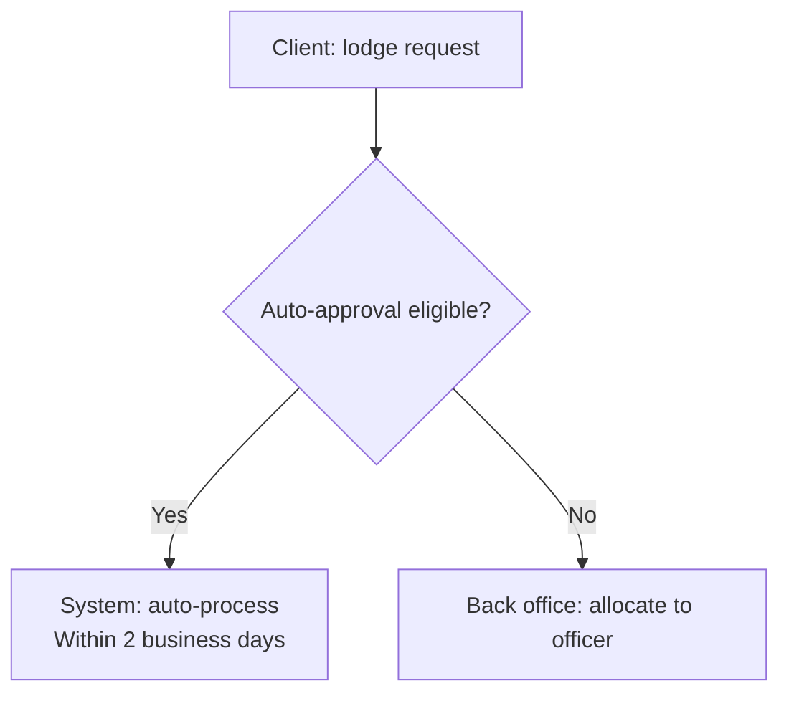

## Project definition — read this first

Before reading any discovery document, read:

```
./projects/<project>/description.md
```

This is the **project definition**: who the client organisation is, what it is
regulated or obliged to do, who its customers actually are, and what it cannot
do. It is written once per project and applies to every feature under it.

**This skill is PROJECT-level.** A capability map describes the client
organisation, not one slice of work — so it is generated once per project and
every feature reads it. Your inputs are every document the client has given us,
across all features; your output belongs to the project.

Use it to:

- resolve who "the customer" is for this process — it is frequently not the end
  consumer, and getting this wrong mis-frames every persona and every story;
- avoid proposing anything the organisation is not permitted to do;
- ground language, roles and obligations in the client's real operating model
  rather than in generic industry assumptions.

The file is **optional**. If it is absent, proceed on the discovery documents
alone and note in your output that no project definition was supplied — do not
invent organisational context to fill the gap.

# Capability & Process Map Builder

Reads every document staged for a project, derives two connected models, and
renders them as one interactive HTML page:

1. A **Business Capability Map** — a hierarchy (L1 → L2 → L3, optionally L4) of
   *what* the organisation does, with current and target maturity per leaf.
2. An **L1/L2/L3 Process Model** — the lifecycle phases (L1), process steps (L2)
   and activities (L3) of *how* the work runs, with the actor lane, service tier
   and supporting components for each activity.
3. A **self-contained HTML view** of both, cross-linked so a capability shows the
   activities that realise it.

Capabilities answer "what we do". Processes answer "how it happens, in order".
Never merge the two — a capability is a stable noun phrase, a process activity
is a verb phrase that occurs at a point in a lifecycle.

All source documents are `.md` (the chatbot converts uploads on the way in).

---

## Where the inputs and output live (Scyne workspace layout)

This skill runs inside its own working folder
`./projects/<project>/solutions/Capabilities/` — the Capabilities Process
Architect agent passes you `<project>` in its issue description and stages the
inputs before invoking the skill. There is **no feature** at this level.

- **Extracts (primary input):** `solutions/Capabilities/extracts/*.extract.json`
  — one per document, written by a `document-extract` pass before this skill
  runs. This is what you read. See Step 1.
- **Documents (verification only):** `solutions/Capabilities/documents/<scope>/<category>/*.md`.
  The agent copies **every `.md` the project has** here, at two levels, so a
  cited page is reachable when an extract item needs checking — not so you
  read them from end to end:
  - `documents/project/<category>/` — the project's own `documents/` tree:
    client-wide policy, legislation, standards, current-state architecture.
    These describe the organisation and outrank any single feature's view of it.
  - `documents/<feature>/<category>/` — one folder per feature, holding that
    feature's discovery documents with the folder they came from preserved as
    `<category>`, so both layouts work:
    - the standard BA layout — `requirements/SOP/`, `requirements/Transcripts/`,
      `requirements/Notes/`;
    - a companion-style document tree — e.g. `companion/docs-md/process/`,
      `.../solution-reference/`, `.../best-practice-refence/`,
      `.../current-state/`.

  `outputs/`, `solutions/` and `design/` are never staged as inputs.

  **Read across all extracts.** A capability the client exercises in three
  features is one capability, not three — deduplicate by what the organisation
  does, and cite every feature whose documents evidenced it.
- **Reference catalogue (optional input):**
  `solutions/Capabilities/capability-reference/` — any house capability
  taxonomy or schema reference (e.g. a `capabilities.csv.md` under a
  `best-practice-refence/` category counts). Use it to align naming and levels;
  never copy its rows in wholesale.
- **Outputs (you write here):** `solutions/Capabilities/outputs/`
  - `capability-map.json` — the capability hierarchy (machine-readable)
  - `process-model.json` — the L1/L2/L3 activities and the process flows (machine-readable)
  - `capability-process.md` — the human-readable document (tables + Mermaid)
  - (no HTML — the project's single page is rendered separately, see Step 5)

  All three names are fixed — the chatbot's approval preview and the HTML
  endpoint read them by exact path. Create `outputs/` if it does not exist.

(All paths below are relative to the working folder
`./projects/<project>/solutions/Capabilities/`.)

---

## Step 1 — Read the Extracts

Every document has already been read, once, by a `document-extract` pass. Your
input is those extracts, not the documents.

```bash
ls extracts/*.extract.json | wc -l
```

Each extract is one document, and carries eight lists:

| Field | Becomes |
|---|---|
| `businessFunctions` | capabilities |
| `processSteps` | process activities, with actor and sequence |
| `actors` | who performs each step |
| `serviceTiers` | variants where a step applies to some cohorts only |
| `components` | supporting systems |
| `maturitySignals` | current versus target maturity |
| `lifecyclePhases` | the L1 phases — prefer these over invented ones |
| `painPoints` | the client's own words, verbatim |

`scope` tells you where it came from: `project` is client-wide,
anything else is one feature's discovery. **Where the two disagree, the
client-wide extract wins.**

### Verify before you assert

Every item carries `src` — the pages it came from. When a capability rests on
one ambiguous item, or two extracts appear to contradict each other, fetch
those exact pages from `documents/` and read the real words before deciding.
Do not settle a contradiction by picking the one that reads better.

### Citations never reach the document

`src` exists so you can check yourself. No citations reach the delivered
document — `src` must **never appear** in `capability-process.md`, in
`capability-map.json`, or anywhere a client sees. No footnotes, no
"(Workshop_Transcript.md, p.23)". The delivered document is clean prose.

### Refuse what you cannot support

If you cannot point a capability back to at least one extract item, do not
record it. An unsupported capability is an invented one, and this is the only
point in the pipeline where that gets caught.

### Coverage

If any extract reports `coverage.truncated: true`, note it under
**Assumptions & Gaps** with the document name and how much was read. A gap you
name is a gap the reader can weigh; a gap you hide is a wrong map.

If `extracts/` is empty, stop and report it — do not read the documents
directly and do not invent a map.

---

## Step 2 — Derive the Capability Map

Build a strict hierarchy. Every node has an ID whose depth matches its level:
`1.0` (L1) → `1.1` (L2) → `1.1.1` (L3) → `1.1.1.1` (L4, only where the
documents genuinely justify a fourth level).

Rules:

- **L1 = value-chain domain.** Usually 4–8 of them. Group into the natural
  domains the documents describe (e.g. engagement, core operations, regulation
  and compliance, common/shared capabilities, enabling capabilities).
- **L2 = capability group** within a domain.
- **L3 = the discrete capability** — this is where maturity is assessed. Name it
  as a noun phrase ending in "Management", "Assessment", "Coordination" and
  similar; never as a verb phrase.
- Every capability carries a **one-to-three sentence description** grounded in
  the documents, and a `sourceDocs` list naming the files it came from.
- **Maturity** is only set on L3/L4 leaves. Use the scale
  `None | Foundational | Operational | Optimised | Transformational` for both
  `currentMaturity` and `targetMaturity`. Set current from evidence in the
  current-state documents; set target from stated ambition. Where the documents
  say nothing, leave both empty rather than guessing — and note it as a gap.
- **`stage`** (optional) maps the capability to the lifecycle phase it is most
  used in — use one of the L1 phase names from Step 3, so the two models line up.
- Do **not** invent capabilities to make the map look complete. A thin document
  set produces a thin map plus an honest gap list.

Write the result to `outputs/capability-map.json`:

```json
{
  "project": "<project>",
  "title": "<Client name> — Capability Map",
  "generatedOn": "YYYY-MM-DD",
  "sources": ["project/policy/Maintenance Standard.md", "work-orders/SOP/Allocation of Work Orders.md", "..."],
  "capabilities": [
    {
      "id": "2.1.3",
      "name": "Allocation & Workload Management",
      "level": 3,
      "parentId": "2.1",
      "stage": "Triage and Allocation",
      "currentMaturity": "Operational",
      "targetMaturity": "Optimised",
      "description": "Allocation of work to team and officer by skill, urgency and capacity.",
      "sourceDocs": ["process/Allocation of Work Orders - SOP.pdf.md"]
    }
  ]
}
```

Field rules: `parentId` is `null` for L1; `level` is an integer 1–4 and must
match the ID depth; `stage`, `currentMaturity`, `targetMaturity` are `""` when
unknown; `sourceDocs` is never empty.

The examples in this skill show **shape only**. Take every capability, phase,
activity, actor and system name from the project's own documents, never from
an example.

---

## Step 3 — Derive the Process Model

One row per **L3 activity**. Order matters — write the activities in the
sequence they occur, grouped by L1 phase then L2 step.

- **L1 — lifecycle phase.** The end-to-end stages (e.g. "Discovery &
  Lodgement", "Triage and Allocation", "Assessment", "Finalisation / Closure").
  Use the documents' own names.
- **L2 — process step.** A cohesive step within a phase.
- **L3 — activity.** A single verb-phrase action ("Verify request information and
  documentation"). This is the unit that carries all the detail.
- **`actor`** — one of `Client`, `Front office`, `Back office`, `Third party`,
  `System`. Pick the one that performs the activity.
- **`serviceTier`** — `All` unless the documents scope the activity to a cohort.
- **`components`** — named enabling systems/modules/features, `[]` if none stated.
- **`capabilityIds`** — the capability IDs this activity realises (usually one or
  two). Every ID must exist in `capability-map.json`; every L3 capability should
  be referenced by at least one activity, or explained as a gap.
- **`sourceDocs`** — the files this activity came from; never empty.

Write `outputs/process-model.json`:

```json
{
  "project": "<project>",
  "title": "<Client name> — Process Model",
  "generatedOn": "YYYY-MM-DD",
  "activities": [
    {
      "l1": "Triage and Allocation",
      "l2": "Allocate work order",
      "l3": "Allocate work order to best-fit team and technician",
      "description": "Match the work order to a team and technician by skill, urgency and workload.",
      "actor": "Back office",
      "serviceTier": "All",
      "components": ["Intelligent Work Allocation"],
      "capabilityIds": ["2.1.3"],
      "sourceDocs": ["process/Allocation of Work Orders - SOP.pdf.md"]
    }
  ]
}
```

Do **not** invent steps. If a flow is only partly described, model what is
stated and record the rest as a gap.

### Process flows (swimlanes)

Add a `flows` array to the same `process-model.json`. The companion app draws
each flow as a swimlane diagram.

**Never hand-write `flows`.** Write Section 5's Mermaid (one `### <L1 phase>`
heading and one ```` ```mermaid ```` flowchart per phase, every task label
prefixed with its role — `SOO: verify ABN`), then generate `flows` from it:

```bash
node scripts/mermaid-to-flows.mjs <project>
```

It reads §5 and the activities, builds every lane, task, decision, start and
end, links each task to its activity, validates, and writes `flows` into
`process-model.json` — in seconds. Writing the same JSON by hand for six
phases exhausted a whole run's output budget and saved nothing. After it runs,
add `pain` to the few tasks where a source document states a problem at that
step — small targeted edits to `process-model.json`, never a rewrite of the
whole file. The rules the generated flows follow:

- **One flow per L1 phase** that the documents describe as a sequence. A phase
  the documents do not sequence gets **no flow** — record it as a gap in
  Section 6 instead.
- **`lanes`** — the actors who perform the phase's activities, using the exact
  `actor` strings from `activities` (`System` for system steps), ordered by
  first appearance in the flow.
- **Nodes** — one `start`; a `task` per step, carrying `activity` (the exact
  `l3` of an activity in the same `l1`) wherever one exists; a `gateway` for
  **every decision the documents state**; one or more `end` nodes with
  `outcome` `good` or `bad`. Every node sits in one of the flow's `lanes`.
  Labels are short (80 chars max) — the full wording lives on the activity.
- **Edges** — `from` / `to` node ids. Every edge out of a gateway carries a
  label: `Yes` / `No`, or the outcome words the documents use (24 chars max).
  Loops are allowed (a "request info" that goes back a step).
- **`pain`** — only when a source document states a problem at that step.
  Short and plain (140 chars max), no citation.
- **`sla`** — only for a timeframe the documents state (60 chars max).

Never invent steps or decisions to make a flow look complete. The validator in
Step 5 refuses a flow whose lanes, ids or edges do not line up, or whose nodes
cannot be reached from the start.

```json
"flows": [{
  "l1": "Requisition & Approval",
  "lanes": ["Requester (REQ)", "System", "Approving Manager (AM)", "Buyer (BUY)"],
  "nodes": [
    {"id": "start", "type": "start", "lane": "Requester (REQ)", "label": "Need identified"},
    {"id": "t1", "type": "task", "lane": "Requester (REQ)", "label": "Check catalogue or BPA",
     "activity": "<exact l3 of an activity in this l1>", "pain": "optional, <=140 chars", "sla": "optional, <=60 chars"},
    {"id": "g1", "type": "gateway", "lane": "Requester (REQ)", "label": "Covered by catalogue?"},
    {"id": "end-ok", "type": "end", "lane": "Buyer (BUY)", "label": "Ready for PO", "outcome": "good"}
  ],
  "edges": [{"from": "start", "to": "t1"}, {"from": "g1", "to": "t2", "label": "Yes"}]
}]
```

(Abridged — a real flow lists every node its edges name, and every node is
reachable from `start`.)

---

## Step 4 — Write the Document

Save to `outputs/capability-process.md` using exactly this structure:

````markdown
# Capability & Process Map
**Project / Feature:** [project] / [feature name]
**Date:** [today's date]
**Documents read:** [count] across [list the category folders]

---

## 1. Executive Summary

[3–5 sentences: how many L1 domains and L3 capabilities, how many lifecycle
phases and activities, the dominant maturity gap, and the biggest evidence gap.]

---

## 2. Business Capability Map

| ID | Capability | Level | Parent | Lifecycle Stage | Current | Target | Source |
|---|---|---|---|---|---|---|---|
| 2.1.3 | Allocation & Workload Management | 3 | 2.1 | Triage and Allocation | Operational | Optimised | Allocation of Work Orders SOP |

[One row per capability, in ID order. Descriptions live in the JSON — keep this
table scannable.]

### 2.1 Capability Descriptions

**[ID] [Name]** — [description] _(Source: [files])_

---

## 3. Process Model (L1 / L2 / L3)

### [L1 phase name]

| L2 Step | L3 Activity | Actor | Tier | Components | Source |
|---|---|---|---|---|---|

[Repeat one subsection per L1 phase, activities in sequence.]

---

## 4. Capability ↔ Process Coverage

| Capability | Activities | Coverage |
|---|---|---|
| 2.1.3 Allocation & Workload Management | 3 | Covered |
| 4.2.1 Knowledge Management | 0 | **No process evidence** |

[Every L3 capability appears. "No process evidence" is a finding, not a defect —
call it out in Section 6.]

---

## 5. Process Flow

[One `### <L1 phase name>` heading and one Mermaid `flowchart TD` per phase
the documents sequence. **This is the source `flows` is generated from** (by
`scripts/mermaid-to-flows.mjs`), so the document and the companion app's
swimlanes cannot disagree. Prefix EVERY task label with its role — the
abbreviation where the actor has one (`REQ: Check catalogue or BPA`), `Oracle:`
for system steps; the prefix picks the swimlane lane. Use `{ ... }` for every
decision, label every edge out of a decision (`-- Yes -->`), put a timeframe on
its own line after `<br/>` (it becomes the step's SLA chip), and avoid
unescaped `()` in labels. A phase with no sequence gets no diagram.

**A line break in a node label is `<br/>` — never `\n`.** Mermaid's label
grammar has no backslash escape, so `\n` does not break the line: the renderer
drops it and welds the two phrases together, which is how a label meant to read
"Issue agreement for digital signature / Typical 4 to 8 weeks" reached a client
wiki as `digital signatureTypical 4 to 8 weeks`. Nothing catches it — the
diagram still parses, so the fence renders and only a reader notices. Putting an
SLA on its own line is the whole reason a label needs a break, so the rule
matters most on exactly the labels this section asks for.]



---

## 6. Assumptions & Gaps

| # | Item | Impact | Recommendation |
|---|---|---|---|
| 1 | [What was missing or ambiguous] | [What it weakens in the map] | [What to obtain] |

---

## 7. Sources

| Category | File | Used for |
|---|---|---|

---

## 8. Revision History

| Version | Date | Author | Notes |
|---|---|---|---|
| 0.1 | [today] | Capabilities Process Architect | Initial capability + process map |
````

Australian English throughout (Behaviour, Authorise, Organisation, Prioritise).

---

## Step 5 — Render the HTML

Run the shipped renderer from the **workspace root** — never hand-write the HTML:

```bash
node scripts/render-capability-map.mjs <project> --validate-only
node scripts/render-companion-app.mjs <project>
```

The first command reads the two JSON files and validates them — `flows`
included — writing nothing.
If it exits non-zero it names the file and field at fault — fix the JSON and
re-run.

The second renders the project's **single page**. A project has ONE HTML
document covering every stage — personas, journeys, capabilities and process at
project level, then the product summary, stories, mockups, data model,
architecture and test cases for each feature — and it is *progressive*: it
renders from whatever has been produced so far, so run it every time you finish,
not once at the end. Never hand-write HTML; a hand-written file drifts from the
data on the next render.

---

## Step 6 — Quality Check

Before finishing, verify:

- [ ] Every document in `documents/` was read, and appears in Section 7
- [ ] Every capability ID's depth matches its `level`, and every `parentId` exists
- [ ] Every L3/L4 capability has maturity set, or is listed as a gap
- [ ] Capabilities are noun phrases; L3 activities are verb phrases
- [ ] Every activity has an actor, a tier, sources, and at least one `capabilityIds` entry
- [ ] Every `capabilityIds` value exists in `capability-map.json`
- [ ] Every L3 capability appears in the Section 4 coverage table
- [ ] Activities are in lifecycle order within each phase
- [ ] `node scripts/mermaid-to-flows.mjs <project>` ran clean, and every phase without a flow is a Section 6 gap
- [ ] Every task label in Section 5 carries its role prefix, and every decision is a `{ }` node with labelled exits
- [ ] Nothing was invented — every row traces to a named source file
- [ ] A capability evidenced by several features appears ONCE, citing all of them
- [ ] All three output files exist, with the exact fixed names
- [ ] The renderer exited 0 and the HTML opens standalone

---

## Step 7 — Report

Give a brief summary covering:

- Documents read, by scope and category — say how many came from the project's
  own `documents/` and how many from each feature
- L1 domains and total capabilities, by level
- Lifecycle phases, L2 steps and L3 activities
- Maturity spread (how many capabilities at each current level) and the largest
  current → target gaps
- Capabilities with no process evidence, and process activities with no
  capability — both are findings worth surfacing
- The absolute path of the project's single page, `generated-apps/<project>/index.html`

---

## Revision mode

When the invocation supplies a **previous version** of these artefacts plus a
**change instruction**, you are revising, not regenerating.

- Preserve every capability, activity, ID and decision the instruction does not
  touch. IDs in particular are referenced by the process model, the companion
  app and any downstream architecture — renumbering them breaks all three.
- Apply the change and its genuine consequences. A new L3 capability needs a
  parent, a maturity pair, source evidence, and at least one activity that
  realises it or an explicit note that it has none.
- Add a `## Revision History` entry at the end of `capability-process.md`
  recording what changed and why.
- Do not reword, restructure or re-order anything the instruction did not ask
  about. A regenerate-from-scratch produces a diff too large for a reviewer to
  check, which defeats the approval gate that follows.
- Re-run the validator afterwards. A revision that breaks the JSON contract is
  worse than no revision.
- **Adding flows to an existing map** (e.g. "add flows from §5"): run
  `node scripts/mermaid-to-flows.mjs <project>` — it builds `flows` from the
  existing Section 5 Mermaid, so Section 5 stays as it is. Then add `pain` only
  where a source document states a problem at that step, as small edits. Do not
  write `flows` by hand and do not rewrite `process-model.json` in one go.
  Change nothing else: no capability, activity or ID changes. Add a Revision
  History entry.
