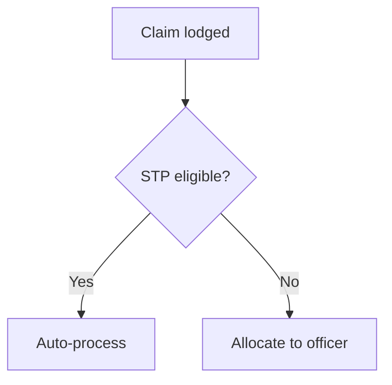

## Project definition — read this first

Before reading any discovery document, read:

```
./projects/<project>/description.md
```

This is the **project definition**: who the client organisation is, what it is
regulated or obliged to do, who its customers actually are, and what it cannot
do. It is written once per project and applies to every feature under it.

Use it to:

- resolve who "the customer" is for this process — it is frequently not the end
  consumer, and getting this wrong mis-frames every persona and every story;
- avoid proposing anything the organisation is not permitted to do;
- ground language, roles and obligations in the client's real operating model
  rather than in generic industry assumptions.

The file is **optional**. If it is absent, proceed on the discovery documents
alone and note in your output that no project definition was supplied — do not
invent organisational context to fill the gap.

# Capability & Process Map Builder

Reads every document staged for a feature, derives two connected models, and
renders them as one interactive HTML page:

1. A **Business Capability Map** — a hierarchy (L1 → L2 → L3, optionally L4) of
   *what* the organisation does, with current and target maturity per leaf.
2. An **L1/L2/L3 Process Model** — the lifecycle phases (L1), process steps (L2)
   and activities (L3) of *how* the work runs, with the actor lane, service tier
   and supporting components for each activity.
3. A **self-contained HTML view** of both, cross-linked so a capability shows the
   activities that realise it.

Capabilities answer "what we do". Processes answer "how it happens, in order".
Never merge the two — a capability is a stable noun phrase, a process activity
is a verb phrase that occurs at a point in a lifecycle.

All source documents are `.md` (the chatbot converts uploads on the way in).

---

## Where the inputs and output live (Scyne workspace layout)

This skill runs inside its own working folder
`./projects/<project>/<feature>/solutions/Capabilities/` — the Capabilities
Process Architect agent passes you `<project>` and `<feature>` in its issue
description and stages the inputs before invoking the skill.

- **Documents (input):** `solutions/Capabilities/documents/<category>/*.md`.
  The agent copies **every `.md` under the feature folder** here, preserving the
  folder name it came from as `<category>` — so both layouts work:
  - the standard BA layout — `requirements/SOP/`, `requirements/Transcripts/`,
    `requirements/Notes/`;
  - a companion-style document tree — e.g. `companion/docs-md/process/`,
    `.../solution-reference/`, `.../best-practice-refence/`,
    `.../current-state/`.
  `outputs/`, `solutions/` and `design/` are never staged as inputs.
- **Reference catalogue (optional input):**
  `solutions/Capabilities/capability-reference/` — any house capability
  taxonomy or schema reference (e.g. a `capabilities.csv.md` under a
  `best-practice-refence/` category counts). Use it to align naming and levels;
  never copy its rows in wholesale.
- **Outputs (you write here):** `solutions/Capabilities/outputs/`
  - `capability-map.json` — the capability hierarchy (machine-readable)
  - `process-model.json` — the L1/L2/L3 activities (machine-readable)
  - `capability-process.md` — the human-readable document (tables + Mermaid)
  - (no HTML — the feature's single page is rendered separately, see Step 5)

  All four names are fixed — the chatbot's approval preview and the HTML
  endpoint read them by exact path. Create `outputs/` if it does not exist.

(All paths below are relative to the working folder
`./projects/<project>/<feature>/solutions/Capabilities/`.)

---

## Step 1 — List and Read Every Document

Before reading anything, list what you actually have:

```bash
ls documents/
ls documents/*/
ls capability-reference/ 2>/dev/null
```

Read **every** `.md` file in every category folder. Note each filename — it
becomes a source tag on the capabilities and activities it supports.

If `documents/` is empty, stop and report it — do not invent a map. If a single
category is empty, continue and record it under **Assumptions & Gaps**.

For each document, extract:

- **Business functions** — what the organisation does, named as noun phrases
  ("Claims Management", "Provider Coordination"). These become capabilities.
- **Process steps and sequence** — what happens, in what order, with what
  decision points, timeframes and SLAs. These become process activities.
- **Actors** — who performs each step: the client/customer, front office, back
  office, a third party, or the system itself.
- **Service tiers / variants** — where a step only applies to some cohorts
  (e.g. straight-through vs complex vs catastrophic).
- **Supporting components** — named systems, modules, portals, tools or
  features that enable a step.
- **Maturity signals** — statements about what exists today versus what is
  wanted ("currently manual", "to be automated", "no single view today").
- **Lifecycle phases** — any stated end-to-end structure (a claim lifecycle, an
  application lifecycle, a case lifecycle). Prefer the document's own phase
  names over invented ones.

---

## Step 2 — Derive the Capability Map

Build a strict hierarchy. Every node has an ID whose depth matches its level:
`1.0` (L1) → `1.1` (L2) → `1.1.1` (L3) → `1.1.1.1` (L4, only where the
documents genuinely justify a fourth level).

Rules:

- **L1 = value-chain domain.** Usually 4–8 of them. Group into the natural
  domains the documents describe (e.g. engagement, core operations, regulation
  and compliance, common/shared capabilities, enabling capabilities).
- **L2 = capability group** within a domain.
- **L3 = the discrete capability** — this is where maturity is assessed. Name it
  as a noun phrase ending in "Management", "Assessment", "Coordination" and
  similar; never as a verb phrase.
- Every capability carries a **one-to-three sentence description** grounded in
  the documents, and a `sourceDocs` list naming the files it came from.
- **Maturity** is only set on L3/L4 leaves. Use the scale
  `None | Foundational | Operational | Optimised | Transformational` for both
  `currentMaturity` and `targetMaturity`. Set current from evidence in the
  current-state documents; set target from stated ambition. Where the documents
  say nothing, leave both empty rather than guessing — and note it as a gap.
- **`stage`** (optional) maps the capability to the lifecycle phase it is most
  used in — use one of the L1 phase names from Step 3, so the two models line up.
- Do **not** invent capabilities to make the map look complete. A thin document
  set produces a thin map plus an honest gap list.

Write the result to `outputs/capability-map.json`:

```json
{
  "project": "<project>",
  "feature": "<feature>",
  "title": "<Feature name> — Capability Map",
  "generatedOn": "YYYY-MM-DD",
  "sources": ["process/Allocation of New Claims - SOP.pdf.md", "..."],
  "capabilities": [
    {
      "id": "2.1.3",
      "name": "Allocation & Workload Management",
      "level": 3,
      "parentId": "2.1",
      "stage": "Triage and Allocation",
      "currentMaturity": "Operational",
      "targetMaturity": "Optimised",
      "description": "Allocation of work to team and officer by skill, urgency and capacity.",
      "sourceDocs": ["process/Allocation of New Claims - SOP.pdf.md"]
    }
  ]
}
```

Field rules: `parentId` is `null` for L1; `level` is an integer 1–4 and must
match the ID depth; `stage`, `currentMaturity`, `targetMaturity` are `""` when
unknown; `sourceDocs` is never empty.

---

## Step 3 — Derive the Process Model

One row per **L3 activity**. Order matters — write the activities in the
sequence they occur, grouped by L1 phase then L2 step.

- **L1 — lifecycle phase.** The end-to-end stages (e.g. "Discovery &
  Lodgement", "Triage and Allocation", "Assessment", "Finalisation / Closure").
  Use the documents' own names.
- **L2 — process step.** A cohesive step within a phase.
- **L3 — activity.** A single verb-phrase action ("Verify claim information and
  documentation"). This is the unit that carries all the detail.
- **`actor`** — one of `Client`, `Front office`, `Back office`, `Third party`,
  `System`. Pick the one that performs the activity.
- **`serviceTier`** — `All` unless the documents scope the activity to a cohort.
- **`components`** — named enabling systems/modules/features, `[]` if none stated.
- **`capabilityIds`** — the capability IDs this activity realises (usually one or
  two). Every ID must exist in `capability-map.json`; every L3 capability should
  be referenced by at least one activity, or explained as a gap.
- **`sourceDocs`** — the files this activity came from; never empty.

Write `outputs/process-model.json`:

```json
{
  "project": "<project>",
  "feature": "<feature>",
  "title": "<Feature name> — Process Model",
  "generatedOn": "YYYY-MM-DD",
  "activities": [
    {
      "l1": "Triage and Allocation",
      "l2": "Allocate claim",
      "l3": "Allocate claim to best-fit team and officer",
      "description": "Match the claim to a team and officer by skill, urgency and workload.",
      "actor": "Back office",
      "serviceTier": "All",
      "components": ["Intelligent Claim Allocation"],
      "capabilityIds": ["2.1.3"],
      "sourceDocs": ["process/Allocation of New Claims - SOP.pdf.md"]
    }
  ]
}
```

Do **not** invent steps. If a flow is only partly described, model what is
stated and record the rest as a gap.

---

## Step 4 — Write the Document

Save to `outputs/capability-process.md` using exactly this structure:

````markdown
# Capability & Process Map
**Project / Feature:** [project] / [feature name]
**Date:** [today's date]
**Documents read:** [count] across [list the category folders]

---

## 1. Executive Summary

[3–5 sentences: how many L1 domains and L3 capabilities, how many lifecycle
phases and activities, the dominant maturity gap, and the biggest evidence gap.]

---

## 2. Business Capability Map

| ID | Capability | Level | Parent | Lifecycle Stage | Current | Target | Source |
|---|---|---|---|---|---|---|---|
| 2.1.3 | Allocation & Workload Management | 3 | 2.1 | Triage and Allocation | Operational | Optimised | Allocation of New Claims SOP |

[One row per capability, in ID order. Descriptions live in the JSON — keep this
table scannable.]

### 2.1 Capability Descriptions

**[ID] [Name]** — [description] _(Source: [files])_

---

## 3. Process Model (L1 / L2 / L3)

### [L1 phase name]

| L2 Step | L3 Activity | Actor | Tier | Components | Source |
|---|---|---|---|---|---|

[Repeat one subsection per L1 phase, activities in sequence.]

---

## 4. Capability ↔ Process Coverage

| Capability | Activities | Coverage |
|---|---|---|
| 2.1.3 Allocation & Workload Management | 3 | Covered |
| 4.2.1 Knowledge Management | 0 | **No process evidence** |

[Every L3 capability appears. "No process evidence" is a finding, not a defect —
call it out in Section 6.]

---

## 5. Process Flow

[One Mermaid `flowchart TD` per L1 phase (or one overall flow if the phases are
short), showing the L2 steps and their decision points in sequence. Keep the
Mermaid source inline — it is the source of truth. Use `{ ... }` for decisions,
put timeframes/SLAs in the node label, and avoid unescaped `()` in labels.]



---

## 6. Assumptions & Gaps

| # | Item | Impact | Recommendation |
|---|---|---|---|
| 1 | [What was missing or ambiguous] | [What it weakens in the map] | [What to obtain] |

---

## 7. Sources

| Category | File | Used for |
|---|---|---|

---

## 8. Revision History

| Version | Date | Author | Notes |
|---|---|---|---|
| 0.1 | [today] | Capabilities Process Architect | Initial capability + process map |
````

Australian English throughout (Behaviour, Authorise, Organisation, Prioritise).

---

## Step 5 — Render the HTML

Run the shipped renderer from the **workspace root** — never hand-write the HTML:

```bash
node scripts/render-capability-map.mjs <project> <feature> --validate-only
node scripts/render-companion-app.mjs <project> <feature>
```

The first command reads the two JSON files and validates them, writing nothing.
If it exits non-zero it names the file and field at fault — fix the JSON and
re-run.

The second renders the feature's **single page**. A feature has ONE HTML
document covering every stage — personas, journeys, capabilities, process,
stories, the product summary and the rest — and it is *progressive*: it renders
from whatever the feature has produced so far, so run it every time you finish,
not once at the end. Never hand-write HTML; a hand-written file drifts from the
data on the next render.

---

## Step 6 — Quality Check

Before finishing, verify:

- [ ] Every document in `documents/` was read, and appears in Section 7
- [ ] Every capability ID's depth matches its `level`, and every `parentId` exists
- [ ] Every L3/L4 capability has maturity set, or is listed as a gap
- [ ] Capabilities are noun phrases; L3 activities are verb phrases
- [ ] Every activity has an actor, a tier, sources, and at least one `capabilityIds` entry
- [ ] Every `capabilityIds` value exists in `capability-map.json`
- [ ] Every L3 capability appears in the Section 4 coverage table
- [ ] Activities are in lifecycle order within each phase
- [ ] Nothing was invented — every row traces to a named source file
- [ ] All four output files exist, with the exact fixed names
- [ ] The renderer exited 0 and the HTML opens standalone

---

## Step 7 — Report

Give a brief summary covering:

- Documents read, by category
- L1 domains and total capabilities, by level
- Lifecycle phases, L2 steps and L3 activities
- Maturity spread (how many capabilities at each current level) and the largest
  current → target gaps
- Capabilities with no process evidence, and process activities with no
  capability — both are findings worth surfacing
- The absolute path of the feature's single page, `generated-apps/<project>-<feature>/index.html`
