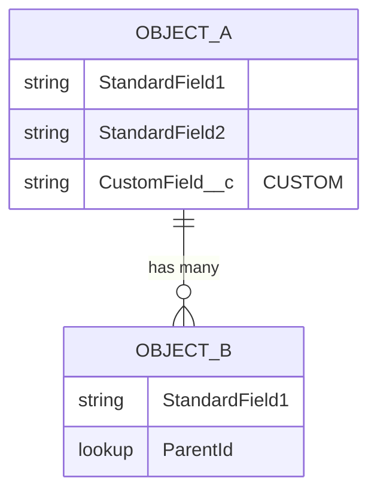

# Salesforce Data Model Impact Analyser

Reads the approved **Product Summary** for a feature, cross-references it against
the Salesforce Social Insurance and Public Sector Solutions (PSS) data model
**reference catalogue**, and produces:

1. A **data model impact table** — standard objects, required custom fields
2. A **Mermaid ER diagram** — visual relationships between impacted objects

All source files are `.md` format.

## Where the inputs and output live (Scyne workspace layout)

This skill runs inside the Scyne workspace. Inputs and the output are organised
by project + feature — the Data Modeler agent passes you the `<project>` and
`<feature>` in its issue description.

- **Product Summary (input):** `./projects/<project>/<feature>/outputs/product-summary.md`
  (the BA's approved output). Read every `.md` file in that `outputs/` folder so
  you also pick up any supporting summary the feature carries.
- **Data model reference catalogue (static input):** `./datamodel-reference/`
  at the workspace root — the global Salesforce PSS / Social-Insurance object
  catalogue (one `.md` per solution area). **Per-project override:** if
  `./projects/<project>/<feature>/datamodel-reference/` exists and contains
  files, use that instead and fall back to the global folder for anything it
  doesn't cover.
- **Output (you write here):** `./projects/<project>/<feature>/outputs/datamodel-impact.md`
  — a single fixed filename so the chatbot's approval preview can read it.

---

## Step 1 — List and Read All Source Files

Before reading anything, list the contents of both input locations:

```bash
ls ./projects/<project>/<feature>/outputs/
ls ./datamodel-reference/            # or the per-project override if present
```

Note every filename — you will reference them as sources throughout the
analysis. If either location is empty, record it in the output under
**Assumptions & Gaps** and continue with what is available.

---

## Step 2 — Read the Product Summary

Read **every** `.md` file in `./projects/<project>/<feature>/outputs/` (the
Product Summary is `product-summary.md`).

For each file, extract and catalogue:

### 2.1 Functional Requirements
- Every stated feature, capability, or system behaviour
- Data entities mentioned explicitly (e.g. "applicant", "claim", "benefit",
  "policy", "case", "payment", "assessment", "document")
- Data actions mentioned (create, read, update, delete, relate, calculate,
  track, store, report on)
- Integrations or data flows with external systems

### 2.2 Non-Functional Requirements
- Data volume or retention requirements
- Reporting or analytics needs that imply additional fields or objects
- Compliance or audit requirements that imply tracking fields

### 2.3 Implicit Data Needs
- Look beyond explicit mentions — infer data entities from business
  processes described. For example:
  - "track application status" → implies a status field on an object
  - "assign caseworker" → implies a lookup to a User or Contact
  - "notify applicant" → implies contact information and communication logs
  - "calculate benefit amount" → implies financial fields
  - "upload supporting documents" → implies ContentDocument / File linkage

---

## Step 3 — Read the Data Model Reference Files

Read **every** `.md` file in `./datamodel-reference/` (or the per-project
override).

For each file, catalogue:

### 3.1 Standard Objects
- Object API name (e.g. `IndividualApplication__c`, `BenefitAssignment__c`)
- Object label and description
- Key standard fields and their data types
- Relationships to other objects (lookups, master-detail, junction)
- Which Salesforce cloud or solution it belongs to
  (Social Insurance, PSS, Health & Human Services, etc.)

### 3.2 Object Relationships
- Map all parent-child relationships
- Note junction objects and what they connect
- Note any polymorphic lookups

### 3.3 Extensibility Notes
- Which objects support custom fields
- Any documented limitations or locked objects
- Recommended extension patterns (custom fields vs custom objects)

If multiple reference files exist, build a unified object catalogue
before proceeding to Step 4.

---

## Step 4 — Perform the Impact Analysis

### 4.0 — Standard-First Principle (MUST follow this order)

**Always attempt to satisfy a requirement using the standard data model
before considering any customisation.** Apply this decision hierarchy
strictly for every requirement — do not skip levels:

```
Level 1 → Can a standard object meet this requirement with NO changes?
              YES → Full Match. Stop here. No customisation needed.
               ↓ NO
Level 2 → Can a standard object meet this requirement by adding
          custom fields only?
              YES → Partial Match. Add custom fields only. Stop here.
               ↓ NO
Level 3 → Can an existing standard object be extended with a new
          lookup/relationship to another standard object?
              YES → Extension. Add the relationship only. Stop here.
               ↓ NO
Level 4 → Only if Levels 1–3 are all exhausted and documented:
          introduce a new Custom Object.
              → No Match. Justify why no standard object can be used.
```

**Custom objects are a last resort, not a default.** Every "No Match"
decision must include an explicit justification in Section 4 of the
output explaining why Levels 1–3 were ruled out.

---

### 4.1 — Classify Each Requirement

For each data entity or requirement from Step 2, work through the
decision hierarchy above and assign one classification:

- **Full Match** — standard object covers the requirement as-is,
  no changes needed
- **Partial Match** — standard object covers the core, custom fields
  required to store additional data
- **Extension** — requirement is met by adding a new lookup or
  junction relationship between existing standard objects
- **No Match** — no standard object can meet the requirement even
  with custom fields or new relationships; a new custom object is
  justified and required

---

### 4.2 — Custom Field Assessment (Partial Match only)

For every Partial Match, identify the minimum set of custom fields
needed — do not propose custom fields that duplicate existing standard
fields:

- What data needs to be stored that standard fields do not cover
- Proposed field label and API name (Salesforce convention: `Field_Name__c`)
- Field data type (Text, Number, Currency, Date, Picklist, Lookup,
  Checkbox, Long Text Area, Formula, etc.)
- Whether the field is required or optional
- Which requirement drives the need (source tag)

---

### 4.3 — Relationship Mapping (Extension only)

For every Extension, identify:
- Which two standard objects need to be linked
- Cardinality: one-to-one, one-to-many, or many-to-many
- Relationship type: Lookup, Master-Detail, or Junction Object
  (junction object = two lookups on a new lightweight object;
  only introduce if no existing junction standard object exists)

---

### 4.4 — Custom Object Justification (No Match only)

For every No Match, document all three of the following before
proposing a custom object:

1. **Why Level 1 failed** — which standard objects were considered
   and why they do not fit
2. **Why Level 2 failed** — why adding custom fields to a standard
   object cannot satisfy the requirement
3. **Why Level 3 failed** — why a new relationship between standard
   objects cannot satisfy the requirement

Then define the proposed custom object:
- Object label and API name (`CustomObject__c`)
- Purpose — what it stores and why it exists
- Key fields (both standard and proposed custom)
- Relationships to existing standard objects

---

## Step 5 — Write the Output Document

Compose the full document using exactly this structure (you save it to the
output path in Step 7, after the quality check):

---

````markdown
# Salesforce Data Model Impact Analysis
**Product / Feature:** [name from product summary]
**Date:** [today's date]
**Reference Models:** [list the datamodel-reference filenames used]
**Product Summary Sources:** [list the product-summary filenames used]

---

## 1. Executive Summary

[2–3 sentences: overall data model impact — how many objects affected,
how many custom fields needed, any new objects required, key risks.]

---

## 2. Data Model Impact Table

| # | Standard Object (API Name) | Object Label | Solution | Impact Type | Custom Fields Required | Requirement Source |
|---|---|---|---|---|---|---|
| 1 | `ObjectName__c` | Object Label | Social Insurance / PSS | Full Match / Partial Match / No Match / Extension | See Section 3 / NA | REQ-001 |

**Impact Type definitions:**
- **Full Match** — standard object covers the requirement with no changes
- **Partial Match** — standard object needs custom fields added
- **No Match** — a new custom object must be created
- **Extension** — a new relationship or junction object is needed

---

## 3. Custom Fields Detail

For each object with a Partial Match or Extension, list the custom fields:

### [Object API Name] — [Object Label]

| # | Field Label | API Name | Data Type | Required? | Description | Requirement Source |
|---|---|---|---|---|---|---|
| 1 | [Label] | `Field_Name__c` | Text(255) / Lookup / etc. | Yes / No | [Why this field is needed] | REQ-00X |

If no custom fields are needed for an object, write: _No custom fields required — standard fields are sufficient._

---

## 4. New Custom Objects (if any)

Custom objects are introduced **only** when Levels 1–3 of the
standard-first decision hierarchy have been exhausted. For each
proposed custom object, the justification must be documented.

If any requirements have a **No Match** classification:

| # | Proposed Object Label | API Name | Purpose | Key Fields | Relates To |
|---|---|---|---|---|---|
| 1 | [Label] | `CustomObject__c` | [What it stores] | [List key fields] | [Parent objects] |

**Justification for each custom object:**

**[Object Label]**
- Level 1 ruled out because: [which standard objects were considered and why they don't fit]
- Level 2 ruled out because: [why custom fields on a standard object cannot satisfy this]
- Level 3 ruled out because: [why a new relationship between standard objects cannot satisfy this]

If no new custom objects are needed, write:
_All requirements are satisfied by standard objects — no custom objects required._

---

## 5. ER Diagram

The following Mermaid ER diagram shows all impacted objects and their
relationships. Standard objects are marked `[STD]`. Custom fields are
shown inline. New custom objects are marked `[CUSTOM]`.



**Diagram conventions:**
- `||--o{` = one-to-many
- `||--||` = one-to-one
- `}o--o{` = many-to-many (via junction)
- Fields marked `"CUSTOM"` are proposed custom fields
- Fields marked `"STD"` are standard fields included for context

---

## 6. Assumptions & Gaps

| # | Item | Impact | Recommendation |
|---|---|---|---|
| 1 | [What was assumed or is missing] | [How it affects the analysis] | [What to do] |

---

## 7. Recommendations

[Bullet list of the top actions the team should take, e.g.:]
- Confirm custom field list with Salesforce architect before build
- Validate No Match objects against latest PSS release notes
- Review any locked or managed objects before adding custom fields

---

## 8. Revision History

| Version | Date | Author | Notes |
|---|---|---|---|
| 0.1 | [today] | Data Modeler | Initial data model impact analysis |
````

---

## Step 6 — Quality Check

Before saving, verify:

- [ ] Every requirement from the product summary is accounted for
- [ ] Every requirement was evaluated against all 4 levels of the standard-first hierarchy
- [ ] No custom object exists without a written Level 1–3 justification
- [ ] No custom field duplicates an existing standard field
- [ ] Every impacted object has a row in the Section 2 impact table
- [ ] Every Partial Match has a detail entry in Section 3
- [ ] Every Extension has a relationship mapping in Section 3
- [ ] Every No Match has a full justification in Section 4
- [ ] Custom field API names follow Salesforce convention (`Name__c`)
- [ ] The Mermaid diagram includes all objects from the impact table
- [ ] All object names in the ER diagram exactly match the impact table
- [ ] Assumptions & Gaps covers any missing reference files or ambiguity

---

## Step 7 — Save

Save the completed document to:

```
./projects/<project>/<feature>/outputs/datamodel-impact.md
```

Write the **Mermaid ER diagram source inline** in the `.md` (it is the source of
truth). Do **not** pre-render it to an image here — the Data Modeler agent
renders Mermaid blocks to PNG locally and embeds them when it publishes to
Confluence. Keep the document focused on a single feature's analysis.

After saving, give a brief summary covering:
- Total number of objects impacted
- Breakdown: Full Match / Partial Match / Extension / No Match counts
- Total custom fields proposed across all objects
- Total new custom objects introduced (with a one-line justification for each)
- Any high-risk gaps or conflicts to resolve before architecture sign-off
