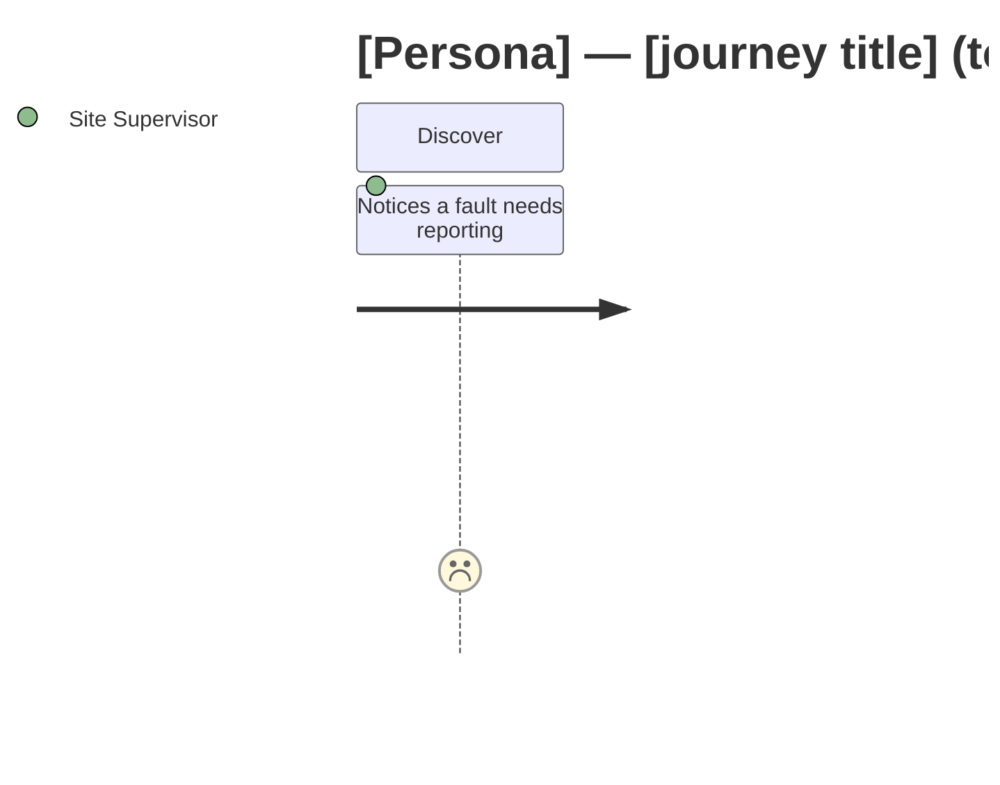
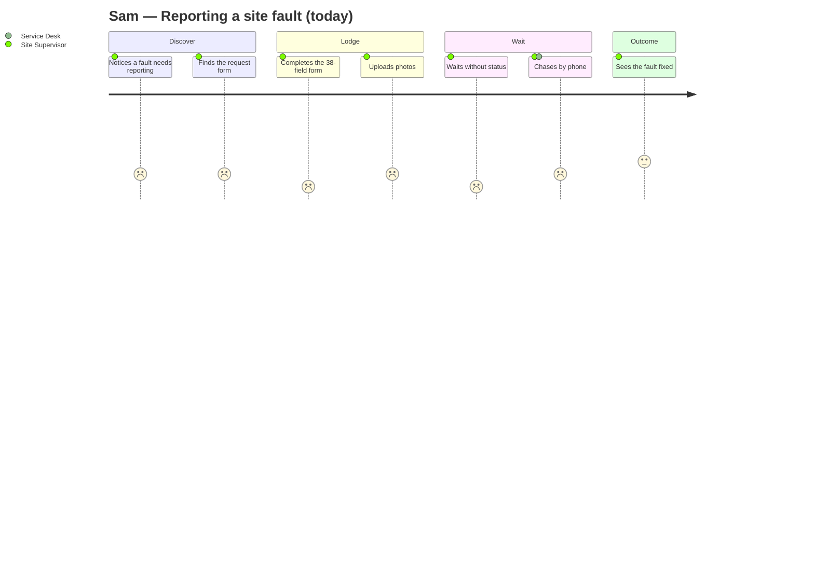

## Project definition — read this first

Before reading any discovery document, read:

```
./projects/<project>/description.md
```

This is the **project definition**: who the client organisation is, what it is
regulated or obliged to do, who its customers actually are, and what it cannot
do. It is written once per project and applies to every feature under it.

Use it to:

- resolve who "the customer" is for this process — it is frequently not the end
  consumer, and getting this wrong mis-frames every persona and every story;
- avoid proposing anything the organisation is not permitted to do;
- ground language, roles and obligations in the client's real operating model
  rather than in generic industry assumptions.

The file is **optional**. If it is absent, proceed on the discovery documents
alone and note in your output that no project definition was supplied — do not
invent organisational context to fill the gap.

# Persona & Journey Map Designer

Work out who the solution is actually for, and what each of them experiences
end to end — today and in the target state. The deliverable is:

1. An **evidence-traced persona set** — every persona, and every pain point on
   it, cites the document it came from
2. A **journey map per persona** — stages, steps, what they are doing, thinking
   and feeling, with a satisfaction score today and in the target state
3. **Moments that matter** — the small number of steps where the experience is
   won or lost
4. **`personas.json` and `journey-map.json`** — drop-in data for the Scyne
   companion app, which is built last and consumes these directly

The failure mode this skill exists to prevent is the invented persona. It is
easy to produce four plausible-sounding people with tidy pain points that nobody
in the discovery material ever described, and impossible to tell the difference
later. **Every persona, pain point and journey step must trace to a source
document.** Where you infer something the documents imply but never state, label
it as an inference rather than presenting it as evidence. A persona set with
three evidenced personas is worth more than one with seven invented ones.

All source files are `.md` format.

---

## Where the inputs and output live (Scyne workspace layout)

**This skill is PROJECT-level.** The people a client serves and the staff who
serve them belong to the organisation, not to one slice of work — so the persona
set is generated once per project and every feature reads it. Your inputs are
every document the client has given us, across all features; your output belongs
to the project.

This skill runs inside its own working folder
`./projects/<project>/solutions/Experience/` — the Service Designer agent passes
you the `<project>` in its issue description, and stages the inputs into this
folder before invoking the skill. There is **no feature** at this level.

> The folder is `Experience/`, not `ServiceDesign/`, deliberately —
> `solutions/Design/` already belongs to the Architecture Lead's solution design
> and the two must never be confused.

- **Discovery documents (input, required):** `solutions/Experience/documents/<scope>/<category>/`
  — every `.md` the project has, at two levels:
  - `documents/project/<category>/` — the project's own `documents/` tree:
    client-wide policy, legislation, standards, service charters. These describe
    the organisation and outrank any single feature's view of it.
  - `documents/<feature>/<category>/` — one folder per feature, holding that
    feature's `requirements/{SOP,Transcripts,Notes}` corpus (the same one the BA
    and the Capabilities Process Architect read), plus any reference document
    tree it carries.

  Transcripts are the richest source of persona evidence — real people
  describing real friction in their own words.

  **Read across all of them and deduplicate by person, not by feature.** An
  Eligibility Officer who appears in three features' transcripts is ONE persona
  whose journey spans all three, not three near-identical personas. Cite every
  feature whose documents evidenced them.
- **Product summaries (input, optional):** `solutions/Experience/productsummary/`
  — one `<feature>-product-summary.md` per feature that has run the BA. Use them
  to align persona names and roles with the requirements. Do **not** block on them.
- **Capability / process model (input, required):** `solutions/Experience/capabilities/`
  — the Capabilities Process Architect's `capability-process.md`,
  `capability-map.json` and `process-model.json`. Align journey stages to the L1
  lifecycle phases and cite capability IDs on the steps, so the journey and the
  process model describe the same world. This stage runs after the capability map
  precisely so that alignment is possible.
- **Outputs (you write here):** `solutions/Experience/outputs/`
  - `personas-journeys.md` — the reviewable deliverable (fixed name; the
    chatbot's approval preview reads this exact path)
  - `personas.json` — companion-app shape, see **Appendix C**
  - `journey-map.json` — companion-app shape, see **Appendix C**

(All paths below are relative to the working folder
`./projects/<project>/solutions/Experience/`.)

---

## Step 1 — List and Read All Source Files

Before reading anything, list the contents of every input folder:

```bash
ls documents/          # scopes: project/ and one folder per feature
ls documents/*/
ls documents/*/*/
ls productsummary/
ls capabilities/
```

Note every filename **and its scope** — you cite them as sources on every
persona and every journey step, and `documents/project/…` (client-wide) carries
more weight than `documents/<feature>/…` (one slice of work) when the two
disagree. If `documents/` is empty, stop and report that: personas cannot be
derived from nothing, and inventing them is the one thing this skill must not do.

Read **every** `.md` file in every input folder before designing anything.

---

## Step 2 — Harvest the Evidence

Work through the documents and collect, with the filename attached to each item:

- **People who appear** — named roles, job titles, actors in a process, speakers
  in a transcript, parties in an SOP's responsibilities table, anyone a document
  says receives a letter or makes a decision.
- **What they are trying to achieve** — the outcome each one wants, in their
  terms, not the system's.
- **Friction, in their own words** — quote the transcript. "I never know if I'm
  cleared" is worth more than "lacks status visibility", and it is what makes a
  persona recognisable to the people who were in the room.
- **Channels and touchpoints** — phone, portal, email, paper form, in person,
  SMS, shared mailbox.
- **Frequency and expertise** — a daily professional user and a once-in-a-
  lifetime applicant need different designs, and this distinction usually decides
  how many personas you need.
- **Volumes** — how many of each type there are. A persona representing 4,000
  interactions a year and one representing 30 are not equally weighted.
- **Workarounds** — the spreadsheet, the personal Outlook rules, the phone call
  to someone they know. Workarounds are the highest-value evidence in the corpus:
  each one marks a place the current design failed a real person.

Give every requirement or finding you rely on a stable source tag —
`[Workshop_Transcript.md]`, `[SOP-FA-002.md §7.2]` — and carry it through.

---

## Step 3 — Identify the Personas

A persona earns its place when it differs from the others in a way that would
**change the design**. Different job title alone is not enough; different goal,
different frequency, different expertise, different channel or different
authority is.

Apply this test. Merge two candidates unless at least one is true:

1. They pursue a **different outcome**.
2. They use the solution at a **materially different frequency** (daily
   professional vs once in a lifetime).
3. Their **expertise or confidence** differs enough to change the interface.
4. They reach the solution through a **different channel**.
5. They hold **different authority or accountability** (can approve, can only
   request).
6. Their **access rights** differ in a way that changes what they can see.

Aim for **3–6 personas**. More than about seven means the set is segmenting on
job titles rather than on design-relevant difference, and nobody will remember
them. Fewer than three usually means an external persona has been forgotten —
the internal staff are always better documented than the customers, and the
customer is usually who the programme is for.

Cover both sides. A persona set with four internal staff roles and no customer
describes an operations manual, not a service. The customer is not always a
member of the public: it may be an internal requester in another department,
or an external business such as a supplier or partner. Resolve which from the
project definition.

For each persona record: a first name and role, the context they operate in,
what today looks like (3–5 pain points), what tomorrow looks like (3–5
improvements that trace to something the solution actually does), the single key
benefit, and a one-paragraph journey summary. **Every pain point cites a source.**

Where the discovery material is thin on a persona you are confident exists —
often the customer — say so explicitly under **Evidence Gaps** rather than
padding them out with plausible invention.

---

## Step 4 — Map the Journey

One journey per persona, covering their primary end-to-end scenario. Read
**Appendix B — Journey Mapping Technique** for the method.

Structure every journey as **stages → steps**:

- **Stages** are the phases the person recognises — "Discover", "Apply",
  "Wait", "Receive a decision", "Get back to work". Name them in the person's
  language, not the organisation's. Where a capability/process model was
  supplied, map each stage to its L1 lifecycle phase.
- **Steps** are the individual interactions inside a stage. For each: what they
  are **doing**, what they are **thinking**, what they are **feeling**, the
  channel, the actor, the pain points today, the opportunity in the target state,
  and a satisfaction score for both (1–5, per **Appendix B**).

Then identify the **moments that matter** — typically three to five steps across
the whole journey where satisfaction moves most, where the person is most likely
to abandon, or where a failure is unrecoverable. These are what the design
should be judged on, and they belong in the executive summary.

Finally, state the **metrics** that would prove the journey improved: time to
complete, number of touches, first-contact resolution, abandonment, satisfaction.
Give today's value where the documents supply one and a target where they don't.

---

## Step 5 — Write the JSON

Write `personas.json` and `journey-map.json` exactly per **Appendix C — Companion
App Data Contract**. These are consumed by a build, not read by a person, so
they must validate. After writing them, verify with:

```bash
node scripts/validate-experience.mjs <project>
```

The validator checks required fields, ID uniqueness, that every journey's
`personaId` resolves to a persona, that satisfaction scores are 1–5 integers, and
that `avatarColor` comes from the app's palette. **Fix anything it reports and
re-run until it passes** — a malformed file silently breaks the companion app
build later, when nobody remembers this stage.

---

## Step 6 — Write the Output Document

Compose the full document using exactly this structure and section order (you
save it to the output path in Step 8, after the quality check).

---

````markdown
# Personas & Journey Map — [Client / Feature Name]

**Version:** 0.1 (Draft) · **Date:** [date] · **Scope:** [feature / release covered] · **Source documents:** [list every input filename]

---

## 1. Executive Summary

[4–6 sentences: who this solution serves, how many personas and why that number, the two or three moments that matter most across all journeys, and the single biggest experience gap between today and the target state.]

## 2. Method & Evidence Base

| Source document | Type | What it contributed |
|---|---|---|
| | Transcript / SOP / Note / Architecture | Personas, pain points, journey steps |

**Evidence strength**

| Persona | Direct quotes | Documents | Confidence | Notes |
|---|---|---|---|---|

**Evidence gaps** — personas or journey stages the documents do not cover, and what would close the gap.

| # | Gap | Why it matters | How to close it |
|---|---|---|---|

## 3. Persona Set

[One block per persona.]

### 3.x [Name] — [Role]

| | |
|---|---|
| **ID** | `slug` |
| **Context** | |
| **Frequency of use** | Daily / Weekly / Occasional / Once in a lifetime |
| **Expertise** | Expert / Competent / Novice |
| **Primary channel** | |
| **Volume represented** | |
| **Why a distinct persona** | Which of the six tests in Step 3 it passes |

**Today**
- [Pain point] `[source]`

**Tomorrow**
- [Improvement, traceable to something the solution does]

**Key benefit** — [one sentence]

**Journey summary** — [one paragraph]

**In their words** — > [a direct quote from a transcript, where one exists]

## 4. Journey Maps

[One per persona.]

### 4.x [Persona] — [Journey title]

**Scenario:** [the end-to-end scenario this journey covers]

| Stage | Step | Doing | Thinking | Feeling | Channel | Today | Target | Pain / Opportunity |
|---|---|---|---|---|---|---|---|---|
| Discover | Notices a fault needs reporting | | | | Web | 2 | 4 | |

**Satisfaction curve**



**Moments that matter**

| # | Step | Why it matters | Design response |
|---|---|---|---|

## 5. Cross-Journey Themes

[Patterns that appear in more than one journey — the same pain hitting several personas is the strongest case for a design change. Include a table of theme → personas affected → design response.]

## 6. Experience Metrics

| Metric | Persona | Today | Target | Source |
|---|---|---|---|---|

## 7. Design Implications

[What the personas and journeys mean for the build: channels required, accessibility needs, assisted-path requirements, notification preferences, language and reading level, and anything that should become a requirement but is not one yet.]

## 8. Companion App Data

| File | Records | Purpose |
|---|---|---|
| `outputs/personas.json` | N personas | Feeds the companion app's Personas perspective |
| `outputs/journey-map.json` | N journeys, M steps | Feeds the companion app's Journeys view mode |

Validated with `node scripts/validate-experience.mjs <project>` — [pass/fail].

## 9. Assumptions & Open Questions

| # | Assumption or question | Affects | Owner |
|---|---|---|---|
````

---

## Step 7 — Quality Check

Before saving, verify:

- [ ] Every persona cites at least one source document, and every pain point
      carries a source tag.
- [ ] No persona is invented. Anything inferred is labelled as an inference, not
      presented as evidence.
- [ ] The set covers both internal and external actors — not staff only.
- [ ] Every persona passes at least one of the six distinctness tests, and the
      test it passes is named in its block.
- [ ] 3–6 personas. If more, merge on design-relevant difference; if fewer,
      check whether a customer persona is missing.
- [ ] Every persona has exactly one journey, and every journey's `personaId`
      resolves.
- [ ] Every journey has at least three stages and covers the end state, not just
      the application.
- [ ] Satisfaction scores are integers 1–5, and today/target differ where the
      solution actually changes something. A journey where every step improves by
      the same amount has not been thought about.
- [ ] Moments that matter are identified and are a subset of the steps —
      typically three to five, not every step.
- [ ] **No step, stage, persona or moment exists to hit a number.** A journey has
      as many steps as the evidence supports — four, six, eleven, any. If
      `validate-experience.mjs` reports a count as low, that is an *advisory
      note*, not a failure: it does not block the build and you must NOT invent a
      step to silence it. An evidenced six beats a padded eight, and a fabricated
      step in an evidence-traced artefact is the one error this skill cannot
      tolerate. Every step still cites its source.
- [ ] Every "tomorrow" improvement traces to something the solution genuinely
      does. Aspirations that nothing in the requirements delivers belong in
      Assumptions, not in the persona.
- [ ] Every Mermaid `journey` diagram parses.
- [ ] `personas.json` and `journey-map.json` pass
      `node scripts/validate-experience.mjs`.

---

## Step 8 — Save

Save the three outputs to (relative to the working folder):

```
./projects/<project>/solutions/Experience/outputs/personas-journeys.md
./projects/<project>/solutions/Experience/outputs/personas.json
./projects/<project>/solutions/Experience/outputs/journey-map.json
```

Write the **Mermaid journey diagram source inline** in the `.md` (it is the
source of truth). Do not pre-render to an image here — the Service Designer agent
renders Mermaid blocks to PNG locally if it publishes to Confluence.

After saving, give a brief summary covering:

- How many personas, and the one-line reason each exists
- The moments that matter, across all journeys
- Evidence gaps that need closing before the companion app is built
- Whether the validator passed

---
---

# Appendix A — Persona Design

Read during Step 3.

## What a persona is for

A persona is a decision-making tool, not a character study. Its job is to let a
team say "Sam would never find that" and have everyone know what that means.
Everything that does not help someone make a design decision — favourite coffee,
stock photography, invented hobbies — is noise that costs credibility with the
people who supplied the evidence.

## Evidence hierarchy

Rank the material you are working from, and say which rank each persona rests on:

| Rank | Source | Strength |
|---|---|---|
| 1 | Direct quotes from a user in a transcript or interview | Strongest. A persona built on quotes is defensible in the room |
| 2 | An SOP's roles-and-responsibilities table, volumes, process steps | Strong for internal staff, silent on how they feel |
| 3 | Architecture or current-state documents describing actors and channels | Good for touchpoints, weak on motivation |
| 4 | The product summary's stated personas | Useful for alignment, but usually derived rather than observed |
| 5 | Inference from the domain | Label it. Never present it as evidence |

If a persona rests only on rank 4–5, say so in the evidence-strength table. That
is not a reason to drop it — the customer persona is often the least documented
and the most important — but the reader must know which ones are solid.

## Anti-patterns

- **The demographic persona** — age, marital status and a photograph, with no
  goal or friction. Nothing in it changes a design decision.
- **The elastic persona** — so broadly drawn that every feature can be justified
  by it. If a persona never rules anything out, it is not doing work.
- **The org-chart persona set** — one persona per job title. Job titles are how
  the organisation is arranged, not how the work is experienced.
- **Staff-only sets** — the internal roles are always better documented, so they
  crowd out the customer. Check the balance deliberately.
- **The aspirational tomorrow** — a target state describing things nothing in the
  solution delivers. Every "tomorrow" bullet must name the capability behind it.

## Naming

Use a first name and a role: `Sam — Site Supervisor`. First names make the
persona memorable and quotable; the role keeps it honest. Avoid alliterative
joke names, and avoid names that match real people in the discovery material.

Persona `id` is the lowercase, hyphenated first name — `sam`, `dr-james`.

---

# Appendix B — Journey Mapping Technique

Read during Step 4.

## Stages and steps

**Stages** are what the person would say the phases are, in their language.
"Waiting to hear back" is a stage even when the organisation does not think of it
as one — and it is usually where the experience is worst, precisely because
nobody owns it.

**Steps** are the interactions inside a stage. Keep them at the grain a person
would recognise as one action. Roughly 12–25 steps across a whole journey; below
about eight the map is a summary, above about thirty it becomes a process model
and stops being about experience.

Always include the **stages the organisation forgets**:

- Becoming aware that the service exists at all
- Waiting, between a submission and a response
- Chasing, when the wait exceeded expectation
- What happens after the decision — the outcome the person actually wanted

## Doing, thinking, feeling

Three distinct rows, and the distinction matters:

- **Doing** — the observable action: "uploads an insurance certificate".
- **Thinking** — what they believe is happening: "I think this is the last thing
  they need from me".
- **Feeling** — the emotional state, in one or two words: anxious, relieved,
  frustrated, resigned.

The gap between *thinking* and what is actually true is where most service
failures live. If the person thinks they are approved and they are not, that is a
design defect, not a user error — and in a safety-relevant process it is the most
important finding in the whole map.

## Satisfaction scoring

Score every step 1–5 for today and for the target state. This drives the mermaid
`journey` diagram and makes the curve visible.

| Score | Meaning |
|---|---|
| 1 | Actively harmful — the person may abandon, escalate or come to harm |
| 2 | Frustrating — works, but costs disproportionate effort or anxiety |
| 3 | Neutral — functional, unremarkable |
| 4 | Good — smooth, the person knows what is happening |
| 5 | Excellent — the step delights, or disappears entirely |

Score honestly. A journey where every step is a 2 today and a 5 tomorrow is not a
map, it is a sales pitch. Some steps will not change, and saying so is what makes
the ones that do change credible.

## Moments that matter

Three to five steps in a journey decide how the whole thing is remembered. They
are usually:

- The **first impression** — the step where the person decides whether this will
  be hard
- The **point of highest anxiety** — usually waiting without information
- The **point of no return** — submission, signature, irreversible choice
- The **failure recovery** — what happens when something goes wrong, which
  determines satisfaction more than the happy path does
- The **outcome** — receiving the thing they came for

Name them explicitly and give each a design response. A journey map without
moments that matter gives a team no way to prioritise.

## Mermaid journey syntax

The companion app bundles Mermaid 11, which renders `journey` diagrams natively.



Syntax rules that matter:

- `Task name: score: Actor` — the score is a single integer 1–5, and multiple
  actors are comma-separated.
- **No semicolons or colons inside a task name.** A colon is the field separator
  and a semicolon is a statement separator; either one breaks the parse with a
  misleading error. Rewrite the task name.
- Produce **two diagrams per journey** — one titled `(today)` and one `(target)`
  — rather than one with both scores. The contrast between the two curves is the
  point.
- Verify every diagram parses before delivering.

---

# Appendix C — Companion App Data Contract

Read during Step 5. These shapes are consumed directly by the Scyne companion
app, which is built last. Getting them wrong is not caught until that build.

The examples below show **shape only**. Take every name, role, stage and pain
point from the project's own documents.

## `personas.json`

Matches the app's `Persona` interface exactly. `today` and `tomorrow` are arrays
in JSON; the app's CSV loader represents the same data as `"; "`-joined strings,
so **never use a semicolon inside an individual bullet**.

```json
{
  "personas": [
    {
      "id": "sam",
      "name": "Sam",
      "role": "Site Supervisor",
      "context": "Runs a busy workshop floor and needs a broken overhead crane fixed before the next shift",
      "avatarColor": "bg-amber-500",
      "today": [
        "Faults reported by email with no reference number",
        "Black-box waiting for a technician",
        "Jargon-filled closure notes"
      ],
      "tomorrow": [
        "Mobile fault lodgement with photos",
        "Real-time status updates",
        "Plain-language SMS and email updates"
      ],
      "keyBenefit": "Keep the floor running with fewer chase-up calls",
      "journeySummary": "Sam is a site supervisor who reports faults several times a month. The target state moves Sam from untracked email requests to mobile self-service with live status.",
      "sources": ["Workshop_Transcript_Facilities_Access.md", "SOP-FA-001.md"]
    }
  ]
}
```

| Field | Type | Rules |
|---|---|---|
| `id` | string | Lowercase, hyphenated. Unique. Matches `journey-map.json` `personaId` |
| `name` | string | First name only |
| `role` | string | Job title or relationship to the service |
| `context` | string | One sentence — the scenario they are in |
| `avatarColor` | string | **Must** be one of the app's palette values below |
| `today` | string[] | 3–5 items, no semicolons inside an item |
| `tomorrow` | string[] | 3–5 items, no semicolons inside an item |
| `keyBenefit` | string | One sentence |
| `journeySummary` | string | One paragraph |
| `sources` | string[] | Source filenames. Extra to the app's interface; the app ignores unknown keys, and the traceability is worth more than the strictness |

**Palette** — `avatarColor` must be one of, assigned in order so the set stays
visually distinct:

```
bg-blue-900   bg-amber-500   bg-teal-600   bg-sky-400
bg-rose-600   bg-violet-700  bg-emerald-600
```

## `journey-map.json`

The app declares `PersonasViewMode = 'Overview' | 'Journeys'` but ships no
journey data shape — this is that shape.

```json
{
  "journeys": [
    {
      "id": "sam-report-fault",
      "personaId": "sam",
      "title": "Reporting a site fault",
      "scenario": "From noticing a fault through to confirming the fix",
      "stages": [
        {
          "id": "discover",
          "name": "Discover",
          "l1Phase": "Request Intake",
          "steps": [
            {
              "id": "discover-1",
              "name": "Notices a fault needs reporting",
              "actor": "Site Supervisor",
              "channel": "Web",
              "doing": "Looks for where to report a broken overhead crane",
              "thinking": "I don't know who owns this or how long it will take",
              "feeling": "uncertain",
              "todayScore": 2,
              "targetScore": 4,
              "painPoints": ["No single place to report a fault"],
              "opportunities": ["One guided request form on the intranet"],
              "capabilityIds": [],
              "sources": ["Workshop_Transcript_Facilities_Access.md"]
            }
          ]
        }
      ],
      "momentsThatMatter": [
        { "stepId": "wait-1", "why": "Longest unexplained wait in the journey", "designResponse": "Proactive status notifications with an expected date" }
      ],
      "metrics": [
        { "name": "Time to lodge", "today": "15 min", "target": "3 min", "source": "Workshop_Transcript.md" }
      ]
    }
  ]
}
```

| Field | Type | Rules |
|---|---|---|
| `id` | string | Unique across journeys |
| `personaId` | string | **Must** resolve to a `personas.json` `id` |
| `stages[].id` / `steps[].id` | string | Unique within the journey |
| `steps[].todayScore` / `targetScore` | integer | 1–5 inclusive |
| `steps[].feeling` | string | One or two words |
| `momentsThatMatter[].stepId` | string | **Must** resolve to a step in this journey |
| `capabilityIds` | string[] | Capability IDs from `process-model.json` where a capability model was supplied; `[]` otherwise |
| `sources` | string[] | Source filenames |

## Validation

```bash
node scripts/validate-experience.mjs <project>
```

Exits non-zero listing the offending file and field. Run it until it passes
before you finish — the companion app build has no other guard.

---

## Revision mode

When the invocation supplies a **previous version** of this deliverable plus a
**change instruction**, you are revising, not regenerating.

The discipline is a small diff. A regenerate-from-scratch produces a diff too
large for a reviewer to check, which defeats the approval gate that follows —
so preserve every section, decision, identifier and wording the instruction does
not touch, and do not renumber, reorder or restyle anything it did not ask
about.

Apply the change **and its genuine consequences**, then record what changed in a
`## Revision History` entry at the end of the document (date, instruction,
sections touched).

Specific to this skill:

- Persona `id` values and `avatarColor` are consumed by the companion app.
  Never change an existing persona's `id`; a renamed persona keeps its id and
  changes only its `name`.
- A new or changed persona needs a journey, and a journey needs a `personaId`
  that resolves. Every persona still needs exactly one journey.
- Evidence is not optional in a revision either. A pain point added by
  instruction still cites the document that supports it, or is labelled an
  inference.
- **Re-run `node scripts/validate-experience.mjs <project>` afterwards.** A
  revision that breaks the JSON contract is worse than no revision — that
  validator is the only guard before a companion-app build weeks later.
