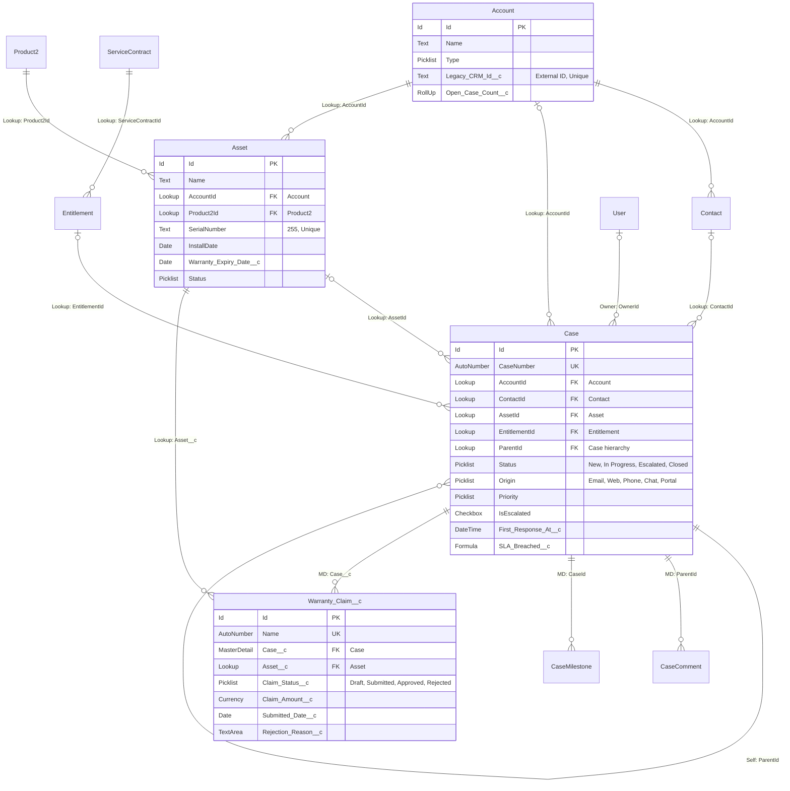

## Project definition — read this first

Before reading any discovery document, read:

```
./projects/<project>/description.md
```

This is the **project definition**: who the client organisation is, what it is
regulated or obliged to do, who its customers actually are, and what it cannot
do. It is written once per project and applies to every feature under it.

Use it to:

- resolve who "the customer" is for this process — it is frequently not the end
  consumer, and getting this wrong mis-frames every persona and every story;
- avoid proposing anything the organisation is not permitted to do;
- ground language, roles and obligations in the client's real operating model
  rather than in generic industry assumptions.

The file is **optional**. If it is absent, proceed on the discovery documents
alone and note in your output that no project definition was supplied — do not
invent organisational context to fill the gap.

# Salesforce Data Modeler

Turn narrative requirements into an implementable Service Cloud schema: which
standard objects carry the load, which custom objects are genuinely needed, what
fields go on each, how they relate, and an ERD that a Salesforce architect can
review in one pass. The deliverable is:

1. A **standard-object-first object inventory** — every entity mapped, custom
   objects justified against the standard object they were weighed against
2. A **full field dictionary** — API names, data types, lengths, picklist
   values, required/unique flags, help text, and the requirement each traces to
3. A **relationship matrix** — child, parent, type, delete behaviour, roll-ups
4. A **Mermaid ERD** — split into domain diagrams once the model passes ~15
   objects

The value of this work is mostly in what you *don't* build. A weak design invents
`Customer__c`, `Ticket__c` and `Agent__c` when Account, Case and User already
exist — that costs the client licence-native features, reporting, Omni-Channel
routing, and years of maintenance. Lead with the standard model and justify every
departure from it.

All source files are `.md` format.

---

## Where the inputs and output live (Scyne workspace layout)

This skill runs inside the Data Modeler's working folder
`./projects/<project>/<feature>/solutions/DataModel/` — the agent passes you the
`<project>` and `<feature>` in its issue description, and stages the inputs into
this folder before invoking the skill.

- **Requirements (input):** `solutions/DataModel/productsummary/` — the BA's
  approved product summary (the agent copies it here from the feature's
  `outputs/product-summary.md`). Any BRD/PRD, user stories or discovery
  transcript staged alongside it is in scope too — read everything in the folder.
- **Reference catalogue (optional input):** `solutions/DataModel/datamodel-reference/`
  — an org-specific object catalogue, existing schema export, or managed-package
  inventory, where the feature carries one. This is *additional* to the Service
  Cloud catalogue in **Appendix A**, which is always the baseline.
- **Output (you write here):** `solutions/DataModel/outputs/salesforce-data-model.md`
  — a single fixed filename so the chatbot's approval preview can read it.
  Create the `outputs/` folder if it does not exist yet.

This is the only data model skill. The retired `datamodel-impact-analysis` skill
wrote `datamodel-impact.md`; features built before it was retired still carry
that file, and downstream stages still read it. Never write to that name — the
two must not be conflated, and a stale analysis must never be mistaken for a
fresh one.

(All paths below are relative to the working folder
`./projects/<project>/<feature>/solutions/DataModel/`.)

---

## Step 1 — List and Read All Source Files

Before reading anything, list the contents of both input folders:

```bash
ls productsummary/
ls datamodel-reference/
```

Note every filename — you will cite them as sources throughout the design and in
the traceability matrix. If `datamodel-reference/` is empty or absent, that is
normal: work from **Appendix A** alone and record it under **Assumptions**. If
`productsummary/` is empty, stop and report that — there is nothing to model.

Read **every** `.md` file in both folders before designing anything.

---

## Step 2 — Extract the Raw Material

Work from whatever the inputs provide (requirements doc, product summary, user
stories, transcript). Pull out and keep a running list of:

- **Nouns / entities** — the things the business tracks ("warranty claim",
  "device", "service plan", "technician").
- **Actors** — who touches the system (agents, supervisors, customers, partners,
  field techs). These drive licence type, Person Accounts vs Contacts, and
  Experience Cloud access.
- **Processes and lifecycles** — anything with states ("submitted → triaged →
  resolved") becomes Status picklists, Record Types, or Support Processes.
- **Channels** — email, web, phone, chat, WhatsApp, self-service portal. Each
  maps to specific standard objects (see **Appendix A**).
- **SLAs, contracts, entitlements** — these have dedicated standard objects; do
  not rebuild them.
- **Reporting and metric asks** — these drive roll-up summaries, formula fields,
  and whether a relationship must be master-detail.
- **Volumes** — record counts per year drive large-data-volume (LDV), skew, and
  indexing decisions.

Give every requirement you extract a stable ID (`R-01`, `R-02`, …) if the source
does not already number them. Every object and field you design later must cite
one, and Section 11 of the output reconciles both directions.

If the inputs are thin on something structurally decisive (Person Accounts vs
B2B, whether SLAs are contractual, multi-org or multi-brand), don't stall the
whole deliverable. Make a clearly-labelled assumption, design against it, and
list it under **Open Questions**.

---

## Step 3 — Map to Standard Objects First

Read **Appendix A — Service Cloud Standard Object Catalogue** and match each
extracted entity to a standard object before considering anything custom. Most
service requirements land on Account, Contact, Case, Asset, Product2,
Entitlement, Knowledge, and the activity objects.

Apply this test in order. Go custom only when all four fail:

1. **Does a standard object already model this?** Use it. Extend with custom
   fields.
2. **Does a standard object model it with a different label?** Use it and rename
   the tab/label (Case → "Ticket", Asset → "Installed Device").
3. **Can Record Types on a standard object separate the variants?** Use Record
   Types + page layouts + Support Processes rather than parallel objects.
4. **Is the difference only in a handful of attributes?** Add custom fields,
   don't clone the object.

Legitimate reasons to build custom: a genuinely distinct entity with its own
lifecycle and security model; a many-to-many junction; a high-volume
transactional log that would pollute Case; or a domain concept with no standard
analogue (e.g. `Meter_Reading__c`).

**Never** custom-build: Ticket/Incident (Case), Customer (Account/Contact), Agent
(User), Team (Group/Queue/Public Group), Article (Knowledge), SLA
(Entitlement/Milestone), Product (Product2), Serialised item at a customer
(Asset), Note/Comment (Case Comment, Feed, ContentNote), Attachment
(ContentDocument/Files).

---

## Step 4 — Design Fields

Read **Appendix B — Field and Relationship Design** for naming conventions, type
selection, and platform limits. For every field capture: label, API name, type
(with length/precision/picklist values), required, unique/external ID, default,
help text, and the requirement it traces to.

Keep custom fields off objects where a standard field already exists —
`Case.Priority`, `Case.Origin`, `Case.Status`, `Case.Type`, `Case.Reason` cover
far more requirements than people expect.

---

## Step 5 — Design Relationships

Read the **Master-Detail vs Lookup** section of **Appendix B**. For each
relationship state the child, the parent, the type (Master-Detail / Lookup /
Hierarchical / Junction), delete behaviour, whether it enables a roll-up, and why
that type was chosen.

Watch the hard constraints: max 2 master-detail per object, roll-up summaries
require master-detail (or Lookup-with-declarative-rollup via tooling), and
master-detail forces the child to inherit the parent's sharing.

---

## Step 6 — Cross-Cutting Design Decisions

Call these out explicitly, because they're the ones that are expensive to
reverse:

- **Person Accounts vs Account+Contact** — B2C service usually wants Person
  Accounts; note that enabling them is irreversible.
- **Record Types + Support Processes** — one per case lifecycle variant.
- **Org-Wide Defaults and sharing** — especially for customer-facing Experience
  Cloud users and any object holding sensitive data.
- **Data classification / PII** — flag fields needing Shield Platform Encryption,
  field-level security restrictions, or compliance categorisation.
- **External IDs and integration keys** — every object fed by an external system
  needs a unique External ID field for upserts.
- **LDV and skew** — flag any object expected to exceed ~1M records or any parent
  that will own >10,000 children.
- **Archiving / retention** — where the volume estimates imply it.

---

## Step 7 — Write the Output Document

Compose the full document using exactly this structure and section order — it is
what makes the document reviewable (you save it to the output path in Step 9,
after the quality check). Build the ERD in Section 9 per **Appendix C**.

Section 12 matters more than it looks — recording "we considered `Ticket__c` and
rejected it because X" is what stops the same debate reopening at every design
review.

---

````markdown
# Salesforce Service Cloud Data Model — [Client / Product Name]

**Version:** 0.1 (Draft) · **Date:** [date] · **Scope:** [releases / phases covered]

## 1. Executive Summary

[3–6 sentences: what the business does, what the service model must support, the shape of the solution, and the headline count — e.g. "11 standard objects extended with 34 custom fields, plus 4 custom objects." State the design principle: standard-first, custom only where justified.]

## 2. Design Approach & Assumptions

**Approach**
- [e.g. Case is the transactional spine; all channels converge on it via Record Types.]
- [e.g. Entitlement Management is used for SLA tracking rather than custom countdown fields.]

**Assumptions**

| # | Assumption | Impact if wrong |
|---|---|---|
| A1 | | |

## 3. Open Questions

| # | Question | Why it matters | Owner |
|---|---|---|---|
| Q1 | | | |

## 4. Object Inventory

| # | Object Label | API Name | Type | Purpose | Est. Volume | Requirement Ref |
|---|---|---|---|---|---|---|
| 1 | Case | `Case` | Standard | | | R-01, R-04 |
| 2 | Warranty Claim | `Warranty_Claim__c` | Custom | | | R-12 |

## 5. Standard Objects in Detail

### 5.x [Object Label] (`ApiName`)

**Role in the model:** [one or two sentences]

**Standard fields used:** [list the ones that carry requirements, with their purpose]

**Record Types:** [name, purpose, Support Process where applicable]

**Custom fields added:** see §7.

**Sharing / OWD:** [value and reasoning]

## 6. Custom Objects in Detail

### 6.x [Object Label] (`Api_Name__c`)

**Why custom:** [name the standard object(s) considered and the specific reason each was rejected]

**Purpose:** [one or two sentences]

**Record Types:** [if any]

**OWD / Sharing:** [value and reasoning]

**Relationships:** [summary — detail in §8]

**Fields:** see §7.

## 7. Field Dictionary

### 7.x [Object API Name]

| Field Label | API Name | Type | Length / Values | Req. | Unique / Ext ID | Default | Description | Req. Ref |
|---|---|---|---|---|---|---|---|---|
| | | | | | | | | |

Repeat per object. Include only fields being added or actively used; note standard fields separately where their configuration changes (e.g. new picklist values on `Case.Origin`).

## 8. Relationship Matrix

| # | Child Object | Parent Object | Field API Name | Type | Required | Delete Behaviour | Enables Roll-Up | Rationale |
|---|---|---|---|---|---|---|---|---|
| 1 | `Warranty_Claim__c` | `Case` | `Case__c` | Master-Detail | Yes | Cascade | Yes — `Total_Claim_Value__c` | Claim has no meaning without its case |

## 9. Entity Relationship Diagram

[Mermaid `erDiagram`. Split into domain diagrams if more than ~15 objects, each with a short intro sentence.]

## 10. Cross-Cutting Considerations

**Sharing and visibility** — [OWD summary table, role hierarchy, sharing rules, Experience Cloud user access]

**Data classification and PII** — [fields needing FLS restriction, encryption, or compliance categorisation]

**Integration and external IDs** — [per object: source system, External ID field, sync direction, frequency]

**Reporting** — [key reports/dashboards the model must support, and the fields that make them possible]

**Large data volumes** — [objects at risk, skew concerns, archiving strategy]

**Automation touchpoints** — [where Flow, Assignment Rules, Escalation Rules, Entitlement Processes or Omni-Channel act on this model — noted for completeness, not designed here]

## 11. Requirements Traceability Matrix

| Requirement ID | Requirement (abbreviated) | Objects | Fields | Notes |
|---|---|---|---|---|
| R-01 | | | | |

Every requirement should appear here. Mark anything not addressed by the data model as "Not data-model — [automation / UI / integration]".

## 12. Design Decisions & Rejected Alternatives

| # | Decision | Alternatives Considered | Why Rejected |
|---|---|---|---|
| D1 | Use `Case` with Record Types for all request types | Separate `Service_Request__c` object | Loses Omni-Channel routing, Email-to-Case, Entitlements, and standard case reporting |
````

---

## Step 8 — Quality Check

Before saving, verify:

- [ ] Every entity in the requirements appears somewhere in the model, and every
      object traces back to at least one requirement. No orphans in either
      direction.
- [ ] Every custom object has an explicit rationale naming the standard object it
      was weighed against.
- [ ] Every field has a concrete API name ending in `__c` for custom fields, and a
      real data type — never "text" without a length or "picklist" without values.
- [ ] Every relationship names its type and its delete behaviour.
- [ ] The Mermaid diagram parses, and every object in the inventory appears in it.
- [ ] Roll-up summary fields are only proposed on the master side of a
      master-detail.
- [ ] No object exceeds 2 master-detail relationships.
- [ ] Nothing in the model duplicates a licence-native capability the client
      already pays for.
- [ ] Every assumption made in Step 2 appears in Section 2, and every unresolved
      decision appears in Section 3.
- [ ] Section 11 accounts for every requirement ID, including those marked "Not
      data-model".

---

## Step 9 — Save

Save the completed document to (relative to the working folder):

```
./projects/<project>/<feature>/solutions/DataModel/outputs/salesforce-data-model.md
```

Write the **Mermaid ERD source inline** in the `.md` (it is the source of truth).
Do **not** pre-render it to an image here — the Data Modeler agent renders Mermaid
blocks to PNG locally and embeds them when it publishes to Confluence. If the user
explicitly asks for a `.docx`, produce it *in addition to* the `.md`, never
instead of it.

This is a deliverable the user will circulate rather than read once in chat, so
after saving, give a brief summary covering:

- Object counts — standard extended / custom introduced
- Total custom fields proposed across all objects
- A one-line justification for each custom object
- Any open questions or assumptions that block architecture sign-off

---
---

# Appendix A — Service Cloud Standard Object Catalogue

Match requirement entities to these before designing anything custom. Read during
Step 3.

## Core CRM

| Object | API name | Use for | Notes |
|---|---|---|---|
| Account | `Account` | Companies, households, or (as Person Account) individual consumers | Person Accounts merge Account+Contact for B2C. Enabling is **irreversible** — decide early. |
| Contact | `Contact` | Individual people at an Account | Supports Contact-to-Multiple-Accounts via `AccountContactRelation` for people who deal with several entities. |
| AccountContactRelation | `AccountContactRelation` | Many-to-many person ↔ organisation with a Role | Standard junction; don't build a custom one. |
| Lead | `Lead` | Unqualified prospects | Rarely central to service, but sometimes used for unidentified inbound contacts. |
| Opportunity | `Opportunity` | Revenue deals | Include only if the requirements mention service-to-sales handoff. |

## Case management

| Object | API name | Use for | Notes |
|---|---|---|---|
| Case | `Case` | Any customer issue, request, ticket, complaint, incident, enquiry | The spine of Service Cloud. Key standard fields: `Subject`, `Description`, `Status`, `Priority`, `Origin`, `Type`, `Reason`, `AccountId`, `ContactId`, `AssetId`, `EntitlementId`, `ParentId`, `OwnerId`, `SuppliedEmail`, `IsEscalated`, `ClosedDate`. |
| Case hierarchy | `Case.ParentId` | Parent/child cases, splitting or merging work | Self-lookup — no custom object needed for sub-cases. |
| CaseComment | `CaseComment` | Threaded internal/public notes | Feed items (`FeedItem`) are the modern alternative via Case Feed. |
| EmailMessage | `EmailMessage` | Inbound/outbound email tied to a Case | Created by Email-to-Case. |
| CaseContactRole | `CaseContactRole` | Additional contacts involved in a case | Standard many-to-many. |
| CaseMilestone | `CaseMilestone` | SLA checkpoints on a case | Populated by Entitlement Process. |
| Incident / Problem / ChangeRequest | `Incident`, `Problem`, `ChangeRequest` | ITSM-style major incident management | Part of Service Cloud's incident management; use instead of custom `Incident__c` where licensed. |
| Support Process | (setup metadata) | Distinct Status value sets per Case Record Type | Use with Record Types instead of separate case-like objects. |

Case Record Types are the standard answer to "we have several different kinds of
ticket". Design one Record Type + Support Process per lifecycle, not one object
per lifecycle.

## Products, assets and installed base

| Object | API name | Use for | Notes |
|---|---|---|---|
| Product2 | `Product2` | The catalogue of things sold or supported | Model the *type* of thing here. |
| Asset | `Asset` | A specific instance owned by a customer — serial number, install date, warranty dates | This is the "customer's device/subscription/installed product". Supports asset hierarchy via `ParentId`, and `AssetRelationship` for asset-to-asset links. |
| AssetRelationship | `AssetRelationship` | Relationships between assets over time (replaced by, upgraded to) | |
| Pricebook2 / PricebookEntry | `Pricebook2`, `PricebookEntry` | Pricing | Only if commerce is in scope. |
| Order / OrderItem | `Order`, `OrderItem` | Fulfilment and returns | Useful when service requests reference purchases. |
| Contract | `Contract` | Signed customer agreements | Parent for Entitlements. |
| ContractLineItem | `ContractLineItem` | Products covered under a Service Contract | Requires Entitlement Management. |

## Entitlements, SLAs and contracts

| Object | API name | Use for |
|---|---|---|
| Entitlement | `Entitlement` | What support a customer is entitled to, and for how long |
| ServiceContract | `ServiceContract` | Support contract / warranty agreement |
| EntitlementProcess / MilestoneType | setup metadata | SLA clocks: first response, resolution |
| CaseMilestone | `CaseMilestone` | Actual SLA instance on a case, with target and completion times |

If the requirements mention SLAs, response times, warranty coverage, support
tiers, or "gold/silver/bronze" service, this is the standard answer. Building
`SLA__c` with a formula countdown is a recognised anti-pattern.

## Knowledge

| Object | API name | Use for |
|---|---|---|
| Knowledge__kav | `Knowledge__kav` | Articles (article-version object; Lightning Knowledge) |
| Custom article Record Types | | FAQ, How-to, Known Error, Policy — Record Types on Knowledge, not separate objects |
| DataCategory / DataCategorySelection | | Article taxonomy and visibility |
| CaseArticle | `CaseArticle` | Article attached to a case (drives deflection reporting) |

## Channels and routing

| Object | API name | Use for |
|---|---|---|
| MessagingSession / MessagingEndUser | `MessagingSession`, `MessagingEndUser` | WhatsApp, SMS, Facebook Messenger, in-app messaging |
| LiveChatTranscript | `LiveChatTranscript` | Web chat sessions |
| VoiceCall | `VoiceCall` | Service Cloud Voice telephony records |
| ConversationEntry | `ConversationEntry` | Individual messages within a conversation |
| Queue / Group | `Group` (Type=Queue) | Work distribution — never build `Team__c` for this |
| AgentWork / ServiceChannel / PendingServiceRouting | | Omni-Channel routing and capacity |
| ServiceResource, ServiceTerritory | | Agent/technician skills and geography |
| Web-to-Case / Email-to-Case | setup | Case creation channels; drive `Case.Origin` values |

## Activities and collaboration

| Object | API name | Use for |
|---|---|---|
| Task | `Task` | Follow-ups, callbacks, to-dos |
| Event | `Event` | Scheduled appointments/meetings |
| FeedItem / FeedComment | `FeedItem`, `FeedComment` | Chatter collaboration on records |
| ContentDocument / ContentVersion / ContentDocumentLink | | Files and attachments — the modern replacement for `Attachment` |
| EmailMessage | `EmailMessage` | Email correspondence |

## Users, security and org structure

| Object | API name | Use for |
|---|---|---|
| User | `User` | Agents, supervisors, admins — never `Agent__c` |
| Group | `Group` | Public Groups and Queues |
| UserRole | `UserRole` | Role hierarchy for record visibility |
| Permission Sets / Permission Set Groups | metadata | Access design |
| Territory2 | `Territory2` | Enterprise Territory Management, where geography drives access |

## Field Service (optional add-on)

Only if the requirements involve on-site work and the client licenses FSL:
`WorkOrder`, `WorkOrderLineItem`, `ServiceAppointment`, `ServiceResource`,
`ServiceTerritory`, `ResourceAbsence`, `WorkType`, `ProductItem` (inventory),
`ProductRequest`, `ReturnOrder`, `MaintenancePlan`, `MaintenanceAsset`.

If FSL is out of scope but on-site visits are required, say so explicitly and
propose either FSL or a lightweight custom `Site_Visit__c` — and note the
trade-off.

## Common mis-mappings

| Requirement wording | Wrong instinct | Correct standard object |
|---|---|---|
| "ticket", "enquiry", "complaint", "request" | `Ticket__c` | `Case` (+ Record Types) |
| "customer", "member", "subscriber" | `Customer__c` | `Account` / Person Account / `Contact` |
| "agent", "advisor", "technician" (internal) | `Agent__c` | `User` (+ `ServiceResource` for FSL) |
| "team", "pod", "workgroup" | `Team__c` | Queue / Public Group / `UserRole` |
| "article", "FAQ", "help topic" | `Article__c` | `Knowledge__kav` + Record Types |
| "SLA", "response target", "warranty period" | `SLA__c` | `Entitlement` + Entitlement Process + Milestones |
| "device", "vehicle", "unit at customer site" | `Device__c` | `Asset` (with `Product2` as the model) |
| "note", "update", "comment" | `Comment__c` | `CaseComment` / `FeedItem` |
| "attachment", "document" | `Attachment__c` | `ContentDocument` (Files) |
| "escalation" | `Escalation__c` | `Case.IsEscalated` + escalation rules, or child Case |
| "survey", "CSAT" | `Survey__c` | Salesforce Feedback Management (`Survey`, `SurveyResponse`) if licensed |
| "contact person on multiple accounts" | custom junction | `AccountContactRelation` |

---

# Appendix B — Field and Relationship Design

Read during Steps 4–5.

## Naming conventions

- **Labels**: business language, Title Case, no jargon or system prefixes —
  "Warranty Expiry Date", not "WARR_EXP_DT".
- **API names**: `Pascal_Snake_Case` ending in `__c` — `Warranty_Expiry_Date__c`.
  Salesforce generates this from the label; state it explicitly rather than
  leaving it implied.
- **Objects**: singular, not plural — `Warranty_Claim__c`, not
  `Warranty_Claims__c`. Plural label goes in the object's Plural Label setting.
- **Booleans**: phrase so `true` is unambiguous — `Is_Escalated__c`,
  `Requires_Callback__c`.
- **Dates**: suffix `_Date__c`; datetimes `_At__c` or `_Date_Time__c`. Be
  consistent within the model.
- **External IDs**: name for the source system — `Legacy_CRM_Id__c`,
  `SAP_Customer_Number__c`.
- **Namespace prefixes**: reserve a package prefix only if the work is being
  delivered as a managed package.

## Choosing a data type

| Need | Type | Watch out for |
|---|---|---|
| Short free text | Text (max 255) | Specify the length; don't default everything to 255. |
| Long narrative | Long Text Area (up to 131,072) | Not filterable in reports, not indexable, can't be unique. |
| Rich formatting | Rich Text Area | Heavier; avoid unless formatting is a real requirement. |
| Constrained value set | Picklist | Define every value. Consider a Global Value Set when shared across objects. |
| Multiple values from a set | Multi-Select Picklist | Poor for reporting and filtering — prefer a junction object or multiple checkboxes if the values drive logic. |
| Yes/no | Checkbox | Can't be required (always has a value); use a picklist if "unknown" is meaningful. |
| Money | Currency | Enable multi-currency only if genuinely needed — it's org-wide and hard to unwind. |
| Counts, quantities | Number | Set precision and scale deliberately. |
| Ratios | Percent | Stored as entered; be explicit about 0–100 vs 0–1 in help text. |
| Point in time | Date or Date/Time | Date/Time is stored in UTC and rendered in user time zone — matters for SLA reporting. |
| Reference to another record | Lookup / Master-Detail | See below. |
| Derived value | Formula | Counts against compile-size limits; can't be indexed unless deterministic. |
| Aggregate of children | Roll-Up Summary | **Requires master-detail** on the child. |
| Integration key | Text + External ID + Unique | Essential for upserts and idempotent integrations. |
| Sensitive data | Any type + FLS / Shield encryption | Encrypted fields lose filtering and some indexing. Flag these explicitly. |

## Master-Detail vs Lookup

Choose **Master-Detail** when all of these hold:
- The child has no meaning without the parent.
- Deleting the parent should delete the children.
- The child should inherit the parent's sharing and ownership (children have no
  independent owner).
- You need roll-up summary fields on the parent.

Choose **Lookup** when any of these hold:
- The child can exist independently, or the parent is optional.
- The child needs its own owner, sharing rules, or queue assignment.
- The object already has two master-detail relationships (hard limit).
- The relationship is to a standard object that doesn't permit master-detail
  (e.g. you can't make Account the master of a custom object *and* keep
  independent sharing).

Also available:
- **Hierarchical** — self-lookup, User object only.
- **Self-lookup** — a lookup to the same object (`Case.ParentId` pattern) for
  parent/child of the same type.
- **Junction object** — a custom object with two master-detail relationships,
  modelling many-to-many. Name it for the relationship it represents
  (`Case_Product__c`), and decide which parent is primary (it drives the detail
  record's sharing and the record's look-and-feel in related lists).
- **External lookup / indirect lookup** — to external objects via Salesforce
  Connect, when data stays in a source system.

Always state delete behaviour: master-detail cascades; lookup can be set to
*Clear the field*, *Don't allow deletion*, or *Delete this record too*.

## Platform limits worth designing around

These change between editions and releases — treat them as design guardrails and
verify against current Salesforce documentation before committing:

- Master-detail relationships per object: **2**
- Lookup (relationship) fields per object: **40**
- Roll-up summary fields per object: **25**
- Custom fields per object: **500** (Enterprise) / **800** (Unlimited &
  Performance)
- Custom objects per org: **200** (Enterprise) / **2,000** (Unlimited &
  Performance)
- Picklist values: 1,000 per picklist, 255 characters each (practical usability
  limit is far lower)
- Long text area data per record: 131,072 characters total across all such fields
- Total custom field data: 122KB per record for long text/rich text
- Relationship depth in SOQL: 5 levels child-to-parent, 1 level parent-to-child

Flag it in the design if any object approaches these — particularly the 2
master-detail limit, which is the one that most often forces a redesign late.

## Large data volume and skew

Raise these when volume estimates suggest them:

- **Ownership skew**: >10,000 records owned by one user (often an integration
  user) degrades sharing recalculation. Distribute ownership or use a dedicated
  user with no role.
- **Lookup skew**: >10,000 child records pointing at one parent record causes
  record-locking contention on inserts.
- **Object volume**: beyond a few million records, plan for custom indexes,
  skinny tables, selective SOQL, and an archiving strategy.
- **Case volume**: high-volume orgs should confirm the retention policy for
  `CaseComment`, `EmailMessage`, and `ContentVersion`, which grow faster than
  Case itself.

## Field-level design checklist

For each field, decide and record:
1. Label and API name
2. Type, with length / precision / scale / picklist values
3. Required at the database level, or enforced by page layout / validation rule
4. Unique and/or External ID
5. Default value
6. Help text (the design deliverable should include it — it's cheap now and
   expensive to retrofit)
7. Field-level security exceptions and PII classification
8. Which requirement it satisfies

---

# Appendix C — Mermaid ERD Conventions for Salesforce

Read during Step 7, when building Section 9 of the output.

## Base syntax

```
erDiagram
    PARENT ||--o{ CHILD : "relationship label"
    ENTITY {
        Type Field_API_Name PK "comment"
    }
```

Cardinality on each side: `||` exactly one, `o|` zero or one, `}o` zero or many,
`}|` one or many. Salesforce relationships are read child → parent, so the parent
almost always takes `||` or `o|` and the child takes `o{`.

| Salesforce relationship | Mermaid |
|---|---|
| Master-Detail (child required) | `Parent ||--o{ Child : "MD: Field__c"` |
| Lookup (optional parent) | `Parent |o--o{ Child : "Lookup: Field__c"` |
| Self-lookup / hierarchy | `Case ||--o{ Case : "ParentId"` |
| Many-to-many via junction | model the junction object explicitly with two MD lines |

## Salesforce-specific conventions

1. **Use API names as entity names** — `Case`, `Account`, `Warranty_Claim__c`.
   The `__c` suffix is the fastest visual signal of what's custom, and it removes
   ambiguity for the developer implementing it.
2. **Label every relationship with its type and the field that carries it** —
   `"MD: Claim__c"` or `"Lookup: AccountId"`. An unlabelled line is not
   reviewable.
3. **Show `Id` as PK and relationship fields as FK.** Mermaid has no separate FK
   notation beyond the marker, so use `FK` on lookup and master-detail fields.
4. **Don't list every field in the diagram.** Include the PK, all FKs, and the
   fields that carry business meaning or drive process — typically 6–12 per
   object. The full set lives in the field dictionary; a diagram with 40
   attributes per box is unreadable.
5. **Put the data type in the type position**, using Salesforce type names:
   `Text`, `Picklist`, `MultiPicklist`, `Number`, `Currency`, `Date`, `DateTime`,
   `Checkbox`, `Formula`, `RollUp`, `Lookup`, `MasterDetail`, `TextArea`,
   `Email`, `Phone`, `Url`. Use the comment for length, values, or notes:
   `Text Serial_Number__c "255, External ID"`.
6. **Split the diagram when it exceeds ~15 objects.** Produce domain-scoped
   diagrams — Core Service, Knowledge & Deflection, Entitlements & SLA, Custom
   Extensions, Integration — plus one high-level context diagram showing only
   objects and lines. One giant ERD is a diagram nobody reads.
7. **Mark objects that are out of scope or future-phase** in the relationship
   comment or a legend, rather than silently omitting them.

## Syntax constraints to avoid broken diagrams

- Attribute type and name cannot contain spaces, parentheses, commas, or slashes.
  Put those in the quoted comment.
- Comments must be double-quoted and on one line.
- Entity names may contain letters, digits, underscores and hyphens; quote
  anything else.
- Don't put picklist values in the attribute name — they belong in the comment or
  the field dictionary.

## Worked example



Verify the diagram parses before delivering — an ERD that fails to render is
worse than a table.
