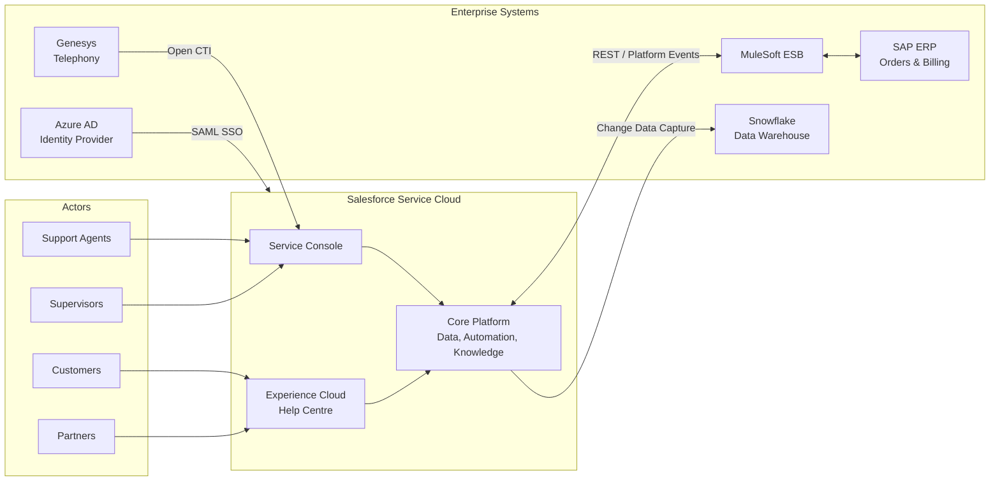
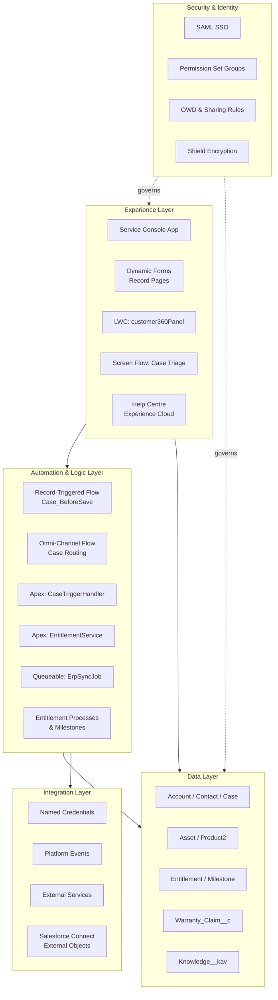
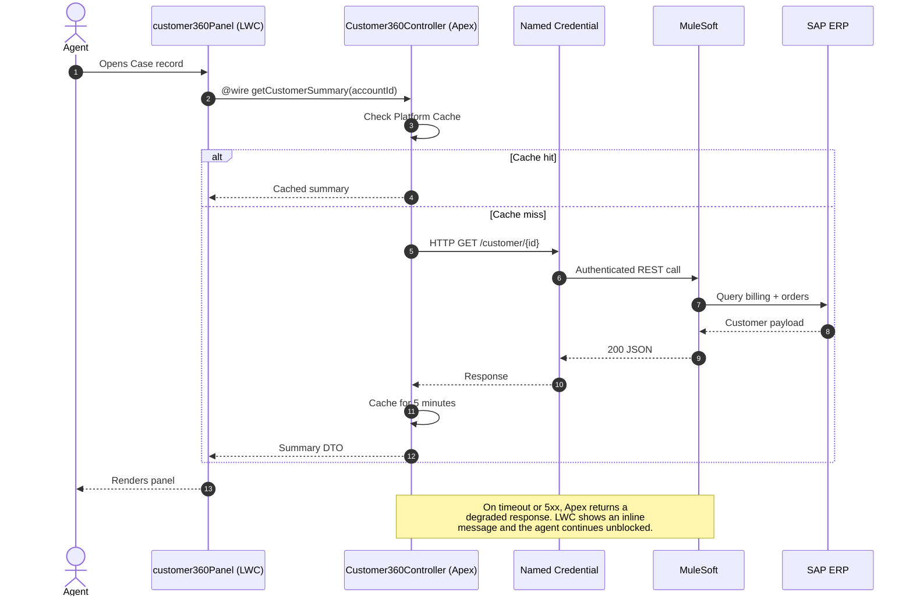
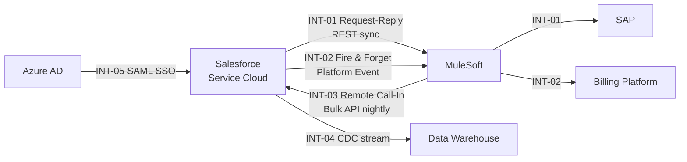
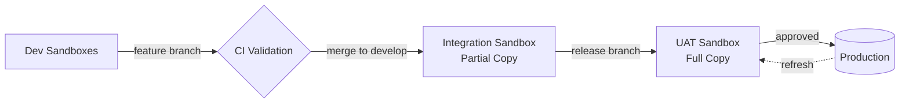

## Project definition — read this first

Before reading any discovery document, read:

```
./projects/<project>/description.md
```

This is the **project definition**: who the client organisation is, what it is
regulated or obliged to do, who its customers actually are, and what it cannot
do. It is written once per project and applies to every feature under it.

Use it to:

- resolve who "the customer" is for this process — it is frequently not the end
  consumer, and getting this wrong mis-frames every persona and every story;
- avoid proposing anything the organisation is not permitted to do;
- ground language, roles and obligations in the client's real operating model
  rather than in generic industry assumptions.

The file is **optional**. If it is absent, proceed on the discovery documents
alone and note in your output that no project definition was supplied — do not
invent organisational context to fill the gap.

# Salesforce Service Cloud Solution Architect

Turn requirement artefacts into a target-state architecture on Service Cloud:
what the platform does out of the box, what gets configured, what gets built in
Flow, what genuinely needs LWC and Apex, how it integrates with the surrounding
estate, and how it holds up under load and scrutiny. The deliverable is:

1. A **capability and component map** — every requirement mapped to a named
   Service Cloud capability and a named build type
2. An **LWC, Flow and Apex inventory** — each entry carrying its justification
3. An **interface catalogue** — pattern, mechanism, idempotency and failure
   behaviour per interface
4. **Architecture Decision Records** for everything expensive to reverse
5. **Mermaid diagrams** — system context, logical architecture, integration
   landscape, sequence diagrams for the complex flows

The discipline that separates a good Salesforce architecture from a bad one is
restraint about code. Every Apex class and LWC is something the client maintains,
tests, and re-validates three times a year at every release. The architecture's
job is to spend that budget only where the platform genuinely can't reach — and
to say explicitly why, each time.

All source files are `.md` format.

---

## Where the inputs and output live (Scyne workspace layout)

This skill runs inside its own working folder
`./projects/<project>/<feature>/solutions/Architecture/` — the Solution Architect
agent passes you the `<project>` and `<feature>` in its issue description, and
stages the inputs into this folder before invoking the skill.

- **Product Summary / requirements (input):** `solutions/Architecture/productsummary/`
  — the BA's approved product summary, plus any BRD/PRD, user stories, SOPs,
  current-state architecture or discovery notes staged alongside it. Read
  everything in the folder.
- **Data model (input, optional but preferred):** `solutions/Architecture/DataModel/`
  — the Data Modeler's output. If a data model has already been designed
  (`salesforce-data-model.md` or `datamodel-impact.md`), **consume it rather than
  re-deriving it**. If the folder is empty, design against the entities in the
  requirements and record the dependency under Open Questions.
- **Landscape (input, optional):** `solutions/Architecture/landscape/` — existing
  system inventories, integration catalogues, identity or middleware standards.
- **Project context (input, optional):** `solutions/Architecture/project/` — what
  the parent PROJECT knows, staged down so this feature is architected in the
  client's terms rather than in isolation:
  - `project/documents/<category>/*.md` — client-wide policy, legislation,
    standards and current-state architecture applying to every feature
  - `project/personas.json`, `project/journey-map.json` — the project's persona
    set and journeys
  - `project/capability-map.json`, `project/process-model.json`,
    `project/capability-process.md` — the project's capability and process model

  All optional, never a gate. When present, the **capability model is your
  capability-to-component map**: build that section from it directly rather than
  re-deriving a capability list from the requirements, and cite the capability IDs
  so the architecture and the operating model describe the same world. The
  **personas** tell you which profiles, permission sets and licence types the
  identity section has to cover.
- **Output (you write here):** `solutions/Architecture/outputs/solution-architecture.md`
  — a single fixed filename so the chatbot's approval preview can read it.
  Create the `outputs/` folder if it does not exist yet.

This filename is deliberately distinct from `solution-design.md`, which is the
`solution-design-document` skill's output, and from `datamodel-impact.md` and
`salesforce-data-model.md`. None of these skills overwrite each other, and more
than one may run for the same feature.

(All paths below are relative to the working folder
`./projects/<project>/<feature>/solutions/Architecture/`.)

---

## Step 1 — List and Read All Source Files

Before reading anything, list the contents of every input folder:

```bash
ls productsummary/
ls DataModel/
ls landscape/
```

Note every filename — you will cite them as sources throughout the design and in
the traceability matrix. An empty `DataModel/` or `landscape/` is normal: record
it under Assumptions and design forward. If `productsummary/` is empty, stop and
report that — there is nothing to architect.

Read **every** `.md` file in every input folder before designing anything.

---

## Step 2 — Inventory the Inputs

Build a working picture of:

- **Functional requirements** — grouped into capability areas (case intake,
  routing, resolution, knowledge, self-service, reporting).
- **Non-functional requirements** — volumes, concurrency, response times,
  availability, retention, residency, accessibility, compliance. These are
  usually thin; state assumptions where they are missing.
- **Data model** — objects, relationships, volumes. Drives sharing design, LDV
  handling, and query patterns.
- **Existing landscape** — the systems around Salesforce: CRM being replaced,
  ERP, billing, telephony, identity provider, data warehouse, middleware/ESB,
  ITSM, customer portal. For each, note whether it is system of record, whether
  it stays, and how it currently talks to anything.
- **Actors and licences** — internal agents, supervisors, back-office, partners,
  customers. Licence type is an architectural constraint, not an afterthought.
- **Constraints** — existing middleware standard, security policy, in-flight
  programmes, delivery timeline, team skills, budget.

Give every requirement a stable ID (`R-01`, `R-02`, …) if the source does not
already number them. Section 17 of the output reconciles every one.

Where an input is missing but structurally decisive — licence edition, whether
MuleSoft exists, whether SSO is mandated, expected case volume — make a labelled
assumption and design forward. Don't block.

---

## Step 3 — Map Requirements to Platform Capability

For each requirement, work down this ladder and **stop at the first rung that
satisfies it**. Read **Appendix A — Service Cloud Capability Reference** for what
each capability actually covers.

1. **Out-of-the-box Service Cloud capability** — Email-to-Case, Web-to-Case,
   Omni-Channel, Entitlements/Milestones, Knowledge, Macros, Quick Actions, Case
   Assignment/Escalation Rules, Service Console, Reports & Dashboards.
2. **Declarative configuration** — Record Types, page layouts / Dynamic Forms,
   validation rules, Lightning App Builder, list views, sharing rules.
3. **Flow** — Record-Triggered, Screen, Scheduled, Autolaunched, Platform
   Event-Triggered.
4. **Lightning Web Components** — only where the UI genuinely can't be assembled
   from standard components or a Screen Flow.
5. **Apex** — only where Flow can't express the logic, or performance/bulk/
   transaction control demands it.
6. **AppExchange or an off-platform component** — when the build is large enough
   that buying beats building.

Record the rung chosen for every requirement. **Appendix B — Component
Selection** has the decision rules, including the specific triggers that
legitimately justify Apex and LWC.

---

## Step 4 — Design Each Architectural Layer

Work through these in order, because each constrains the next.

**Experience layer** — Service Console app design (tabs, subtabs, utility bar,
split view), Lightning record pages and Dynamic Forms, LWC inventory, Screen
Flows, Experience Cloud site for self-service, mobile. For each LWC, state its
purpose, the data it needs, how it gets it (Lightning Data Service / `@wire`
Apex / imperative Apex), and where it is surfaced.

**Automation and business logic layer** — one record-triggered Flow per object
per timing (before-save vs after-save) where practical, Apex trigger handler
framework where triggers are needed, invocable Apex called from Flow,
asynchronous work (Queueable, Batch, Scheduled, Platform Events), and error
handling/retry strategy. Name the ownership boundary: which object's automation
lives in Flow, which in Apex, and how they coexist without ordering surprises.

**Data layer** — reference the data model; add what architecture contributes:
sharing and visibility design, large-data-volume handling, indexing and selective
queries, archiving and retention, external objects via Salesforce Connect where
data should stay put.

**Integration layer** — build an interface catalogue and assign each interface a
pattern. Read **Appendix C — Integration Patterns**. Every interface needs:
direction, trigger, pattern, protocol, payload, volume/frequency, error handling,
idempotency key, and security model.

**Identity and security layer** — SSO and identity provider, licence allocation
per persona, profiles vs permission sets, OWD and sharing model, field-level
security and PII handling, Shield Platform Encryption where required, integration
user and named credential design, audit and monitoring.

---

## Step 5 — Cover the Non-Functionals

Design decisions skipped here become production incidents. Address at minimum:
expected volumes and growth, governor limit exposure in the hot paths, page and
console performance, bulk data load strategy, concurrency and record locking,
availability and degraded-mode behaviour when a dependent system is down,
retention and archiving, and observability (what gets logged, where, and who
watches it). See **Appendix D — Security, Licensing and Non-Functional Design**.

---

## Step 6 — Environment and Delivery Architecture

Sandbox strategy (dev/UAT/full copy), source-driven development with SFDX and Git
branching, CI/CD, deployment mechanism (unlocked packages vs org-dependent
metadata), data seeding, and the release calendar's three annual Salesforce
upgrades. Brief but explicit — this is a frequent gap in architecture documents.

---

## Step 7 — Draw the Diagrams

Produce, at minimum, a **system context** diagram, a **logical architecture**
diagram showing the layers, and **sequence diagrams** for the two or three most
complex integration or automation flows. Read **Appendix E — Architecture
Diagrams in Mermaid** for conventions and worked examples.

Every diagram needs one sentence above it stating what the reader should take
away. A diagram without that sentence gets skimmed.

---

## Step 8 — Write the Output Document

Compose the full document using exactly this structure and section order (you
save it to the output path in Step 10, after the quality check).

---

````markdown
# Solution Architecture — [Client / Programme Name]
## Salesforce Service Cloud

**Version:** 0.1 (Draft) · **Date:** [date] · **Scope:** [phases/releases] · **Status:** For review

---

## 1. Executive Summary

[5–8 sentences: the business problem, the target platform position, the shape of the solution, the headline build counts (e.g. "12 Flows, 6 LWCs, 9 Apex classes, 5 integration interfaces"), and the two or three decisions that most define the architecture.]

## 2. Architecture Principles

| # | Principle | What it means in practice |
|---|---|---|
| P1 | Standard before configured, configured before coded | Every custom component carries a written justification |
| P2 | Integrate through the enterprise middleware | No point-to-point coupling from Salesforce to systems of record |
| P3 | Least privilege by default | Minimal profiles, permission set groups, scoped integration users |
| P4 | Design for the release cadence | Nothing that breaks predictably three times a year |

## 3. Assumptions, Constraints & Open Questions

**Assumptions**

| # | Assumption | Impact if wrong |
|---|---|---|

**Constraints**

| # | Constraint | Source |
|---|---|---|

**Open Questions**

| # | Question | Blocks | Owner | Needed by |
|---|---|---|---|---|

## 4. Current State Landscape

[Narrative of the as-is: systems, what each is system of record for, current pain, what's being replaced vs retained. Include an as-is diagram where the estate is non-trivial.]

| System | Role | System of Record For | Disposition | Interfaces Today |
|---|---|---|---|---|

## 5. Target Architecture Overview

[Narrative, then the system context diagram. State what changes versus current state and what the platform boundary is — what Salesforce owns and what it deliberately does not.]

## 6. Capability & Component Map

| Req ID | Requirement | Service Cloud Capability | Build Type | Component(s) | Justification |
|---|---|---|---|---|---|

Build Type values: `Standard`, `Config`, `Flow`, `LWC`, `Apex`, `Integration`, `AppExchange`, `Out of scope`.

## 7. Experience Layer Design

**Service Console** — [app structure, tabs and subtabs, utility bar, split view, highlights panel, keyboard/macro strategy]

**Lightning pages** — [per object: layout approach, Dynamic Forms usage, conditional visibility]

**LWC inventory**

| Component | Purpose | Surface | Data Source | Apex Dependency | Why not config/Flow |
|---|---|---|---|---|---|

**Screen Flows**

| Flow | Purpose | Launched From | Notes |
|---|---|---|---|

**Experience Cloud** — [template, audiences, branding, authenticated vs guest, licence model]

## 8. Automation & Business Logic Design

**Flow inventory**

| Flow | Object | Type / Timing | Purpose | Entry Criteria | Fault Handling |
|---|---|---|---|---|---|

**Apex inventory**

| Class | Type | Purpose | Called From | Why not Flow |
|---|---|---|---|---|

**Asynchronous design** — [Queueable/Batch/Scheduled/Platform Event usage, chaining, volumes, scheduling windows]

**Automation ordering and coexistence** — [how Flow and Apex on the same object are sequenced; recursion control; managed package interactions]

**Error handling strategy** — [where errors go, how they're surfaced, who is alerted, how work is reprocessed]

## 9. Data Layer & Sharing Design

[Reference the data model document. Cover what architecture adds:]

| Object | OWD | Sharing Mechanisms | Est. Volume | LDV Considerations |
|---|---|---|---|---|

**Archiving and retention** — [policy and mechanism]

## 10. Integration Architecture

**Interface catalogue**

| ID | Name | Source → Target | Trigger | Pattern | Mechanism | Sync/Async | Volume | Auth | Idempotency Key | Error Handling |
|---|---|---|---|---|---|---|---|---|---|---|

**Sequence diagrams** — [for the two or three most complex interfaces]

**Failure behaviour** — [per interface: what the agent sees, whether the process can continue degraded]

## 11. Identity, Security & Licensing

**Licence allocation**

| Persona | Count | Licence | Rationale |
|---|---|---|---|

**Identity** — [SSO, MFA, provisioning, customer identity]

**Access model** — [profiles, permission set groups, OWD table, sharing rules, restriction rules, Experience Cloud sharing sets]

**Data protection** — [PII classification, encryption, audit trail, residency, retention]

## 12. Non-Functional Design

| NFR | Target | Design Response |
|---|---|---|
| Peak case creation rate | | |
| Console page load | | |
| Data volume (3-year) | | |
| Availability / degraded mode | | |
| Accessibility | | |
| Retention | | |

**Governor limit exposure** — [the hot paths and how the design stays inside limits]

## 13. Environment, DevOps & Release Strategy

[Sandbox topology, source control and branching, CI/CD pipeline, packaging approach, test data strategy, handling of the three annual Salesforce releases. Include the environment flow diagram.]

## 14. Architecture Diagrams

[System context · Logical architecture · Integration landscape · Key sequence diagrams · Environment flow. One sentence of takeaway above each.]

## 15. Architecture Decision Records

**ADR-01: [Decision title]**
- **Context:** [the forces at play]
- **Options considered:** (a) … (b) … (c) …
- **Decision:** [chosen option]
- **Rationale:** [why]
- **Consequences:** [what this commits to, what it forecloses, what it costs]
- **Status:** Proposed / Accepted / Superseded

## 16. Risks, Assumptions & Technical Debt

| # | Risk | Likelihood | Impact | Mitigation | Owner |
|---|---|---|---|---|---|

**Accepted technical debt**

| # | Debt | Why accepted | Remediation trigger |
|---|---|---|---|

## 17. Requirements Traceability

| Req ID | Requirement | Addressed By | Section | Status |
|---|---|---|---|---|

Every requirement appears. Mark anything not addressed as `Deferred`, `Out of scope`, or `Gap — decision required`.

## 18. Phasing & Roadmap

| Phase | Scope | Components | Dependencies | Key Risks |
|---|---|---|---|---|
````

---

## Step 9 — Quality Check

Before saving, verify:

- [ ] Every requirement maps to a named capability and a named build type. No
      requirement silently unaddressed.
- [ ] Every Apex class and LWC in the inventory has a one-line justification for
      why Flow or standard config wasn't enough. If a component can't earn that
      sentence, remove it.
- [ ] No custom build duplicates a licensed platform capability — the most common
      failures are custom routing, custom SLA timers, custom knowledge search,
      custom email threading, and custom file management.
- [ ] Every integration interface has a pattern, an error-handling behaviour, and
      an idempotency story.
- [ ] Governor limits are addressed anywhere the design touches bulk data or
      high-volume triggers.
- [ ] Every diagram parses and matches the narrative.
- [ ] Licence implications are stated wherever the design assumes a feature that
      isn't in the base edition (Omni-Channel skills-based routing, Knowledge,
      Field Service, Shield, Agentforce, Experience Cloud, Salesforce Connect,
      Data Cloud).
- [ ] Every ADR states its consequences, not only its decision.
- [ ] Where a data model was supplied, the design consumes it rather than
      contradicting it; where it was not, the dependency is recorded.

---

## Step 10 — Save

Save the completed document to (relative to the working folder):

```
./projects/<project>/<feature>/solutions/Architecture/outputs/solution-architecture.md
```

Write the **Mermaid diagram source inline** in the `.md` (it is the source of
truth). Do **not** pre-render to an image here — the Solution Architect agent
renders Mermaid blocks to PNG locally and embeds them when it publishes to
Confluence. If the user explicitly asks for a `.docx`, produce it *in addition to*
the `.md`, never instead of it.

After saving, give a brief summary covering:

- Build counts — Flows, LWCs, Apex classes, integration interfaces
- The two or three decisions that most define the architecture
- Any requirement marked `Gap — decision required`
- Licence dependencies that need confirming before build

---
---

# Appendix A — Service Cloud Capability Reference

Map requirements to these before designing any build. Licence notes are
indicative — confirm against the client's actual edition and add-ons, because
several of these are separately licensed. Read during Step 3.

## Case intake channels

| Capability | What it covers | Notes |
|---|---|---|
| Email-to-Case (On-Demand) | Inbound email creates/updates Cases, threading, attachments | Standard. Prefer On-Demand over the Email Agent unless there's a firewall requirement. |
| Web-to-Case | HTML form → Case | Simple, unauthenticated, rate-limited (daily cap). For anything richer use an Experience Cloud form or an API-driven form. |
| Omni-Channel Messaging | WhatsApp, SMS, Facebook, Apple Messages, in-app | Separately licensed per channel. |
| Web/Embedded Chat (Messaging for In-App and Web) | Real-time chat from web and mobile | Licensed. |
| Service Cloud Voice | Telephony inside the console — call control, transcription, routing | Licensed; requires a partner or Amazon Connect model. |
| Open CTI | Adapter framework for third-party telephony | Use when the client keeps an incumbent contact centre platform. |
| API-created cases | Any external system creating cases via REST/SOAP/Bulk | Design as an integration interface with an External ID for idempotency. |

`Case.Origin` should carry every channel in the design and drive reporting.

## Routing and work distribution

| Capability | Use for | Notes |
|---|---|---|
| Assignment Rules | Simple attribute-based ownership at case creation | Free, standard, but evaluated once at insert unless re-run. |
| Queues | Pull-based work pools | Standard. |
| Omni-Channel queue-based routing | Push work to available agents with capacity | Included with Service Cloud. |
| Omni-Channel skills-based routing | Route on required skills rather than queue | More capable; confirm edition. |
| Omni-Channel Flow routing | Routing logic expressed in Flow | The current recommended approach for complex routing — reach for this before custom Apex. |
| Escalation Rules | Time-based escalation on cases | Standard; often superseded by Entitlement milestones. |
| External Routing | Hand routing to a third-party engine via API | For clients with an incumbent WFM/routing platform. |

Custom Apex routers are almost always a design smell. If routing logic is
genuinely too complex for Flow routing, document why in an ADR.

## Agent productivity

- **Service Console app** — tabbed/split-view workspace. Design tabs, subtabs,
  utility bar items, and the highlights panel deliberately; console layout is a
  real performance factor.
- **Macros and Quick Text** — repeatable agent actions and canned responses.
  Frequently replaces requests for custom "one-click" buttons.
- **Quick Actions** — object-specific and global actions, including
  Flow-launching actions and LWC actions.
- **Email templates and Lightning Email Templates** — with merge fields and
  Enhanced Letterhead.
- **Case Feed / Chatter** — collaboration and internal notes.
- **Einstein Case Classification / Reply Recommendations** — licensed AI assists.
- **Dynamic Forms and Dynamic Actions** — conditional field and button visibility
  without code. These remove the majority of "we need a custom LWC for the
  layout" requests.
- **Split View, Keyboard shortcuts, Pinned lists** — throughput features worth
  calling out in the design.

## Knowledge and deflection

- **Lightning Knowledge** — articles as `Knowledge__kav` with Record Types, Data
  Categories for taxonomy and visibility, versioning, approval and publishing
  workflow, multi-language translation.
- **Article recommendations in console** and **attach-article-to-case** for
  deflection metrics.
- **Search** — Einstein Search, synonym groups, promoted results, search layouts.
  Never build custom search infrastructure before exhausting these.
- **Knowledge in Experience Cloud** — public and authenticated article visibility
  via Data Categories.

## SLA and entitlements

- **Entitlement Management** — Entitlements, Service Contracts, Contract Line
  Items.
- **Entitlement Processes and Milestones** — first response, resolution, custom
  milestones with business hours, milestone actions (success/warning/violation).
- **Business Hours and Holidays** — org-level, used by milestones and escalation
  rules.

A custom "SLA countdown" built from formula fields and scheduled Flows is a
recurring anti-pattern. Use the platform capability and note the licensing.

## Self-service

- **Experience Cloud (Customer Account Portal / Help Center / Build Your Own)** —
  authenticated case submission and tracking, Knowledge, chat entry point. Licence
  model (Customer Community vs Customer Community Plus vs member-based vs
  login-based) is an architectural decision with real cost consequences — make it
  an ADR.
- **Guest user access** — needs a deliberate sharing and security design; guest
  user record access is a known risk area.
- **Salesforce Mobile / Mobile Publisher** — for branded mobile self-service.

## AI and Agentforce

Where the client has or is considering Agentforce / Einstein:

- **Agentforce Service Agent** — autonomous handling of customer conversations,
  grounded in Knowledge and org data via topics and actions.
- **Agent Actions** — built from Flows, Apex (`@InvocableMethod`), or prompt
  templates. Note this in the architecture: an action's underlying Flow or Apex is
  a real component with the usual design obligations.
- **Prompt Builder / Einstein Trust Layer** — grounding, masking, and audit for
  generative features.
- **Einstein Case Classification, Article Recommendations, Reply
  Recommendations, Work Summaries.**
- **Data Cloud** — if unified customer profile or cross-system grounding is in
  scope.

Treat AI as a capability layer with its own data-access, grounding and governance
design — not a bolt-on feature bullet.

## Reporting and analytics

- Reports, dashboards, report types (including custom report types for custom
  object joins), dashboard subscriptions.
- Service Cloud standard KPIs: case volume by channel/type, first response and
  resolution against milestones, deflection rate, reopen rate, backlog age, agent
  occupancy via Omni supervisor.
- **Omni Supervisor** for real-time queue and agent state.
- **CRM Analytics** or the client's data warehouse for cross-system analytics —
  decide where the reporting boundary sits, and how data leaves Salesforce if it
  does.

## Field Service

If on-site work is in scope and FSL is licensed: Work Orders, Service
Appointments, Scheduling Policies, Dispatcher Console, Mobile app, Resource
Absences, Maintenance Plans, Inventory. If FSL isn't licensed but on-site work is
required, raise it as a gap with a costed option, rather than designing a
lightweight custom scheduler by default.

## Don't build these

Each of these is a licensed platform capability that projects regularly rebuild
by accident:

| Requirement | Build instinct | Use instead |
|---|---|---|
| Route work to the right agent | Custom Apex router | Omni-Channel (Flow routing) |
| SLA timers and breach alerts | Formula countdown + scheduled batch | Entitlement Processes and Milestones |
| Canned responses | Custom LWC | Quick Text and Macros |
| Article search | Custom search LWC over a custom object | Lightning Knowledge + Einstein Search |
| Email threading and correspondence | Custom email object + Apex | Email-to-Case + `EmailMessage` |
| File uploads and versioning | Custom attachment handling | Salesforce Files (`ContentVersion`) |
| Conditional field display | Custom LWC form | Dynamic Forms |
| Approval chains | Custom status Flow + Apex | Approval Processes (or Flow orchestration) |
| Audit history | Custom history object + triggers | Field History Tracking / Field Audit Trail |
| Duplicate prevention | Custom Apex on insert | Duplicate and Matching Rules |

---

# Appendix B — Component Selection: Config, Flow, LWC, Apex

Read during Steps 3–4.

## The ladder

Stop at the first rung that satisfies the requirement, and record which rung you
stopped at.

1. **Standard capability** — a licensed feature already does this
2. **Declarative configuration** — Record Types, Dynamic Forms, validation rules,
   App Builder, list views, rules engines
3. **Flow** — record-triggered, screen, scheduled, autolaunched,
   platform-event-triggered
4. **LWC** — custom UI that standard components and Screen Flow can't express
5. **Apex** — logic Flow can't express, or where bulk/transaction/performance
   control is required
6. **Buy** — AppExchange or an off-platform service

Each descent costs maintenance, test coverage, release regression, and specialist
skills. The architecture document should be able to justify every step down.

## When Flow is the right answer

Flow handles the large majority of Service Cloud automation:

- Field updates on the same record → **before-save record-triggered Flow**
  (fastest option on the platform; no DML)
- Creating or updating related records → after-save record-triggered Flow
- Guided agent processes, wizards, data capture → Screen Flow, surfaced as a
  Quick Action or in the utility bar
- Scheduled batch-ish work over modest volumes → Scheduled Flow
- Reacting to Platform Events → Platform Event-Triggered Flow
- Omni-Channel routing logic → Omni-Channel Flow
- Calling out to external systems declaratively → HTTP Callout in Flow, or
  External Services with an OpenAPI spec

**Flow design rules to state in the architecture:**

- One record-triggered Flow per object per timing where practical, with sub-flows
  for modularity — ordering between multiple flows on the same object is a known
  source of unpredictability.
- Never place DML or callouts inside a loop.
- Use entry criteria to keep flows from running on irrelevant updates.
- Define fault paths and an error-notification mechanism; unhandled flow errors
  emailing the last-modifying admin is not an error strategy.
- Bulk-test every record-triggered Flow against a 200-record load.

## When Apex is genuinely justified

These are legitimate triggers for code. If a proposed Apex class doesn't match
one of them, push it back to Flow.

- Complex branching, recursion, or set/map manipulation that Flow expresses badly
  or not at all
- Bulk processing beyond Flow's practical limits — Batch Apex over hundreds of
  thousands of records
- Precise transaction control: savepoints, partial-success handling, explicit
  rollback
- Callouts requiring custom authentication, request signing, retry with backoff,
  or complex payload transformation
- Long-running asynchronous chains — Queueable with chaining
- Custom REST/SOAP endpoints exposed to external systems (`@RestResource`)
- Invocable actions supplying capability to Flow or Agentforce
  (`@InvocableMethod`)
- Server-side logic backing an LWC (`@AuraEnabled`)
- Sophisticated sharing calculation (Apex managed sharing)
- Performance-critical paths where Flow's overhead measurably matters

**Apex design standards to state:**

- One trigger per object, delegating to a handler class; no logic in the trigger
  body
- Bulkified throughout — no SOQL or DML inside loops
- Recursion control via a static guard
- Separation of concerns: trigger handler → service layer → selector/repository
  layer → domain logic
- `with sharing` by default; every `without sharing` needs a written
  justification
- Enforce FLS/CRUD explicitly (`Security.stripInaccessible`, `WITH USER_MODE`, or
  equivalent) — the platform does not do this for you in Apex
- No hardcoded IDs; use Custom Metadata Types for configuration
- Test coverage that asserts behaviour, not coverage percentage; include bulk and
  negative tests
- Async pattern chosen deliberately: Future (simple, limited), Queueable
  (chainable, takes objects), Batch (large volumes), Scheduled (time-based),
  Platform Events (decoupled fan-out)

## When LWC is genuinely justified

Before designing an LWC, confirm none of these covers it: Dynamic Forms, Dynamic
Actions, standard Lightning components (`lightning-record-form`,
`lightning-datatable`, related lists, path, highlights panel), Screen Flow, Quick
Actions, or an App Builder configuration.

Legitimate LWC drivers:

- A composite view assembling data from several objects or an external system in
  one interaction
- Interaction models the standard components don't support — drag-and-drop,
  canvas, inline multi-record editing, custom search-and-select
- Embedding in Experience Cloud with branding and behaviour requirements standard
  components can't meet
- Real-time or event-driven UI subscribing to Platform Events via the Lightning
  Message Service or `empApi`
- Reusable UI primitives shared across console, portal and mobile

**LWC design standards to state:**

- Prefer Lightning Data Service (`lightning-record-form`, `@wire(getRecord)`)
  over Apex for single-record CRUD — it gives caching, FLS enforcement and shared
  state for free
- `@wire` Apex for cacheable reads (`@AuraEnabled(cacheable=true)`); imperative
  Apex for anything that mutates data
- Never fire a SOQL-per-row pattern from the client; design a single
  bulk-friendly Apex method
- Use Lightning Message Service for cross-component communication in the console;
  avoid custom global state
- Base components from SLDS for accessibility and design-system consistency —
  accessibility is usually a contractual NFR
- Handle loading, empty and error states explicitly; surface errors with
  `ShowToastEvent` or inline messaging
- Jest tests for components, and a documented browser/device support matrix

For each LWC in the inventory, record: name, purpose, surface (record page / app
page / utility bar / Quick Action / Experience Cloud / Flow screen), data source,
Apex dependencies, and the one-line justification for why config or Flow wasn't
enough.

## Configuration over hardcoding

Anything an admin might reasonably want to change belongs in **Custom Metadata
Types** (deployable, packageable, queryable without limits) or **Custom
Settings** (hierarchy-based, user/profile overrides). Recipients lists,
thresholds, endpoint names, feature toggles, mapping tables — none of these
belong in code or in a Flow's literal values.

## Documenting the decision

For every capability area, the architecture should carry a row like:

| Requirement | Capability | Build type | Component | Justification |
|---|---|---|---|---|
| R-14 Auto-acknowledge new cases | Email templates | Config + Flow | `Case_Acknowledgement` record-triggered Flow | No code needed; template merge fields sufficient |
| R-22 Multi-system customer 360 panel | — | LWC + Apex | `customer360Panel`, `Customer360Controller` | Composite of Salesforce data plus two external calls; no standard component composes this |

---

# Appendix C — Integration Architecture Patterns

Read during Step 4.

## Selecting a pattern

Ask four questions per interface: which side initiates, is it synchronous or
asynchronous, is it one record or many, and who is system of record. That
resolves the pattern almost every time.

| Pattern | When | Salesforce mechanism |
|---|---|---|
| **Request and Reply** | Salesforce needs an answer now, in the user's transaction | Apex callout (`HttpRequest`), External Services, Flow HTTP Callout, LWC → Apex → REST |
| **Fire and Forget** | Salesforce notifies another system, doesn't need the answer | Platform Events, Change Data Capture, Outbound Messages, `@future`/Queueable callout |
| **Batch Data Synchronisation** | Bulk movement on a schedule | Bulk API 2.0, ETL/middleware, Data Loader, scheduled extracts |
| **Remote Call-In** | External system creates/reads/updates Salesforce data | REST/SOAP API, custom Apex REST (`@RestResource`), Composite API, Bulk API |
| **UI Update Based on Data Changes** | Salesforce UI must react to an external event in near-real-time | Platform Events + `empApi` in LWC, Change Data Capture, Streaming API |
| **Data Virtualisation** | Data should stay in the source system, not be copied | Salesforce Connect (OData / custom Apex adapter), External Objects, external lookups |

## Mechanism notes

**Platform Events** — decoupled publish/subscribe, high-volume, replayable within
the retention window. Best default for Salesforce-to-external notification and
for decoupling internal processing. Design the event schema deliberately; events
are an API contract.

**Change Data Capture** — near-real-time record change events without writing
publishers. Good for replicating to a warehouse or downstream cache. Note the
object enablement list and that it delivers changes, not business events.

**Salesforce Connect** — external objects queried live. Avoids copying data, but
comes with real constraints: limited SOQL, no roll-ups, reporting restrictions,
and dependency on source-system availability and latency. Excellent for "show me
the last 12 months of billing" panels; poor for anything needing joins or
automation.

**External Services** — register an OpenAPI-described API and invoke it from Flow
without Apex. Prefer this over hand-written Apex callouts when the spec is clean.

**Named Credentials and External Credentials** — the correct home for endpoints
and authentication. No endpoint URLs or secrets in code; no custom OAuth token
management where a Named Credential can do it.

**MuleSoft / middleware** — if the client has an ESB or iPaaS standard, honour
it: Salesforce should talk to middleware, not point-to-point to a dozen systems.
Say so explicitly and show it in the diagram. Point-to-point integration from
Salesforce to many systems is a maintainability decision you should have to
defend.

**Bulk API 2.0** — for initial migration and ongoing high-volume loads. Design
chunking, error file handling, and reprocessing.

**Composite / Composite Graph API** — lets an external caller do multiple related
operations in one transaction; useful for reducing chatty integrations.

## Design obligations per interface

The interface catalogue must state all of these for each row, because these are
the fields that get skipped and then cause incidents:

- **ID and name**
- **Source and target**, and direction
- **Trigger** — user action, record change, event, schedule
- **Pattern** and **mechanism**
- **Protocol and format** — REST/JSON, SOAP/XML, event
- **Objects and fields** in the payload
- **Volume and frequency**, peak and average
- **Sync/async** and expected latency
- **Authentication** — OAuth 2.0 JWT bearer / client credentials / mTLS, and
  which integration user
- **Idempotency** — the External ID or correlation key that makes a retry safe
- **Error handling** — retry policy, dead-letter destination, alerting, manual
  reprocessing route
- **System of record** for the data in question
- **Failure behaviour** — what the agent sees, and whether the business process
  can continue degraded

## Governor and API limits to design against

- Callouts per transaction: 100; total callout time per transaction: 120 seconds
- No callouts after DML in the same transaction — use async or reorder
- Daily API request limits are edition- and licence-based; high-frequency polling
  integrations are the usual cause of exhaustion. Prefer events over polling.
- Platform Event publishing and delivery allocations are separate from API limits
  — check both
- Long-running synchronous requests risk the 10-minute limit and console
  timeouts; move heavy work async
- Bulk API has its own batch and daily limits

## Anti-patterns to call out

- **Polling** an external system on a schedule when Platform Events or a webhook
  would do
- **Chatty synchronous callouts** in a record-triggered path, coupling
  Salesforce's availability to a third party's
- **Point-to-point sprawl** where middleware exists
- **Copying data with no need** — replicating an entire ERP into custom objects
  when Salesforce Connect or an on-demand call would serve the actual use case
- **Integration user with a System Administrator profile** — use a dedicated,
  least-privilege integration user, and consider ownership skew if it owns records
- **No idempotency** — retried messages creating duplicate cases is the single
  most common integration defect in Service Cloud implementations

---

# Appendix D — Security, Licensing and Non-Functional Design

Read during Steps 5–6.

## Licensing as an architectural constraint

Decide and document the licence position early — it constrains what the
architecture can assume.

| Persona | Typical licence | Notes |
|---|---|---|
| Support agent | Service Cloud | Console, Omni-Channel, Knowledge, Entitlements |
| Supervisor | Service Cloud (+ Omni Supervisor) | |
| Back-office / occasional | Platform or Service Cloud | Platform licences can't access Case-adjacent standard objects fully — check before assuming |
| Partner | Partner Community | Role-based sharing available |
| Customer (self-service) | Customer Community (member or login-based) | No role hierarchy; sharing via sharing sets and sharing groups |
| Customer needing role-based sharing | Customer Community Plus | Materially more expensive — make it an ADR |
| Integration user | Salesforce Integration licence or a full licence | Least privilege regardless |

Separately licensed capabilities worth flagging wherever the design depends on
them: Knowledge, Field Service, Service Cloud Voice, Messaging channels, Shield
Platform Encryption and Event Monitoring, Experience Cloud, Salesforce Connect,
CRM Analytics, Data Cloud, Agentforce.

## Access and sharing design

Design in this order — it's the order the platform evaluates, and designing out
of order produces contradictions:

1. **Org-Wide Defaults** — set the most restrictive baseline the business can
   tolerate
2. **Role hierarchy** — vertical access
3. **Sharing rules** — criteria-based and owner-based horizontal access
4. **Manual sharing / Apex managed sharing** — exceptions
5. **Teams** (Case Teams, Account Teams) — collaboration-based access
6. **Profiles and permission sets** — object and field permissions, and system
   permissions. Prefer minimal profiles plus permission set groups over many fat
   profiles.
7. **Field-Level Security** — per-persona field visibility, especially for PII and
   financial data
8. **Restriction Rules and Scoping Rules** — narrowing access within an object
   where OWD alone is too blunt

For Experience Cloud, treat guest and community user access as its own design:
sharing sets, sharing groups, guest user record sharing, and object permissions
on the guest profile. This is a known source of exposure incidents — design it
explicitly rather than inheriting defaults.

## Data protection

- **Classification** — mark PII, PCI, PHI or otherwise sensitive fields in the
  field dictionary
- **Shield Platform Encryption** — where required by policy; note the functional
  trade-offs (filtering, sorting, some search and indexing behaviour)
- **Field Audit Trail / Field History Tracking** — retention of who changed what
- **Event Monitoring** — for detective controls and login/API forensics
- **Data residency and cross-border transfer** — instance region, and where
  integrations send data
- **Retention and deletion** — how the design satisfies right-to-erasure and
  record retention policy

## Identity

- SSO via SAML or OpenID Connect against the client's IdP; My Domain configured
- MFA policy (Salesforce mandates MFA for direct logins; SSO with IdP-enforced
  MFA satisfies it)
- Just-in-time provisioning vs SCIM vs managed provisioning for user lifecycle
- Customer identity for self-service: Experience Cloud login, social sign-on, or
  the client's CIAM via an external IdP
- API authentication: OAuth 2.0 JWT bearer for server-to-server, client
  credentials flow where appropriate, connected apps scoped and IP-restricted,
  Named/External Credentials for outbound

## Governor limits to design against

Per-transaction, synchronous (async limits are generally higher — verify current
values):

- SOQL queries: 100 · rows retrieved: 50,000
- DML statements: 150 · records per DML: 10,000
- Callouts: 100 · cumulative callout time: 120s
- CPU time: 10,000ms sync / 60,000ms async
- Heap: 6MB sync / 12MB async
- Future calls: 50 per transaction
- Queueable: chaining depth limits apply

Flag every design element likely to approach these: high-volume record-triggered
automation, LWCs that fan out to Apex, batch jobs over large objects, and any
path combining several triggers, flows and managed-package logic on the same
object.

## Performance and scale

- **Volume model** — records per object per year, peak concurrent users, peak
  case creation rate
- **LDV thresholds** — objects heading past a few million records need custom
  indexes, selective SOQL, skinny tables, and an archiving plan
- **Skew** — ownership skew (>10k records to one user, often the integration
  user) and lookup skew (>10k children on one parent) cause locking and sharing
  recalculation problems
- **Console performance** — number of components on a record page, LWCs making
  independent Apex calls, related list counts. This is the most commonly reported
  "Salesforce is slow" cause and it is a design decision.
- **Query design** — filter on indexed fields, avoid leading wildcards and
  negative operators, keep queries selective
- **Bulk load strategy** — for migration and ongoing feeds: deferred sharing
  calculation, disabling non-essential automation during load, chunking by parent

## Availability and resilience

- Salesforce availability is the vendor's; the design's job is the behaviour when
  a *dependent* system is down
- For each integration: does the agent process stop, degrade, or queue? State it.
- Retry, dead-letter and replay design for asynchronous interfaces
- Graceful UI degradation in LWCs that depend on external calls

## Observability

- Where errors land: Flow fault paths, Apex exception handling, a custom error
  log object or Platform Event, integration middleware logs
- Alerting: who is notified, through what channel, at what threshold
- Debug logging strategy for production, and Event Monitoring where licensed

## Environments and delivery

- **Sandbox strategy** — developer/developer pro for build, partial copy for
  integration testing with representative data, full copy for UAT/performance/
  migration rehearsal
- **Source of truth** — Git, with SFDX source format; branching model tied to the
  release cadence
- **CI/CD** — automated validation deploys, static analysis, Apex and Jest test
  execution, scratch orgs where the team is mature enough
- **Packaging** — unlocked packages vs org-dependent metadata; choose based on
  team maturity and org complexity, and record it as an ADR
- **Test data** — seeding and anonymisation for lower environments
- **Salesforce release cadence** — three major releases per year; the design
  should note where preview sandboxes and regression testing fit

---

# Appendix E — Architecture Diagrams in Mermaid

Read during Step 7. Produce at least three: a **system context** diagram, a
**logical architecture** diagram, and **sequence diagrams** for the two or three
most complex flows. Add a deployment/environment diagram where the delivery model
matters.

Every diagram needs one sentence above it stating what the reader should take
away. A diagram without that sentence gets skimmed.

## 1. System context diagram

Shows Salesforce in its estate: who uses it, what it talks to, and in which
direction. Keep it to systems and actors — no internal Salesforce detail.



Label every line with its mechanism. An unlabelled arrow tells the reader nothing
they couldn't guess.

## 2. Logical architecture diagram

Shows the layers inside Salesforce and which components sit in each. This is the
diagram that carries the design.



Name real components — `customer360Panel`, `CaseTriggerHandler` — not generic
boxes labelled "Custom UI" and "Business Logic". The specificity is the point.

## 3. Sequence diagram

Use for anything with ordering, timing or failure modes worth showing: an
integration round-trip, a routing decision, an async chain.



Always show the failure branch. A sequence diagram that only shows the happy path
hides exactly the design the reviewer needs to check.

## 4. Integration landscape diagram

When there are more than a handful of interfaces, give them their own view with
interface IDs matching the catalogue.



## 5. Environment and release flow



## Conventions

- **Never put a semicolon inside a `Note`, edge label or node label.** Mermaid
  treats `;` as a statement separator, so it fails the parse with a bare
  `got 'INVALID'` that points at the wrong thing. Use a full stop or an em dash.
  `<br/>` inside a Note is fine.
- Keep any one diagram under roughly 25 nodes; split by domain rather than
  shrinking the text
- Custom components carry their real API names; standard capabilities carry their
  product names
- Distinguish synchronous from asynchronous in the edge label — the reader can't
  infer it
- Use `-.->` for governance, dependency or non-runtime relationships and solid
  arrows for runtime flow
- Verify every diagram parses before delivering

---

## Revision mode

When the invocation supplies a **previous version** of this deliverable plus a
**change instruction**, you are revising, not regenerating.

The discipline is a small diff. A regenerate-from-scratch produces a diff too
large for a reviewer to check, which defeats the approval gate that follows —
so preserve every section, decision, identifier and wording the instruction does
not touch, and do not renumber, reorder or restyle anything it did not ask
about.

Apply the change **and its genuine consequences**, then record what changed in a
`## Revision History` entry at the end of the document (date, instruction,
sections touched).

Specific to this skill:

- **Every custom component still needs its one-line justification for why Flow or
  standard configuration was insufficient.** A component added by revision without
  one is exactly the thing this skill exists to prevent.
- A changed component ripples: the component inventory, the capability-to-component
  map, any sequence or context diagram that names it, and the ADR that chose it.
  Update all of them or explain why not.
- If the instruction reverses an architecture decision, do not silently rewrite the
  ADR — add a **superseding** ADR that references the original by number and says
  what changed. The decision history is part of the deliverable.
- Re-render every Mermaid diagram you touched; several exist and Phase 2 renders
  all of them.
